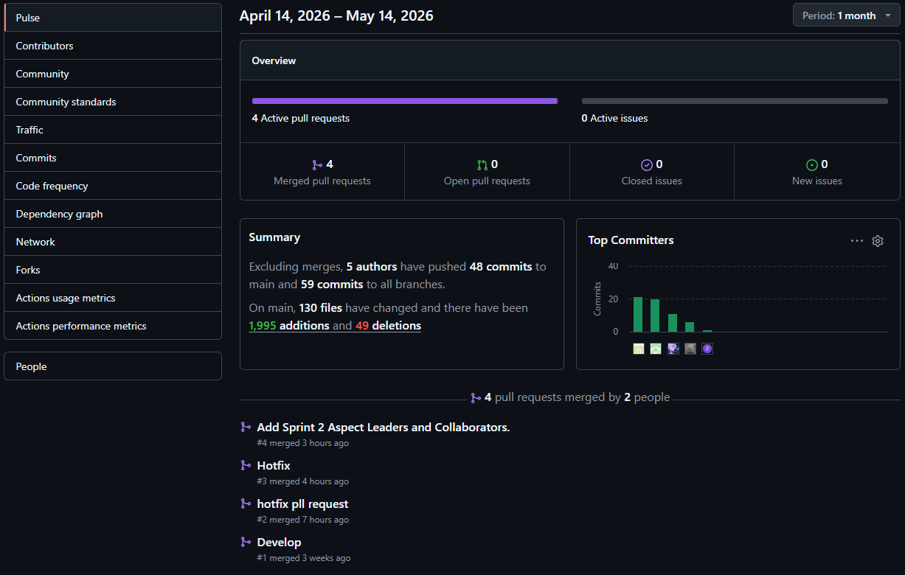
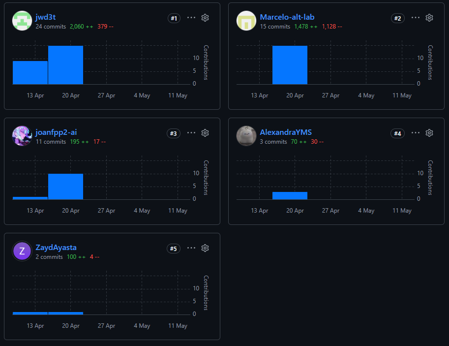

# Project Report Collaboration Insights

## Description of contributions

### Cuadros Villanueva, Marcelo Fabio

- Añadió el contenido del capítulo 4 sobre diseño de producto, pautas de estilo y arquitectura de información con diagramas de event storming.
- Añadió el reporte de evaluación de resultados de los estudiantes para la fase AV1.
- Añadió la documentación del capítulo 5 sobre gestión de la configuración de software e imágenes relacionadas.
- Añadió la documentación del capítulo 5 detallando la gestión de la configuración de software y estándares de desarrollo con imágenes de soporte.
- Corrigió y refactorizó algunas tablas.
- Añadió el análisis competitivo del capítulo 2.1 a la documentación de elicitación de requisitos.
- Añadió la portada del proyecto y el capítulo 5 respecto a la gestión de la configuración de software.
- Añadió el capítulo de especificación de requisitos, incluyendo épicas e historias de usuario para la gestión de inventario y adquisiciones.
- Realizó correcciones en algunas historias de usuario (US) y sus valores en Story Points en el capítulo 3.

### Wang Chen, Juan Sung Jau

- Corrigió los perfiles del equipo.
- Refactorizó la ruta de las imágenes.
- Renombró imágenes.
- Añadió la documentación de la página de aterrizaje (landing page) en el capítulo 4.
- Expandió la tabla de contenidos.
- Actualizó la arquitectura de información en el capítulo 4.
- Eliminó imágenes.
- Añadió varias imágenes y actualizó el contenido del capítulo 2.
- Añadió imágenes de analíticas para dueños de restaurantes y proveedores en el capítulo 2.
- Corrigió el nombre del producto en la carátula.
- Añadió user personas, mapas de viaje (journey mapping) y mapas de empatía en la sección de imágenes.
- Añadió la arquitectura de información en el capítulo 4.
- Actualizó los perfiles de los miembros del equipo y mejoró la definición del problema para restaurantes de chifa en el capítulo 1.
- Añadió nuevas imágenes para user personas y entrevistas en la sección de imágenes.
- Añadió resúmenes de entrevistas para dueños de restaurantes y proveedores en el capítulo 2.
- Expandió las secciones de análisis competitivo y diseño de entrevistas en el capítulo 2.
- Añadió la guía de estilo del código fuente y la configuración de despliegue en el capítulo 5.
- Corrigió los enlaces del repositorio en el capítulo 5.

### Payano Puchuri, Joan Fabricio

- Corrigió la sección del mapa de impacto (impact map) y añadió dos imágenes nuevas en el capítulo 3.
- Añadió el análisis de entrevistas en el capítulo 2.
- Añadió una imagen faltante.
- Añadió los nombres de los autores en la sección de registros.
- Corrigió el formato de la tabla de épicas en el capítulo 3.
- Añadió el product backlog en el capítulo 3.
- Añadió la imagen del mapa de impacto (impact map) en el capítulo 3.
- Añadió el nombre de un miembro del equipo en la carátula.
- Añadió las historias de usuario en el capítulo 3.
- Actualizó los perfiles de los miembros y añadió una imagen en el capítulo 1.
- Actualizó el archivo 01-caratula.md.

### Meza Soza, Alexandra Yamile

- Corrigió el formato de la tabla.
- Actualizó el diagrama de clases.
- Realizó modificaciones leves.

### Ayasta Martel, Zayd Jaffar

- Añadió los mockups web en el capítulo 4.
- Revisó la sección de la startup Aurora y la solución en el capítulo 1.