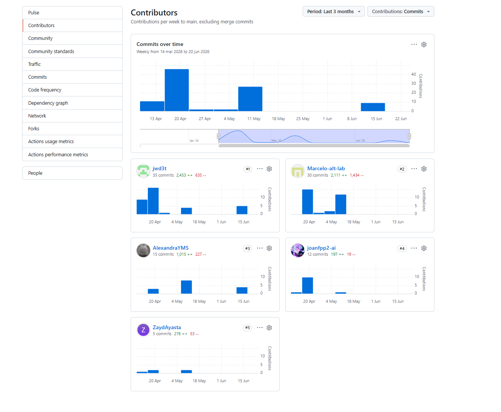
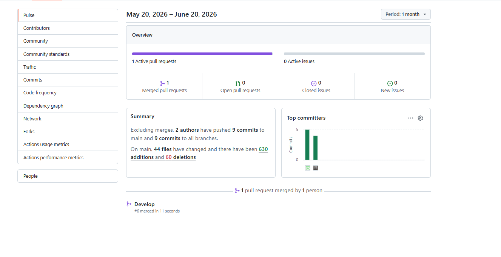
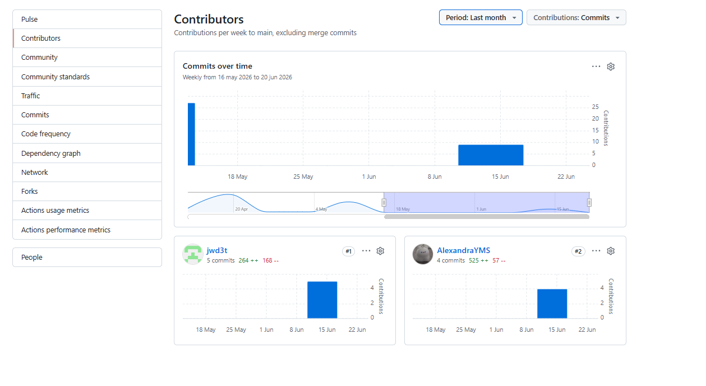
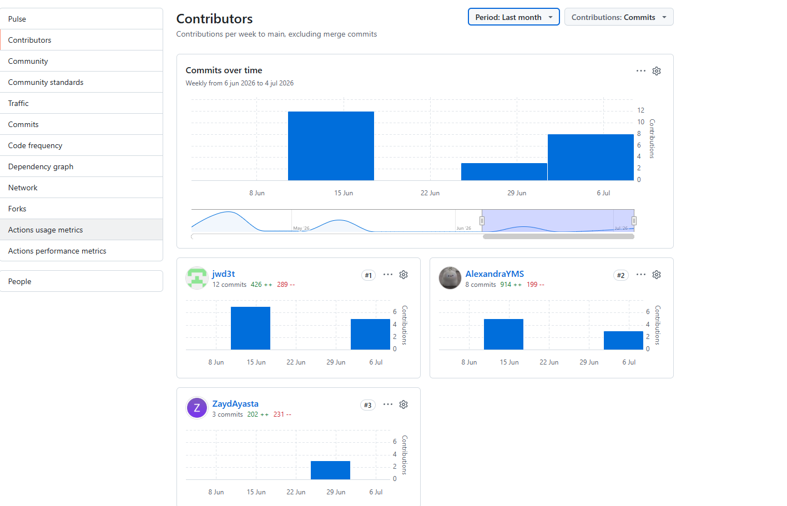
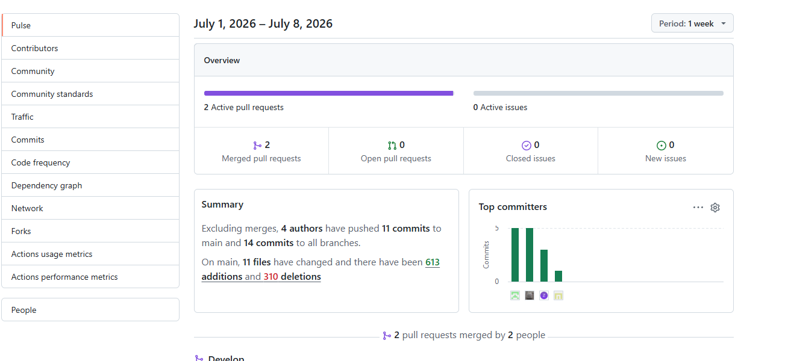

# Project Report Collaboration Insights

Todas las actividades asignadas para cada entrega se encuentran documentadas en el repositorio de GitHub de la organización del equipo, accesible en: [https://github.com/Aurora-startup](https://github.com/Aurora-startup).

En cuanto al informe, cada miembro del equipo participó redactando y elaborando gráficos en formato Markdown de acuerdo con los temas asignados, registrando su progreso mediante commits en el repositorio correspondiente, encontrándose en el siguiente enlace: [https://github.com/Aurora-startup/project-report](https://github.com/Aurora-startup/project-report) 

## AV1
En esta primera entrega se desarrolló todo el contenido de los capítulos I, II, III, IV y V del informe, así como el Sprint 1, orientado al desarrollo de la Landing Page de SupplyWok. Además, se elaboró un avance de las conclusiones, la bibliografía y los anexos. A continuación, se presentan las capturas que evidencian la colaboración de los integrantes del equipo en el repositorio del informe durante el desarrollo del Avance 1.

## TB1
En esta segunda entrega se desarrolló todo el contenido correspondiente al Sprint 2, orientado al desarrollo del Frontend de SupplyWok y de una API simulada (Fake API) para el consumo de datos por parte del frontend. Además, se elaboró un avance de las conclusiones, la bibliografía y los anexos. A continuación, se presentan las capturas que evidencian la colaboración de los integrantes del equipo en el repositorio del informe durante el desarrollo del Avance 2.

## AV2
En esta tercera entrega se desarrolló todo el contenido correspondiente al Sprint 3, orientado al desarrollo del backend de la plataforma SupplyWok. Además, se elaboraron las entrevistas de validación, la evaluación según heurísticas, el video About the Product, el video About the Team, así como un avance de las conclusiones, la bibliografía y los anexos. A continuación, se presentan las capturas que evidencian la colaboración de los integrantes del equipo en el repositorio del informe durante el desarrollo del Avance 3.

   

## TB2
En esta cuarta y última entrega se desarrolló todo el contenido correspondiente al Sprint 4, orientado a pulir los detalles finales de la plataforma y concluir el ciclo de desarrollo. Además, se elaboró la versión final de las conclusiones, la bibliografía y los anexos. A continuación, se presentan las capturas que evidencian la colaboración de los integrantes del equipo en el repositorio del informe durante el desarrollo de este último entregable.

