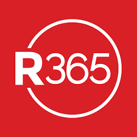
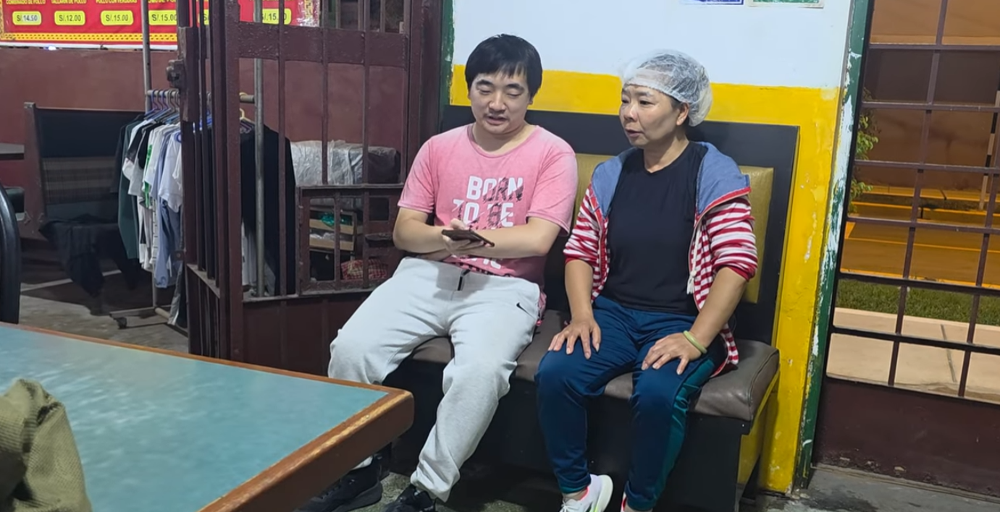
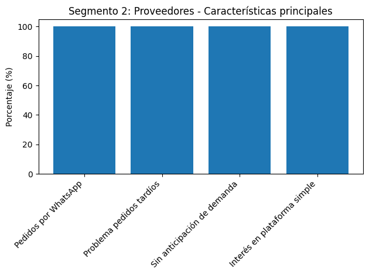
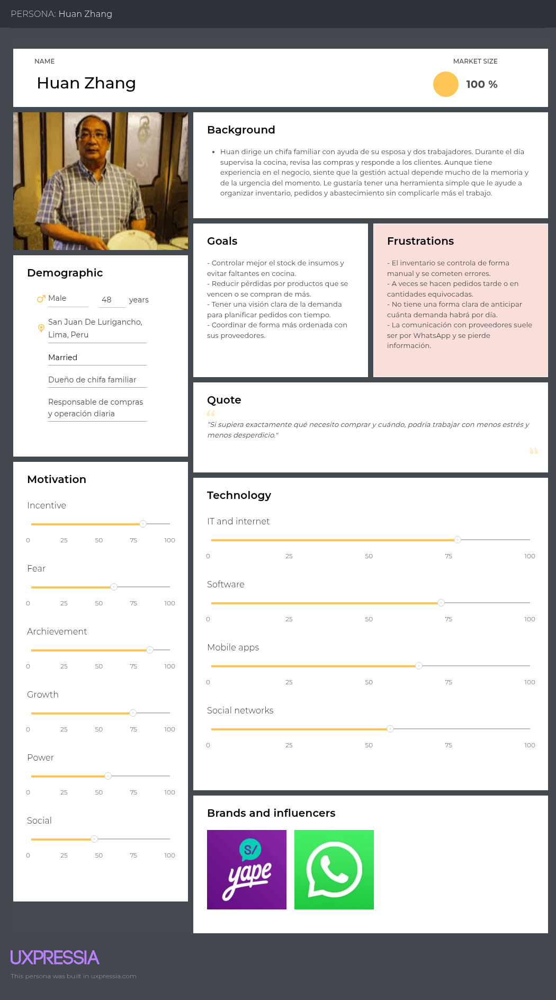
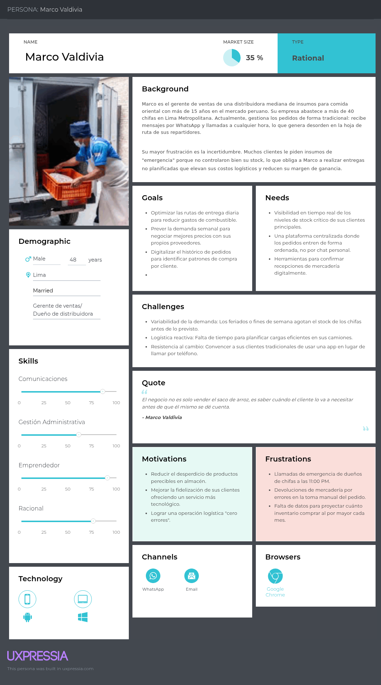
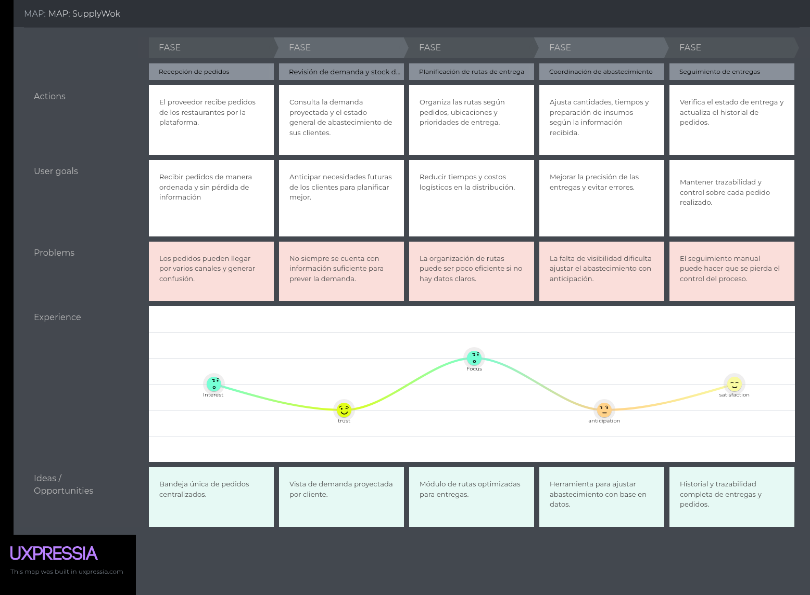
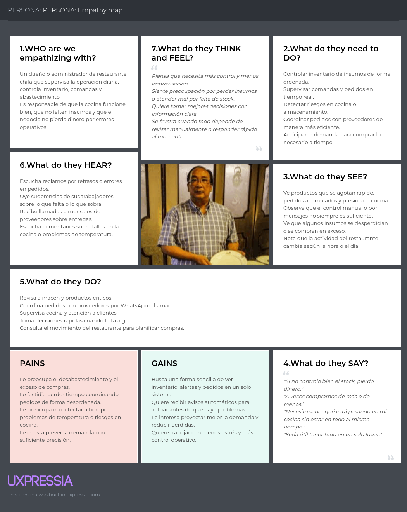
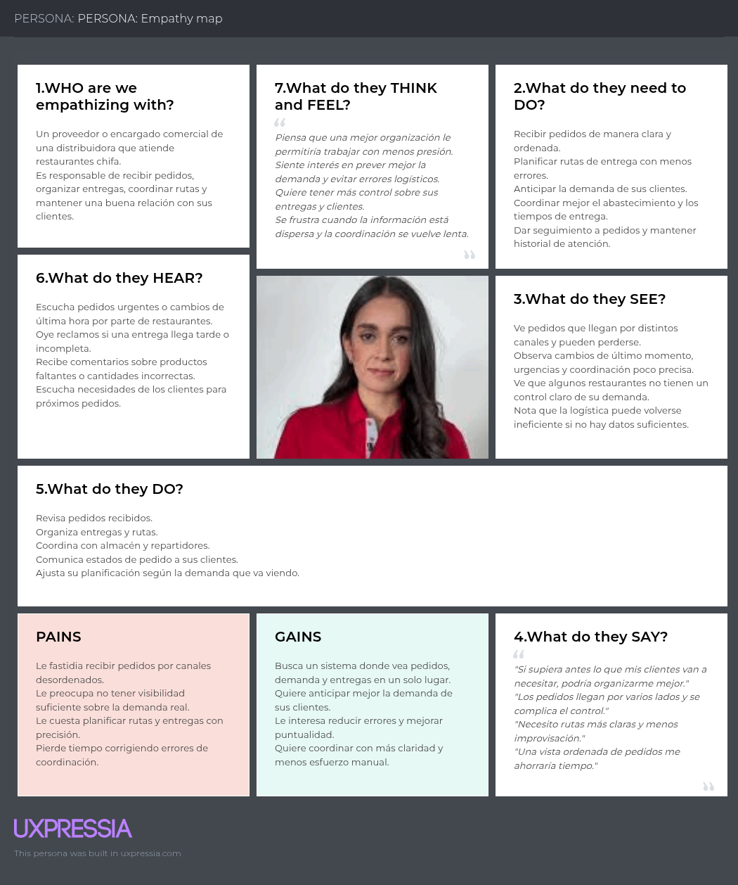
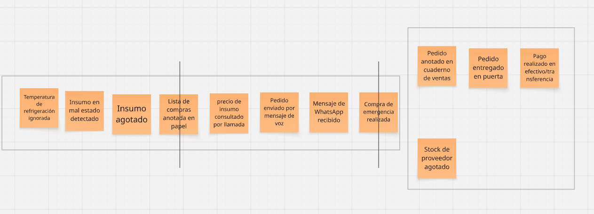
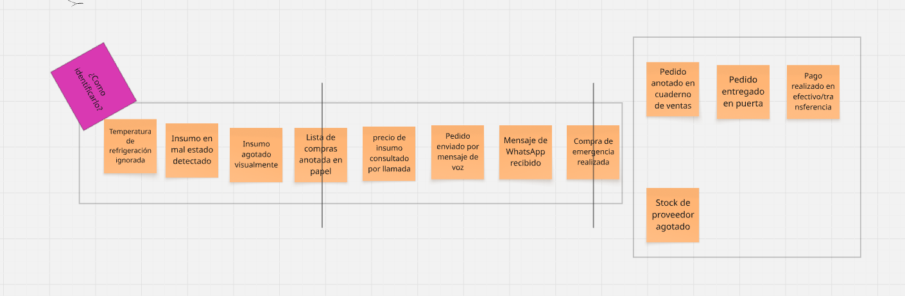

# Capítulo II: Requirements Elicitation & Analysis.

## 2.1. Competidores

En esta sección se realizará un análisis competitivo sobre distintas plataformas de gestión de restaurantes y proveedores que se encuentran en el mercado, que cumplan funciones similares a nosotros. De esta manera podremos conocer nuestra posición frente a posibles competidores.

Las siguientes plataformas son de las más relevantes en el mercado de gestión de restaurantes y proveedores, cada una con enfoques y características distintas que las hacen destacar en diferentes aspectos del sector:

**1. Apicbase**

- Es un sistema operativo para la gestión de alimentos y bebidas diseñado específicamente para operaciones multi-unidad, como cadenas de restaurantes y hoteles. Unifica recetas, menús y compras en todos los locales, asegurando consistencia en la calidad y los costos e incluye módulos avanzados para trazabilidad de ingredientes, gestión de alérgenos y cumplimiento de normas HACCP (Apicbase, s.f.)[^c2-1].

**2. MarketMan**

- Plataforma "todo en uno" para el control de inventarios y suministros, ideal para optimizar los flujos de trabajo administrativos (back-of-house). Utiliza análisis predictivos para automatizar pedidos a proveedores y detectar fluctuaciones de precios en tiempo real y calcula el costo exacto de cada plato integrando las facturas de compra con las ventas del punto de venta (TPV) (MarketMan, s.f.)[^c2-2].

**3. WISK.ai**

- App móvil que se destaca por su precisión técnica, ofreciendo una de las soluciones de inventario más rápidas y precisas del mercado gracias al uso intensivo de inteligencia artificial. Su app móvil puede identificar botellas y productos mediante la cámara, agilizando el conteo de existencias, ofrece herramientas muy detalladas para bares y hoteles, permitiendo un seguimiento exacto de mermas en licores y bebidas mezcladas y su IA puede predecir la demanda basándose no solo en ventas pasadas, sino también en factores externos como el clima o eventos locales (WISK.ai, s.f.)[^c2-3].

**4. Restaurant365**

- Plataforma de gestión empresarial integral basada en la nube, diseñada específicamente para el sector de la hospitalidad. Incluye una red contable específica para restaurantes que automatiza facturas, cuentas por pagar y conciliaciones bancarias, permite rastrear ingredientes en tiempo real, gestionar pedidos automáticos a proveedores y analizar el costo teórico frente al real para reducir mermas, utiliza IA para predecir la demanda futura, optimizar los horarios de trabajo y generar informes de pérdidas y ganancias (P&L) en tiempo real y se integra con cientos de sistemas de punto de venta (TPV/POS), bancos y proveedores de alimentos para que los datos fluyan automáticamente sin necesidad de hojas de cálculo manuales (Restaurant365, s.f.)[^c2-4].

### 2.1.1. Análisis Competitivo

**Competitive Analysis Landscape**

*¿Porqué llevar a cabo este análisis?*
El objetivo de este análisis es identificar las fortalezas, debilidades, oportunidades y amenazas del entorno competitivo en el sector de gestión de resturantes y proveedores, con el fin de definir la ventaja competitiva de SupplyWok frente a las alternativas existentes y orientar las estrategias de diferenciación e innovación.

| Categoría | Subcategoría | SupplyWok   | Apicbase   | MarketMan   | WISK.ai   | Restaurant365   |
|---|---|---|---|---|---|---|
| **Perfil** | Overview | Plataforma web que optimiza y agiliza la gestión operativa y de abastecimiento en restaurantes tipo chifa mediante soluciones tecnológicas inteligentes. | Plataformaa basada en la nube diseñada para centralizar la gestión de alimentos y bebidas en cadenas de restaurantes y hoteles. | Plataforma basada en la nube especializada en automatizar el inventario y las compras para restaurantes, conectando el almacén directamente con los proveedores. | Plataforma basada en IA que se especializa en la gestión ultraprecisa de inventarios, usando reconocimiento de imágen para agilizar el conteo de existencias mediante el móvil. | Plataforma de gestión empresarial que unifica en un solo sistema la contabilidad, el control de inventarios, las compras y la gestión del personal. |
| **Perfil** | Ventaja competitiva ¿Qué valor ofrece a los clientes? | Plataforma centralizada y escalable que optimiza la cadena de suministro mediante analítica predictiva, garantizando eficiencia operativa, prevención de accidentes y una colaboración inteligente entre restaurantes y proveedores para una gestión sostenible. | Gestión centralizada de recetas y menús para múltiples locales, con enfoque en trazabilidad alimentaria, control de alérgenos y estandarización de la producción a gran escala. | Automatización integral del inventario y compras que utiliza análisis predictivos para sugerir pedidos, detectar variaciones de precios y maximizar la rentabilidad operativa. | Control de inventario ultrapeciso mediante inteligencia artificial y reconocimiento visual, especializado en la reducción de mermas y optimización de costos en bebidas y licores. | Sistema ERP unificado que integra contabilidad financiera, inventarios y gestión de personal, conectando el flujo de caja con la operación diaria en una sola plataforma. |
| **Perfil de Marketing** | Mercado objetivo | Restaurantes de gastronomía peruano-china (chifas), aquellos con una operación moderada a alta complejidad que enfrentan retos críticos en la frescura de insumos y seguridad laboral. | Grupos de hospitalidad, hoteles y empresas de catering. Negocios con múltiples unidades y cocinas centrales que necesitan estandarizar recetas y producción a gran escala. | Restaurantes individuales y pequeñas cadenas enfocados principalmente en gestión de alimentos. | Establecimientos con un alto volumen de bebidas, como bares, clubes nocturnos y restaurantes de alta gama. | Operadores de nivel empresarial y franquicias que requieren una solución contable robusta. |
| **Perfil de Marketing** | Estrategias de marketing | Promocionar el uso de sensores IoT, contenido especializado en seguridad y prevención de riegos en cocina, y co-marketing con proveedores de insumos orientales. | Contenido educativo profundo, usando una biblioteca técnica para profesionales F&B, marketing basado en casos de éxito y enfoque emocional para chefs. | Estrategia de Co-Marketing, colaborando con socios tecnológicos, SEO y guías prácticas y prueba social masiva. | Marketing de comparación con otros competidores, calculadoras de ROI y lead magnets gratuitos. | Webinars de nivel eje ejecutivo, eventos de grandes franquicias y networking y marketing de datos unificados. |
| **Perfil de Producto** | Productos & Servicios | Gestión de inventario, comandas y abastecimiento, monitoreo de seguridad en cocina mediante sensores, analítica predictiva para demanda y alertas de bajo stock. | Gestión de recetas y menús, planificación de producción, módulo de inventario, trazabilidad de alérgenos, ventas y analítica. | Gestión de compras, escaneo de facturas, control de inventario, alertas de precios y libro de cocina digital. | Inventario de bebidas (Bar), base de datos global para licores y vinos, inteligencia de pedidos y análisis de costos. | Contabilidad, gestión de mano de obra, inventario y recetas, reporting empresarial y servicios de nómina. |
| **Perfil de Producto** | Precios & costos | Modelo de Suscripción; Wok: S/ 119.99 al mes por ubicación. Wok Enterprise: Precio personalizado según necesidades y tamaño del cliente. | Modelo de Suscripción; Basic: $265 aprox. al mes por establecimiento | Modelo de Suscripción; Starter: Desde $199 al mes. Crecimiento: Desde $299 al mes. | Modelo de Suscripción; Essentials: Desde $189 al mes. Professional: Desde $249 al mes. Premium: Desde $499 al mes. | Modelo de Suscripción; Eseential: Desde $399 o $435 al mes por ubicación. Professional: Aproximadamente $635 al mes. |
| **Perfil de Producto** | Canales y distribución (Web y/o móvil) | Web (Escritorio) y móvil. | Web (Escritorio) y móvil. | Web (Escritorio) y móvil (iOS y Android). | Web (Escritorio) y móvil (iOS y Android). | Web (Escritorio) y móvil (iOS y Android). |
| **Análisis SWOT** | Fortalezas | Diferenciador de seguridad, visión colaborativa y enfoque de sostenibilidad y escalabilidad. | Gestión visual de recetas de altísima calidad y control estricto de alérgenos/HACCP. | Enorme red de proveedores ya integrados y facilidad para escanear facturas. | Tecnología de escaneo de botellas y uso de IA para predecir demanda externa. | Unificación total de contabilidad, nómina y operación en un solo sistema financiero. |
| **Análisis SWOT** | Debilidades | Barrera tecnológica inicial, dependencia de la data del proveedor y recursos de desarrollo. | Curva de aprendizaje elevada y precio alto para restaurantes individuales | Interfaz móvil no tan intuitiva respecto a la competencia | Enfoque limitado a bebidas, la gestión de alimentos no es tan robusta como la de Apicbase. | Implementación extremedamente costosa y lenta, con un enfoque más contable que operativo. |
| **Análisis SWOT** | Oportunidades | Nicho Especilizado (Chifas), crecimiento del sector en Latinoamérica y datos para el sector objetivo. | Expansión en el sector hotelero de lujo y grandes canteras de catering. | Integración con sistemas de pago para el proceso directo de compras. | Convertirse en el estándar para auditorías de inventario en bares de alta gama y casinos. | Adquisición de plataformas más pequeñas para dominar el mercado de franquicias. |
| **Análisis SWOT** | Amenazas | Competencia consolidada de grandes empresas, inestabilidad económica en Latinoamérica y resistencia al cambio cultural | Nuevos competidores con interfaces más ágiles y menos burocráticas como SupplyWok. | Pérdida de mercado frente a soluciones especializadas en nichos (como SupplyWok). | Que los sistemas de Punto de Venta (TPV) desarrollen sus propios escáneres nativos. | Software de contabilidad general, como QuickBook, que mejoren sus módulos de restaurante. |

*Tabla 3. Análisis Competitivo*

### 2.1.2. Estrategias y tácticas frente a competidores

| **Estrategia / Táctica**                 | **Descripción**                                                                                                                                                     |  
|:-----------------------------------------|:--------------------------------------------------------------------------------------------------------------------------------------------------------------------|
| **Módulo de Seguridad Activa**           | Implementar "Checklists de Seguridad" en cocina obligatorios al abrir/cerrar turnos.                                                                                | 
| **Marketing Segmentado**                 | Diseñar campañas digitales en redes sociales, enfocadas en restaurantes peruano-chino (chifa), destacando el impacto innovador en sus negocios y el costo moderado. | 
| **Coordinación con Proveedores Locales** | Crear un portal simple (no gratuito) para los proveedores locales, facilitando el envío de pedidos mediante canales digitales.                                      | 
| **Pago por Local Escalable**             | Modelo de suscripción "Pay as you grow", ofreciendo precios accesibles para chifas de barrio, pero que escala con funciones avanzadas para cadenas grandes.         |
| **Rotación de Mesas**                    | Uso de sensores para calcular el promedio de ocupación. Si una mesa está libre, el sistema alerta al anfitrión o actualiza la app.                                  |

*Tabla 4. Estrategias y tácticas frente a competidores*

## 2.2. Entrevistas

### 2.2.1. Diseño de entrevistas

Para comprender mejor a nuestros usuarios y construir arquetipos representativos, diseñamos preguntas para las entrevistas de los dos segmentos objetivos identificados.

**Segmento 1: Dueños de restaurantes chifa y administradores**

**Objetivo de la entrevista:** Identificar cómo gestionan actualmente su inventario, abastecimiento, control operativo y monitoreo de procesos internos; además de reconocer sus principales frustraciones, necesidades y disposición para adoptar una plataforma digital con servicios IoT que les ayude a mejorar la toma de decisiones.

**Preguntas:**
- ¿Cuál es su nombre, edad y distrito donde se ubica su restaurante?
- ¿Cuál es su cargo o rol dentro del negocio?
- ¿Hace cuánto tiempo administra o trabaja en el restaurante?
- ¿Qué tipo de insumos manejan con mayor frecuencia en su operación?
- ¿Cómo realizan actualmente el control de inventario y el registro de stock?
- ¿Qué dificultades enfrenta al momento de prever la demanda de insumos o platos?
- ¿Con qué frecuencia tiene problemas de sobrestock o desabastecimiento?
- ¿Cómo coordinan actualmente los pedidos con sus proveedores?
- ¿Qué información considera más útil para tomar decisiones sobre abastecimiento?
- ¿Qué tan importante sería para usted recibir alertas automáticas sobre bajo stock?
- ¿Le sería útil visualizar proyecciones de demanda antes de hacer pedidos?
- ¿Qué tan dispuesto estaría a usar una plataforma web para controlar inventario, pedidos y monitoreo operativo?
- ¿Cuál de las siguientes funcionalidades considera más importante en una herramienta de este tipo? (Control de inventario alertas de stock bajo, registro de pedidos a proveedores, proyección de demanda, monitoreo de temperatura)
- ¿Qué le fastidia de la manera actual de gestionar la operación del restaurante?
- ¿Qué tan seguido cree que usaría una plataforma como esta: diario, semanal o solo cuando tenga problemas?

**Preguntas complementarias:**
- ¿Qué herramientas digitales usa actualmente para el negocio?
- ¿Qué redes sociales usa con mayor frecuencia?
- ¿Ha usado sensores o sistemas de monitoreo en su restaurante?
- ¿Qué tan cómodo se siente usando smartphones o aplicaciones móviles?

**Segmento 2: Proveedores de insumos para restaurantes**

**Objetivo de la entrevista:** Comprender cómo gestionan sus entregas, cómo se coordinan con sus clientes y qué información les sería útil para planificar mejor su abastecimiento, rutas y atención comercial a través de una plataforma digital.

**Preguntas:**
- ¿Cuál es su nombre, edad y tipo de negocio?
- ¿Qué productos o insumos distribuye a restaurantes?
- ¿Cuánto tiempo lleva trabajando como proveedor?
- ¿Cómo coordina actualmente los pedidos con sus clientes?
- ¿Qué canales usa para recibir pedidos o solicitudes de abastecimiento?
- ¿Qué dificultades enfrenta al planificar entregas o rutas?
- ¿Qué tan frecuente es que reciba pedidos imprevistos o urgentes?
- ¿Qué información le sería útil para anticipar la demanda de sus clientes?
- ¿Le ayudaría visualizar pedidos pendientes o proyecciones de compra?
- ¿Qué tan importante sería para usted conocer el consumo o stock aproximado de sus clientes?
- ¿Qué funcionalidades considera más valiosas en una plataforma para proveedores?
- ¿Qué le frustra de la forma actual de coordinar entregas y abastecimiento?
- ¿Qué tan dispuesto estaría a usar una plataforma digital para gestionar clientes y pedidos?
- ¿Con qué frecuencia cree que usaría una herramienta como esta?

**Preguntas complementarias:**
- ¿Qué herramientas usa hoy para organizar sus rutas o pedidos?
- ¿Usa algún sistema para seguimiento de entregas?
- ¿Qué datos le gustaría consultar antes de salir a repartir?
- ¿Cómo se podría usar una herramienta digital para mejorar la coordinación con restaurantes?

**Preguntas transversales para ambos segmentos**
- ¿Qué problemas considera más urgentes dentro de la operación actual?
- ¿Qué beneficios esperaría obtener de una plataforma como SupplyWok?
- ¿Qué tan importante sería para usted que la información esté centralizada en un solo lugar?
- ¿Qué tipo de reportes o indicadores le ayudarían más en su trabajo diario?
- ¿Qué tan útil le parecería una solución que combine gestión de inventario, pedidos, alertas y monitoreo operativo?
- ¿Qué preocupaciones tendría al usar una nueva plataforma digital para su negocio?
### 2.2.2. Registro de entrevistas.

#### Segmento #1: Dueños de restaurantes chifa y administradores
- **Entrevista #1**

**Resumen de entrevista:**

Ana Chen, dueña de un chifa en La Perla (Callao) con 22 años de experiencia, gestiona su restaurante basándose principalmente en su experiencia y cálculo mental, especialmente para el manejo de inventario y abastecimiento de insumos como pollo, verduras y otros productos. No utiliza herramientas digitales ni considera necesarias funciones como alertas de stock o predicción de demanda, ya que confía en su conocimiento práctico y en la compra diaria según precios y necesidades. Actualmente realiza pedidos de forma directa (llamadas) y percibe que una plataforma podría complicar su proceso. Sin embargo, muestra cierto interés en herramientas orientadas a atraer más clientes, como una mejor presentación del menú, y solo usaría una solución digital en casos puntuales cuando lo considere necesario.

 

| Detalle          | Información                                |
|------------------|--------------------------------------------|
| **Entrevistador** | Juan Sung Jau Wang Chen            |
| **Entrevistado**  | Ana Chen                |
| **Edad**          | 50 años                                    |
| **Ubicacion**     | La Perla, Callao                             |
| **Duración / Empieza en**      | 7:38 minutos / 0:19                           |
| **Enlace**        | [Ver entrevista](https://upcedupe-my.sharepoint.com/:v:/g/personal/u202318609_upc_edu_pe/IQDQHa7uwWb0SpGufV03qReqAdJZ63c91J2peSXSFxW63_U?e=CLpwrJ) |

*Tabla 5. Entrevista 1*

- **Entrevista #2**

**Resumen de entrevista:**

El entrevistado Weiquan Wang, un cocinero y dueño de un chifa en La Perla (Callao) con aproximadamente 20 años de experiencia, gestiona su restaurante de forma muy tradicional, basándose principalmente en la compra directa y la comunicación por teléfono con proveedores. No lleva un control formal de inventario y suele darse cuenta de la falta de insumos cada pocos días, lo que genera problemas recurrentes de abastecimiento. Muestra interés en herramientas digitales, reconoce que sería útil contar con alertas de stock y sistemas que indiquen cuánto comprar, especialmente para evitar faltantes. También considera importante mejorar la rapidez en la entrega de pedidos y estaría dispuesto a usar una plataforma diariamente si esta le ayudara a resolver estos problemas de manera automática y sencilla.

 

| Detalle          | Información                                |
|------------------|--------------------------------------------|
| **Entrevistador** | Juan Sung Jau Wang Chen            |
| **Entrevistado**  | Weiquan Wang               |
| **Edad**          | 55 años                                    |
| **Ubicacion**     | La Perla, Callao                             |
| **Duración / Empieza en**      | 8:46 minutos / 0:20                 |
| **Enlace**        | [Ver entrevista](https://upcedupe-my.sharepoint.com/:v:/g/personal/u202318609_upc_edu_pe/IQDEAnd2qgv5RrhlW47RT0uwAeMEyqi6KVvTeeECfeDlJLw?nav=eyJyZWZlcnJhbEluZm8iOnsicmVmZXJyYWxBcHAiOiJTdHJlYW1XZWJBcHAiLCJyZWZlcnJhbFZpZXciOiJTaGFyZURpYWxvZy1MaW5rIiwicmVmZXJyYWxBcHBQbGF0Zm9ybSI6IldlYiIsInJlZmVycmFsTW9kZSI6InZpZXcifX0%3D&e=ftyrCl) |

*Tabla 6. Entrevista 2*

- **Entrevista #3**

**Resumen de entrevista:**

La entrevistada, Lili (54 años), dueña y encargada de cocina de un chifa con 10 años de experiencia, gestiona su restaurante de manera empírica, sin un control formal de inventario, revisando manualmente y comprando cuando nota que faltan insumos como carne, pollo, verduras y bebidas. Coordina los pedidos principalmente por llamadas y, en ocasiones, debe ir personalmente a adquirir los productos. No percibe grandes dificultades en su operación diaria, aunque reconoce que todo el proceso puede resultar molesto. A diferencia de otros casos, muestra apertura hacia una solución digital: considera importante recibir alertas de stock bajo y ve útil contar con proyecciones de demanda para planificar compras. Estaría dispuesta a usar una plataforma que automatice estas funciones y acepte diversas herramientas (inventario, pedidos, predicción), utilizándola de forma frecuente si le facilita la gestión del negocio.

 

| Detalle          | Información                                |
|------------------|--------------------------------------------|
| **Entrevistador** | Juan Sung Jau Wang Chen            |
| **Entrevistado**  | Lily 蔡                |
| **Edad**          | 54 años                |
| **Ubicacion**     | La Perla, Callao       |
| **Duración / Empieza en**      | 12:49 minutos / 0:36  |
| **Enlace**        | [Ver entrevista](https://upcedupe-my.sharepoint.com/personal/u202318609_upc_edu_pe/_layouts/15/stream.aspx?id=%2Fpersonal%2Fu202318609%5Fupc%5Fedu%5Fpe%2FDocuments%2Fentrevista3%2Downers%201%2Emov&nav=eyJyZWZlcnJhbEluZm8iOnsicmVmZXJyYWxBcHAiOiJTdHJlYW1XZWJBcHAiLCJyZWZlcnJhbFZpZXciOiJTaGFyZURpYWxvZy1MaW5rIiwicmVmZXJyYWxBcHBQbGF0Zm9ybSI6IldlYiIsInJlZmVycmFsTW9kZSI6InZpZXcifX0&ga=1&referrer=StreamWebApp%2EWeb&referrerScenario=AddressBarCopied%2Eview%2Ec4f1f5f8%2Db63d%2D4413%2D84a5%2Dd4920163ad74) |

*Tabla 7. Entrevista 3*
<!-- Segmento objetivo: Proveedores-->
#### Segmento #2: Proveedores de insumos para restaurantes
- **Entrevista #1**

**Resumen de entrevista:**

El entrevistado, Alberto Copa Villa (37 años, La Perla – Callao), es un proveedor de carne y pollo con 7 años de experiencia que gestiona sus pedidos principalmente por WhatsApp. Su trabajo es inmediato y diario, ya que los restaurantes compran para el momento, lo que genera como principal problema que muchos clientes pidan tarde, dificultando la disponibilidad de productos y su organización. No muestra interés en herramientas de predicción de demanda ni en conocer el consumo o stock de sus clientes, ya que considera que el consumo es constante. Sin embargo, sí valora una solución digital simple que le permita visualizar pedidos pendientes y recibir recordatorios o alertas, con el fin de evitar olvidos y mejorar su gestión diaria.
 

| Detalle          | Información                                |
|------------------|--------------------------------------------|
| **Entrevistador** | Juan Sung Jau Wang Chen            |
| **Entrevistado**  | Alberto Copa Villa                |
| **Edad**          | 37 años                                    |
| **Ubicacion**     | La Perla, Callao                             |
| **Duración / Empieza en**      | 5:26 minutos / 0:31                           |
| **Enlace**        | [Ver entrevista](https://upcedupe-my.sharepoint.com/:v:/g/personal/u202318609_upc_edu_pe/IQAz-yZWPjdaTYEhhCMiX-lwAbe6dgRCmz--mI4NhxnP9zk?e=bCvRPf&nav=eyJyZWZlcnJhbEluZm8iOnsicmVmZXJyYWxBcHAiOiJTdHJlYW1XZWJBcHAiLCJyZWZlcnJhbFZpZXciOiJTaGFyZURpYWxvZy1MaW5rIiwicmVmZXJyYWxBcHBQbGF0Zm9ybSI6IldlYiIsInJlZmVycmFsTW9kZSI6InZpZXcifX0%3D) |

*Tabla 8. Entrevista 4*

### 2.2.3 Análisis de entrevistas.

El análisis de las entrevistas realizadas permite identificar patrones claros en los dos segmentos objetivo de SupplyWok: dueños de restaurantes chifa y proveedores. A partir de las entrevistas, se evidencian tanto comportamientos comunes como diferencias en la adopción tecnológica, sustentados en la frecuencia de respuestas observadas.

#### Segmento 1: Dueños de restaurantes chifa y administradores

Este segmento agrupa a propietarios con amplia experiencia (entre 10 y 22 años en los casos entrevistados), quienes gestionan sus negocios de manera empírica.

##### Gestión del Inventario
El 100% de los entrevistados indicó que no utiliza sistemas formales de inventario, dependiendo de la memoria o revisión visual. Esto genera situaciones donde los insumos se acaban sin planificación previa, obligando a compras reactivas.

##### Abastecimiento y compras
El 100% realiza compras diarias o frecuentes, basándose en la demanda inmediata o en variaciones de precios (especialmente en productos como el pollo). No existe planificación a mediano plazo.

##### Canales de comunicación
El 100% coordina pedidos mediante llamadas telefónicas, manteniendo procesos tradicionales.

##### Percepción de problemas
Aproximadamente el 66% reconoce problemas operativos, como falta de insumos o retrasos en abastecimiento, aunque algunos los consideran parte normal del negocio. El 34% restante percibe su operación como estable, pese a no tener control estructurado.

##### Adopción tecnológica
Se identifican dos subgrupos:

- **Resistentes (≈33%)**: consideran innecesarias las herramientas digitales y prefieren métodos tradicionales.
- **Abiertos (≈67%)**: muestran interés en soluciones si estas simplifican su trabajo.

##### Funcionalidades de interés
- El 67% valora alertas de stock bajo y herramientas que automaticen el cálculo de compras.  
- Un 66% considera útil la predicción de demanda, especialmente para evitar faltantes.

#### Segmento 2: Proveedores de insumos

Este segmento incluye proveedores con experiencia (ej. 7 años), que operan en entornos de alta inmediatez.

##### Gestión de pedidos
El 100% recibe pedidos mediante WhatsApp, lo que genera desorden y dependencia de mensajes informales.

##### Problemas principales
El 100% identifica como principal dificultad los pedidos tardíos, lo que afecta la planificación y disponibilidad de productos.

##### Planificación de demanda
El 100% indica que no puede anticipar la demanda, debido a que los restaurantes compran para el momento.

##### Necesidades tecnológicas
El 100% muestra interés en herramientas simples, especialmente:

- Visualización de pedidos pendientes  
- Recordatorios o alertas  

Sin embargo, el 0% muestra interés en analítica avanzada o predicciones complejas.

#### Conclusiones para el diseño de arquetipos

##### Automatización simple y práctica
Dado que el 100% de restaurantes no usa sistemas formales, la plataforma debe automatizar procesos sin requerir esfuerzo adicional del usuario.

##### Diferenciación de valor por segmento
- **Restaurantes**: valoran evitar faltantes y facilitar decisiones de compra.  
- **Proveedores**: necesitan orden en los pedidos y anticipación.

##### Reducción de fricción
El sistema debe reemplazar llamadas y WhatsApp (usados por el 100%) con una solución igual de rápida, pero estructurada.

##### Oportunidad clave
Existe una adopción potencial en el ≈67% de restaurantes, siempre que la solución sea simple, directa y no complique su operación.

## 2.3. Needfinding.

### 2.3.1. User Personas.

- **Segmento objetivo 1: Dueños de restaurantes chifa y administradores**

*Ilustración. User Persona dueños de restaurantes chifa y administradores*

- **Segmento objetivo 2: Proveedores de insumos para restaurantes**

*Ilustración. User Persona proveedores de insumos para restaurantes*

### 2.3.2. User Task Matrix.

En la siguiente matriz se comparan las principales tareas que realizan los dos User Personas considerados en el proyecto. Para cada tarea se indica la frecuencia y la importancia relativa según el segmento, buscando evidenciar coincidencias, diferencias operativas y prioridades antes de la existencia de la solución propuesta.

| User Task | Dueños y administradores de chifa Frecuencia | Dueños y administradores de chifa Importancia | Proveedores de insumos Frecuencia | Proveedores de insumos Importancia |
|---|---|---|---|---|
| Registrar y actualizar el inventario de insumos del restaurante | Alta | Alta | Baja | Media |
| Monitorear el stock de productos críticos en almacén | Alta | Alta | Baja | Media |
| Detectar a tiempo cuándo un insumo está por agotarse para prevenir desabastecimiento | Alta | Alta | Media | Alta |
| Controlar las comandas y el estado de atención de los pedidos | Alta | Alta | Baja | Baja |
| Supervisar la demanda estimada de platos e insumos | Media | Alta | Media | Alta |
| Supervisar las condiciones de conservación de insumos | Alta | Alta | Baja | Media |
| Identificar posibles riesgos operativos o de seguridad en cocina | Media | Alta | Baja | Baja |
| Coordinar pedidos de abastecimiento con proveedores | Media | Alta | Alta | Alta |
| Consultar el historial de pedidos y consumo de insumos | Media | Media | Media | Media |
| Revisar el flujo de clientela en mesa para apoyar la proyección de demanda | Alta | Alta | Baja | Baja |
| Tomar decisiones de compra y abastecimiento con base en datos | Media | Alta | Media | Alta |
| Mantenerse informado sobre eventos críticos de la operación | Alta | Alta | Media | Alta |
| Registrar y gestionar pedidos recibidos de los restaurantes | Baja | Media | Alta | Alta |
| Consultar el estado de los pedidos y su historial | Media | Alta | Alta | Alta |
| Planificar rutas de entrega según pedidos y ubicaciones | Baja | Media | Media | Alta |
| Coordinar entregas con mayor anticipación y precisión | Baja | Media | Media | Alta |
| Monitorear información relacionada con el abastecimiento de sus clientes | Baja | Media | Media | Alta |
| Identificar necesidades de reposición según consumo estimado | Media | Alta | Media | Alta |
| Consultar alertas o cambios relevantes en los pedidos | Media | Alta | Alta | Alta |
| Revisar patrones de compra de los restaurantes atendidos | Baja | Media | Media | Media |
| Organizar su operación logística en función de la demanda prevista | Baja | Media | Media | Alta |
| Mejorar la puntualidad y eficiencia en las entregas | Baja | Media | Alta | Alta |
| Mantener comunicación más clara con los restaurantes sobre pedidos y abastecimiento | Media | Alta | Alta | Alta |

*Tabla 9. User Task Matrix comparativo para los segmentos objetivo de SupplyWok*

### 2.3.3. User Journey Mapping.

En esta sección se presentan los User Journey Maps en su versión As-Is para cada segmento objetivo. Estos mapas resumen el recorrido actual de los usuarios en la gestión de sus tareas más relevantes, desde la identificación de una necesidad hasta la resolución manual de sus actividades, permitiendo visualizar pasos, fricciones, puntos de dolor y oportunidades de mejora antes de la intervención de SupplyWok.

- **Segmento objetivo 1: Dueños de restaurantes chifa y administradores**

*Ilustración. User Journey Mapping - Segmento 1*  

- **Segmento objetivo 2: Proveedores de insumos para restaurantes**

*Ilustración. User Journey Mapping - Segmento 2*  

### 2.3.4. Empathy Mapping.

Los siguientes Empathy Maps fueron elaborados a partir de las observaciones extraídas de las entrevistas y organizan, para cada User Persona, lo que el usuario dice, piensa, hace y siente en su contexto actual. Este artefacto permite profundizar en sus pains, gains, preocupaciones y motivaciones, facilitando una comprensión más humana del problema y orientando mejor las decisiones posteriores de diseño.

- **Segmento objetivo 1: Dueños de restaurantes chifa y administradores**

*Ilustración. Empathy Map - Segmento 1*  

- **Segmento objetivo 2: Proveedores de insumos para restaurantes**

*Ilustración. Empathy Map - Segmento 2*  

### 2.3.5. As-Is Scenario Maps.

En esta sección se presentan los escenarios actuales de los usuarios objetivo antes de la existencia de SupplyWok. Cada As-Is Scenario Map organiza el flujo de trabajo en fases y muestra qué hace, piensa, dice y siente el usuario mientras intenta completar una tarea relevante en su contexto actual.

- **Segmento objetivo 1: Dueños de restaurantes chifa y administradores**

| Phase | Doing | Thinking | Saying | Feeling |
|---|---|---|---|---|
| **1. Detect shortage** | Revisa visualmente cocina, almacén o zona de preparación para verificar qué insumos quedan disponibles. | "¿Todavía alcanza para hoy o ya me voy a quedar corto?" | "Falta pollo" / "Ya casi no queda verdura." | Preocupación, urgencia |
| **2. Estimate need** | Calcula mentalmente cuánto insumo necesita según experiencia, flujo de clientes o lo que espera vender ese día. | "Tengo que comprar lo justo para no quedarme sin nada, pero tampoco gastar de más." | "Con esto debería aguantar hasta la tarde." | Incertidumbre, presión |
| **3. Contact supplier** | Llama o envía mensajes a uno o más proveedores para consultar disponibilidad, precio y tiempo de entrega. | "Ojalá tengan producto y puedan traerlo rápido." | "¿Tienes pollo?" / "¿A cuánto está hoy?" | Dependencia, apuro |
| **4. Decide purchase** | Define qué comprar y en qué cantidad con la información parcial que obtuvo. | "Si compro poco, me vuelvo a quedar corto; si compro mucho, se puede perder." | "Mándame lo de siempre" / "Tráeme un poco más." | Duda, tensión |
| **5. Wait or resolve manually** | Coordina entrega, espera respuesta o decide salir personalmente a comprar para no detener la operación. | "No puedo esperar demasiado porque la cocina sigue trabajando." | "Si no llega, tendré que salir yo mismo." | Estrés, frustración |
| **6. Continue operation** | Ajusta platos, ritmo de cocina o decisiones de compra mientras espera el abastecimiento. | "Tengo que seguir atendiendo aunque no tenga todo controlado." | "Hoy tendremos que reemplazar este insumo." | Cansancio, resignación |

**Pain Points identificados:** detección tardía de faltantes, cálculo empírico de compras, dependencia de llamadas o mensajes dispersos, poca visibilidad del stock y decisiones reactivas bajo presión.

**Oportunidades de diseño:** alertas tempranas, visibilidad centralizada del inventario, apoyo para decidir cantidades de compra y coordinación digital más ordenada con proveedores.

*Tabla 10. As-Is Scenario Map para dueños y administradores de restaurantes chifa*

- **Segmento objetivo 2: Proveedores de insumos para restaurantes**

| Phase | Doing | Thinking | Saying | Feeling |
|---|---|---|---|---|
| **1. Receive requests** | Revisa llamadas o mensajes de WhatsApp para identificar qué cliente pidió, qué necesita y para cuándo lo requiere. | "Otra vez están pidiendo a última hora." | "¿Qué te falta?" / "¿Para cuándo lo necesitas?" | Apuro, interrupción |
| **2. Check availability** | Verifica manualmente si tiene stock suficiente para responder al pedido. | "Tengo que ver si me alcanza para todos." | "Sí tengo" / "Solo me queda cierta cantidad." | Tensión, cálculo rápido |
| **3. Prioritize orders** | Ordena mentalmente los pedidos según urgencia, cercanía o cliente habitual. | "Primero debo atender al que lo necesita ya o al que siempre compra." | "Voy a salir primero por esa zona." | Presión, responsabilidad |
| **4. Organize delivery** | Define de manera informal la ruta o secuencia de entregas del día. | "Si me atraso en una entrega, se me desordena todo." | "Primero paso por Callao, luego por Lima." | Carga operativa |
| **5. Confirm with clients** | Confirma disponibilidad, hora estimada o ajustes de cantidad con los restaurantes. | "Tengo que avisar si no podré cumplir exactamente lo que pidieron." | "Te lo llevo en una hora" / "Solo puedo mandarte esta cantidad." | Incomodidad, negociación |
| **6. Deliver and react** | Realiza las entregas y resuelve sobre la marcha cambios, retrasos o nuevos pedidos urgentes. | "Todo cambia rápido y tengo que adaptarme en el momento." | "Estoy en camino" / "Espérame unos minutos más." | Estrés, improvisación |

**Pain Points identificados:** pedidos tardíos, coordinación fragmentada en mensajes, priorización manual, rutas improvisadas y escasa visibilidad de la demanda futura.

**Oportunidades de diseño:** consolidación de pedidos, visibilidad de órdenes pendientes, alertas de prioridad, planificación básica de rutas y referencia anticipada de demanda.

*Tabla 11. As-Is Scenario Map para proveedores de insumos para restaurantes*

## 2.4. Big Picture EventStorming.

En esta sección se introduce y resume el proceso colaborativo realizado por el equipo Aurora para el descubrimiento del dominio del negocio. El objetivo primordial de esta actividad fue lograr una comprensión integral del ecosistema de gestión y abastecimiento de los restaurantes tipo chifa, plasmando los eventos significativos y sus interacciones de manera visual.

A través de esta aproximación de alto nivel, el equipo exploró el panorama del negocio, lo cual permitió identificar procesos clave, al mismo tiempo que se expusieron potenciales problemas u oportunidades de mejora operativa. El proceso se desarrolló siguiendo una línea de tiempo narrativa, facilitando la identificación de puntos críticos y la delimitación de las fronteras lógicas de la solución propuesta.

#### Step 1: Unstructured Exploration

En esta fase inicial, todos los miembros del equipo generan eventos de dominio de forma libre, sin preocuparse por el orden ni la coherencia. Cada evento representa una acción relevante en el negocio, escrita en tiempo pasado (ej. "Pedido registrado", "Stock actualizado"). El objetivo es capturar el mayor volumen posible de eventos para construir una visión completa del dominio antes de estructurarlo.

*Ilustración. Big Picture Event Storming — Step 1: Exploración no estructurada*

#### Step 2: Structured Organization

Con el conjunto de eventos identificados, el equipo los organiza cronológicamente en una línea de tiempo narrativa. Se eliminan duplicados, se agrupan eventos relacionados y se identifican las relaciones causales entre ellos. Esta vista lineal permite detectar flujos principales del negocio y los primeros límites lógicos entre procesos.

*Ilustración. Big Picture Event Storming — Step 2: Organización estructurada*

#### Step 3: Pivotal points

Se identifican los eventos pivote: aquellos que marcan transiciones críticas en el negocio (ej. "Pedido confirmado por proveedor", "Alerta de stock crítico emitida"). Alrededor de estos eventos se trazan las fronteras de los Bounded Contexts, delimitando las responsabilidades de cada subdominio y sirviendo como base para la arquitectura del sistema.

*Ilustración. Big Picture Event Storming — Step 3: Pivotal points*

#### Step 4: Pain Points and Opportunities

El equipo marca sobre la línea de tiempo los puntos de fricción, cuellos de botella y oportunidades de mejora detectados. Estos "pain points" suelen concentrarse en transiciones entre actores o en procesos manuales que podrían automatizarse. Esta fase orienta las decisiones de diseño hacia las áreas de mayor impacto operativo.

*Ilustración. Big Picture Event Storming — Step 4: Pain Points and Opportunities*

## 2.5. Ubiquitous Language.

El Ubiquitous Language es el lenguaje compartido entre el equipo, los stakeholders y los usuarios del negocio. En SupplyWok se utilizarán términos del dominio expresados en inglés, con definiciones en español, para asegurar que los conceptos clave de inventario, abastecimiento, operación y coordinación entre restaurantes y proveedores mantengan un significado único y consistente en toda la solución.

### Cross-Domain Terms

| Term | Definición | Context |
|---|---|---|
| **User** | Persona registrada en la plataforma que interactúa con los módulos del sistema según su tipo de cuenta. | General |
| **Account** | Perfil asociado a un usuario, con sus datos de acceso, información de contacto y plan contratado. | General |
| **Role** | Función que determina el alcance operativo del usuario dentro de la plataforma, por ejemplo restaurant owner, administrator o supplier. | Access and responsibilities |
| **Restaurant** | Negocio gastronómico que administra insumos, pedidos, operación interna y relación con proveedores. | Business actor |
| **Supplier** | Persona o negocio que abastece productos o insumos a uno o varios restaurantes. | Business actor |
| **Client** | Restaurante atendido por un proveedor dentro de la relación comercial registrada en la plataforma. | Supplier domain |
| **Subscription Plan** | Plan comercial que define capacidad, beneficios y alcance funcional del servicio contratado. | Commercial model |
| **Notification** | Mensaje emitido por la plataforma para informar eventos relevantes, cambios de estado o situaciones urgentes. | General |

### Inventory and Supply Terms

| Term | Definición | Context |
|---|---|---|
| **Inventory** | Conjunto de insumos o productos disponibles para la operación del restaurante. | Inventory management |
| **Inventory Item** | Unidad registrada dentro del inventario, con nombre, categoría, cantidad, unidad y relación con proveedor. | Inventory management |
| **Stock** | Cantidad disponible de un producto o insumo en un momento determinado. | Inventory management |
| **Minimum Stock** | Cantidad mínima configurada para un producto antes de requerir reposición. | Inventory control |
| **Stock Threshold** | Valor de referencia utilizado para clasificar y monitorear niveles de stock. | Inventory control |
| **Low Stock** | Estado que indica que la cantidad disponible se aproxima al umbral mínimo configurado. | Inventory alerts |
| **Critical Stock** | Estado que indica que el stock alcanzó o superó el nivel de riesgo definido para reposición urgente. | Inventory alerts |
| **Inventory Movement** | Registro de entrada, salida o ajuste que modifica la cantidad disponible de un ítem. | Traceability |
| **Restocking** | Acción de reponer un insumo o producto cuando su disponibilidad resulta insuficiente. | Supply operation |
| **Purchase Order** | Solicitud formal emitida por un restaurante a un proveedor para abastecer determinados productos. | Supply operation |
| **Order Status** | Estado de avance de una orden, como pending, confirmed, in transit, delivered o canceled. | Order tracking |
| **Order History** | Registro de órdenes realizadas o recibidas, usado para consulta, seguimiento y análisis. | Traceability |
| **Estimated Delivery** | Fecha u hora esperada en la que una orden debe ser entregada. | Supply coordination |
| **Delivery Commitment** | Compromiso asumido por el proveedor respecto a la atención y entrega de una orden. | Supply coordination |

### Supplier Operations Terms

| Term | Definición | Context |
|---|---|---|
| **Product Catalog** | Catálogo de productos ofrecidos por un proveedor, incluyendo precio, unidad y condiciones asociadas. | Supplier management |
| **Delivery Conditions** | Condiciones comerciales u operativas bajo las cuales un proveedor realiza una entrega. | Supplier management |
| **Demand Forecast** | Proyección del consumo o requerimiento futuro de productos, usada para anticipar decisiones de compra o abastecimiento. | Forecasting |
| **Demand Outlook** | Vista resumida de la tendencia esperada de demanda para apoyar la planificación operativa. | Forecasting |
| **Delivery Route** | Secuencia planificada de entregas que organiza paradas, fechas y órdenes asociadas. | Delivery planning |
| **Service Zone** | Área geográfica dentro de la cual un proveedor atiende pedidos o distribuye productos. | Supplier management |
| **Urgent Request** | Solicitud que requiere atención prioritaria por cambios de última hora o riesgo de desabastecimiento. | Supplier alerts |
| **Rush Reorder** | Pedido urgente de reposición generado por una necesidad inmediata del restaurante. | Supplier alerts |

### Operational Monitoring Terms

| Term | Definición | Context |
|---|---|---|
| **Sensor** | Dispositivo que registra variables operativas del entorno, como temperatura o humedad. | IoT monitoring |
| **Sensor Reading** | Valor medido por un sensor en un momento específico y asociado a una ubicación o área. | IoT monitoring |
| **Safe Range** | Intervalo aceptable de valores para una variable operativa monitorizada. | IoT monitoring |
| **Risk Condition** | Situación en la que una lectura cae fuera del rango esperado y requiere atención. | IoT monitoring |
| **Alert** | Aviso generado por la plataforma cuando detecta una condición crítica o un cambio relevante. | Operational monitoring |
| **Alert History** | Registro acumulado de alertas emitidas y su estado de atención. | Operational monitoring |
| **Monitored Area** | Espacio físico del restaurante sujeto a supervisión mediante sensores o controles operativos. | IoT monitoring |

### Restaurant Operations Terms

| Term | Definición | Context |
|---|---|---|
| **Kitchen Ticket** | Instrucción operativa asociada a un pedido interno o de atención que debe ser procesado por cocina. | Kitchen operation |
| **Table** | Unidad física del salón donde se atiende a los clientes del restaurante. | Floor operation |
| **Table Occupancy** | Estado o nivel de uso de las mesas dentro del restaurante en un momento dado. | Floor operation |
| **Restricted Mode** | Configuración que limita el acceso a ciertas funciones para personal operativo distinto del owner o administrator. | Restaurant operation |

### Language Alignment Notes

- Estos términos deben utilizarse de manera consistente en documentación, diseño, frontend, backend y conversaciones del equipo.
- Solo se incluyen conceptos del dominio del negocio; términos de interfaz genérica o implementación técnica quedan fuera de este glosario.
- Si durante la evolución del producto aparece un nuevo concepto relevante del dominio, esta sección debe actualizarse para mantener coherencia.

[^1]: Apicbase. (s.f.). _Plataforma líder de gestión de F&B_. https://get.apicbase.com/es/

[^2]: MarketMan. (s.f.). _Software De Gestión De Inventario Para Restaurantes Para El Control De Costes Y La Eficiencia_. https://es.marketman.com/

[^3]: WISK.ai. (s.f.). _Bar and Restaurant Inventory Management Software_. https://www.wisk.ai/

[^4]: Restaurant365. (s.f.). _Restaurant Management Software_. https://www.restaurant365.com/
