<div style="page-break-before: always;"></div>

# Capítulo V: Product Implementation, Validation & Deployment.

## 5.1. Software Configuration Management. 

Para tener consistencia y seguimiento del desarrollo de la plataforma, se ha definido una serie de herramientas y estrategias de desarrollo. El metodo cubre la configuracion del entorno de desarrollo, la gestion del codigo y el despliegue, alineado a las buenas practicas de ingenieria de software y metodologias agiles.

### 5.1.1. Software Development Environment Configuration.

Para facilitar la colaboración del equipo en todas las actividades del ciclo de vida de desarrollo de SupplyWok, se ha definido un entorno de desarrollo común. Este entorno está compuesto por herramientas especializadas para la gestión del proyecto, diseño UX/UI, modelado, desarrollo, pruebas, documentación y despliegue. La selección de estas herramientas se basa en criterios de eficiencia, compatibilidad con tecnologías open-source (Java + web), y alineación con prácticas recomendadas de la industria.

|  Categoría   | Herramienta   | Propósito | Tipo de acceso/enlace |
|:---:|:---:|:---:|:---:|
|    Project Management   |         Trello        |Gestión del backlog, tareas y sprints del equipo usando metodología ágil (Scrum).|   [https://trello.com](https://trello.com) |
| Requirements Management |       UXPressia       |Creación de User Personas, Journey Maps y artefactos de needfinding.|[https://uxpressia.com](https://uxpressia.com)|
|   Product UX/UI Design  |         Figma         |Diseño de wireframes, mockups y prototipos de la aplicación web y móvil.|[https://figma.com](https://figma.com)|
|   Modelado de Software  |    LucidChart / Miro / Structurizr|Modelado de arquitectura (UML, C4, Event Storming, Bounded Contexts).|[https://www.lucidchart.com/](https://www.lucidchart.com/)/[https://miro.com/](https://miro.com/) / [https://structurizr.com/](https://structurizr.com/)|
|   Frontend Development  |   Visual Studio Code  |Desarrollo del Landing Page y Web Application (HTML, CSS, JavaScript).|[https://code.visualstudio.com](https://code.visualstudio.com)|
|   Backend Development   |IntelliJ IDEA|     Desarrollo del RESTful API en Java (Spring Boot) siguiendo arquitectura orientada a servicios.    |[https://www.jetbrains.com/idea/](https://www.jetbrains.com/idea/)               |
|       API Testing       |Postman|Pruebas y validación de endpoints del API RESTful.|[https://www.postman.com](https://www.postman.com)|
|     Version Control     |         GitHub        | Control de versiones del código fuente y documentación colaborativa (GitFlow + Conventional Commits). |[https://github.com](https://github.com)|
|  Software Documentation |        Markdown       |Redacción del informe del proyecto bajo enfoque Docs-as-Code.                     |Compatible con GitHub / editores de texto|


### 5.1.2. Source Code Management. 

Los repositorios utilizados para el desarrollo de código fuente son los siguientes:

<div align="center">

| Producto Digital | URL del Repositorio | 
|:----------------:|:-------------------:|
| Landing Page | https://github.com/Aurora-startup/SupplyWok-landing-page | 
| Web Services (Backend API) |https://github.com/Aurora-startup/SupplyWok-backend  |
| Frontend Web Application | https://github.com/Aurora-startup/SupplyWok-frontend|

</div>


**Modelos de Ramificación**

Se implementará GitFlow, un modelo de ramificación estructurado, el cual permite separar de manera clara las etapas de desarrollo, pruebas, liberación y mantenimiento.

**La estructura de ramas en GitFlow será:**

- _Main_: Contiene el código en estado estable y listo para producción.
- _Develop_: Rama de integración para desarrollo activo.
- _Feature branches_: Para nuevas funcionalidades.
    - Convención: `feature/nombre-descriptivo`  
    - Ejemplo: `feature/US007-business-profiles`
- _Release branches_: Para preparar versiones antes de pasar a producción.
    - Convención: `release/X.Y.Z`  
    - Ejemplo: `release/1.0.0`
- _Hotfix branches_: Para correcciones urgentes.
    - Convención: `hotfix/X.Y.Z`  
    - Ejemplo: `hotfix/1.0.1`        

**Versionado Semántico (Semantic Versioning)**

- Se utiliza Semantic Versioning 2.0.0, con el esquema MAJOR.MINOR.PATCH:

    - **MAJOR:** Cambios incompatibles.
    - **MINOR:** Funcionalidades nuevas retrocompatibles.
    - **PATCH:** Correcciones retrocompatibles.

    **Ejemplos de versiones:**  
    `v1.0.0`, `v1.1.0`, `v1.1.1`.

**Convenciones para Commits**

El equipo sigue el estándar de Conventional Commits para los mensajes de commits, lo que permite claridad en el historial y facilita la generación automática de changelogs:

`<type>[optional scope]: <description>`

Tipos comunes:

- `feat`: Nueva funcionalidad.
- `fix`: Corrección de errores.
- `docs`: Cambios en documentación.
- `style`: Cambios de formato sin impacto funcional.
- `refactor`: Reestructuración del código.
- `test`: Relacionados con pruebas.
- `chore`: Tareas de mantenimiento.

Ejemplo:
```
  feat(auth): implement login via OAuth
  fix(api): handle null user tokens
```
### 5.1.3. Source Code Style Guide & Conventions. 

Esta sección define los lineamientos y estándares que se seguirán durante el desarrollo del software, con el fin de garantizar un código uniforme, comprensible y fácil de mantener, alineado con buenas prácticas de la industria.

Se adoptarán convenciones ampliamente aceptadas para los lenguajes utilizados en el proyecto: HTML, CSS, JavaScript, TypeScript y Java. Asimismo, todos los nombres de variables, funciones, clases y demás identificadores estarán escritos en inglés.


#### Referencias utilizadas

Las siguientes guías servirán como base para la implementación de estándares de código:

- [Angular Style Guide (oficial)](https://angular.io/guide/styleguide)
- [Google TypeScript Style Guide](https://google.github.io/styleguide/tsguide.html)
- [Google Java Style Guide](https://google.github.io/styleguide/javaguide.html)
- [Google HTML/CSS Style Guide](https://google.github.io/styleguide/htmlcssguide.html)
- [HTML Style Guide and Coding Conventions - W3Schools](https://www.w3schools.com/html/html5_syntax.asp)
- [Spring Boot Features](https://docs.spring.io/spring-boot/docs/current/reference/htmlsingle/)


#### Estructura del código

El proyecto se organizará en módulos según sus responsabilidades, separando claramente componentes como servicios, modelos, vistas, rutas y configuraciones.  
Este enfoque permite mejorar la escalabilidad del sistema y fomenta la reutilización de código, aplicando el principio de *Separation of Concerns*.


#### Convenciones de nomenclatura

| Elemento                    | Convención                         | Ejemplo                    |
|---------------------------|------------------------------------|----------------------------|
| Componentes Angular       | PascalCase + `Component`           | `UserProfileComponent`     |
| Servicios Angular         | PascalCase + `Service`             | `AuthService`              |
| Interfaces TypeScript     | PascalCase                         | `User`, `CourseDetails`    |
| Archivos                  | kebab-case                         | `user-profile.component.ts`|
| Variables / funciones     | camelCase                          | `getUserData()`            |
| Constantes                | UPPER_SNAKE_CASE                   | `MAX_LOGIN_ATTEMPTS`       |
| Clases Java              | PascalCase                         | `UserController`           |
| Métodos Java             | camelCase                          | `getUserById()`            |
| Paquetes Java            | minúsculas con puntos              | `com.example.module`       |


#### Lineamientos por lenguaje

##### TypeScript
- Uso de tipado fuerte y explícito.
- Se emplean `let` y `const`, evitando `var`.
- La lógica compleja se delega a servicios, no a componentes.
- Orden de imports: Angular → librerías externas → módulos internos.
- No se utiliza el prefijo `I` en interfaces.

##### JavaScript
- Configuración basada en ESLint y Prettier.
- Preferencia por funciones puras y código modular.
- Uso de camelCase en nombres.
- Prioridad a `const` y `let`.

##### HTML
- Etiquetas y atributos en minúsculas.
- Indentación de 2 espacios.
- Uso de comillas dobles en atributos.
- Se prioriza semántica y accesibilidad según HTML5.

##### CSS / SCSS
- Uso de metodología BEM (Block Element Modifier) para definir las clases:

```css
.button {}
.button--primary {}
.button__icon {}
```
- Estructura modular de estilos, agrupados por componente.

- Uso de variables SCSS para colores, fuentes y tamaños.

- Están prohibidos los estilos en línea y el uso indiscriminado de !important.

###### JAVA
- Organización por capas: controller, service, repository, model, etc.

- Uso de anotaciones estándar como `@RestController`, `@Service`, `@Repository`.

- Documentación con Javadoc en clases y métodos públicos.

- Acceso a atributos mediante métodos getter y setter.

- Se sigue el https://google.github.io/styleguide/javaguide.html

##### Internacionalización

Se utiliza el paquete `@ngx-translate/core` para la internacionalización de la interfaz.

Toda cadena visible al usuario se encuentra externalizada en archivos JSON, organizados por idioma.

Las claves de traducción están en mayúsculas y separadas por puntos para reflejar su estructura jerárquica.

```css
<h1>{{ 'LOGIN.TITLE' | translate }}</h1>
```

### 5.1.4. Software Deployment Configuration.  
La configuración de despliegue define los procesos y herramientas necesarias para publicar los distintos componentes del sistema: **Landing Page**, **API REST (Backend)** y **Web Application (Frontend)**.  
Este enfoque permite asegurar consistencia, trazabilidad y facilidad de mantenimiento durante el ciclo de vida del producto.


#### Despliegue del Landing Page

- **Tecnologías utilizadas:**  
  HTML5, CSS3, JavaScript, enfoque responsive.

- **Repositorio:**  
  [https://github.com/Aurora-startup/SupplyWok-landing-page](https://github.com/Aurora-startup/SupplyWok-landing-page)

- **Plataforma de hosting:**  
  GitHub Pages

- **Proceso de despliegue:**  
  - La rama `main` contiene la versión pública del sitio.  
  - El contenido estático se ubica en el directorio raíz del proyecto.  
  - Los cambios se integran desde la rama `develop` mediante pull requests validados.  
  - GitHub Pages realiza la publicación automáticamente al detectar actualizaciones en la rama principal.


#### Despliegue del Backend (RESTful API)

- **Tecnologías utilizadas:**  
  Java + Spring Boot

- **Repositorio:**  
  [https://github.com/Aurora-startup/SupplyWok-backend](https://github.com/Aurora-startup/SupplyWok-backend)

- **Plataforma de despliegue:**  
  Servicios Cloud (ej. Render, Railway, AWS o Azure)

- **Proceso de despliegue:**  
  - La aplicación se empaqueta utilizando Maven/Gradle (`.jar` ejecutable).  
  - Se configura el despliegue automático conectado al repositorio GitHub.  
  - Las variables sensibles (credenciales, conexión a base de datos, tokens) se gestionan mediante variables de entorno.  
  - El servicio se expone a través de endpoints REST accesibles mediante HTTP/HTTPS.  
  - Se asegura la correcta comunicación con servicios externos requeridos por el sistema.


#### Despliegue del Frontend Web Application

- **Tecnologías utilizadas:**  
  Framework SPA (Angular 21+), HTML, CSS, TypeScript.

- **Repositorio:**  
  [https://github.com/Aurora-startup/SupplyWok-frontend](https://github.com/Aurora-startup/SupplyWok-frontend)

- **Plataforma de despliegue:**  
  Firebase Hosting

- **Proceso de despliegue:**  
  - La aplicación se compila en modo producción (`npm run build`).  
  - Los archivos generados en la compilación se publican en Firebase Hosting.  
  - El despliegue del frontend utiliza la configuración de entorno correspondiente a producción para consumir el backend desplegado.  
  - Se configura la URL del backend mediante variables de entorno para garantizar la integración con la API REST.


#### Consideraciones adicionales

- Se documentarán los pasos de despliegue en el repositorio principal del proyecto.  
- Se mantendrá una separación clara entre entornos (desarrollo, testing y producción).  
- Se realizarán pruebas posteriores al despliegue para validar la disponibilidad y funcionamiento del sistema.  
- Se contempla la integración de herramientas de automatización como **GitHub Actions** para implementar flujos de integración y despliegue continuo (CI/CD).
  
## 5.2. Landing Page, Services & Applications Implementation.
### 5.2.1. Sprint 1 
#### 5.2.1.1. Sprint Planning 1

Durante el Sprint 1, el equipo se centró en la creación de la Landing Page de **SupplyWok**, la cual representa la primera interacción de los usuarios con la plataforma. Para ello, se definieron las secciones clave de la página con el objetivo de presentar la propuesta de valor del producto, informar a los visitantes sobre sus funcionalidades principales y generar interés en la solución ofrecida.

**Sprint Planning 1**

| **Sprint #** | 1 |
|---|---|
| **Date** | 20-04-2026 |
| **Time** | 15:00 |
| **Location** | Virtual, Discord |
| **Prepared by** | Zayd Ayasta, Juan Wang |
| **Attendees** | Marcelo Cuadros, Alexandra Meza, Joan Payano, Zayd Ayasta, Juan Wang |
| **Sprint 0 Review Summary** | *Siendo el primer sprint, este campo no es aplicable.* |
| **Sprint 0 Retrospective Summary** | *Siendo el primer sprint, este campo no es aplicable.* |
| **Sprint 1 Goal** | Nuestro enfoque en este sprint es la Landing Page que informará de nuestra plataforma, por lo que la desarrollaremos e implementaremos para que sea accesible y responsiva. Con la información que brindamos sobre nuestro producto esperamos ganarnos la confianza de los que visiten la página y que empiecen a usar nuestro sistema. Se confirmará cuando esté en producción y se pueda usar el enlace de la página. |
| **Sprint 1 Velocity** | Límite de **35 SP** |
| **Sum of Story Points** | **30 SP** |

#### 5.2.1.2. Aspect Leaders and Collaborators.

Durante el Sprint 1, el equipo se enfocó principalmente en el desarrollo de la Landing Page de SupplyWok, implementando una interfaz agradable e información relevante para atraer la atencion de nuestros usuarios. Los principales aspectos considerados en este sprint son los siguientes:

**Link al Sprint 1 Board:** https://trello.com/invite/b/6a4ef7a05fa73a1b97d2c516/ATTIe1fbc18eb0fb43ebd1a2f3689350f455EFAAE5BD/supplywok-sprint-backlog-1

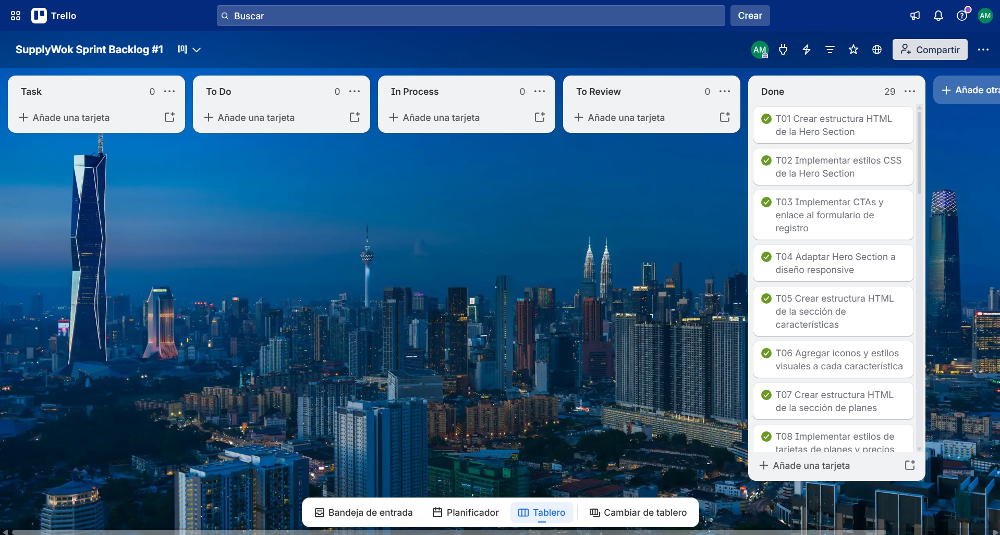

**Consider Aspects**

- **Estructure HTML**

- **Design UI & responsive**

- **Scripts and UX**

- **SEO and Accessibility**

- **Content and Assets**

| Team Member | GitHub username | Estructure HTML | Design UI & responsive | Scripts and UX | SEO and Accessibility | Content and Assets |
|---|---|---|---|---|---|---|
| Cuadros, Marcelo | Marcelo-alt-lab | C | C | L | C | C |
| Payano, Joan | Nounz27 | C | C | C | - | - |
| Meza, Alexandra | AlexandraYMS | - | L | - | C | C |
| Ayasta, Zayd | Zayd Ayasta | L | C | C | C | - |
| Wang, Juan | jwd3t | C | - | C | L | C |

#### 5.2.1.3. Sprint Backlog 1.

En esta sección se presenta el Sprint Backlog correspondiente al Sprint 1. Los elementos incluidos fueron definidos en función del Sprint Goal establecido para esta primera iteración, orientado al diseño y desarrollo de la Landing Page de SupplyWok. Para ello, se planificaron las historias de usuario y tareas necesarias para construir la estructura inicial de la plataforma, incluyendo la definición de la interfaz, creación de las secciones principales, implementación de componentes visuales y aplicación de estilos orientados a presentar la propuesta de valor del producto.

**Link al Sprint 1 Board:** https://trello.com/invite/b/6a4ef7a05fa73a1b97d2c516/ATTIe1fbc18eb0fb43ebd1a2f3689350f455EFAAE5BD/supplywok-sprint-backlog-1


**Sprint 1 Backlog**

| US Id | US Title | Task Id | Task Title | Description | Estimation (Hours) | Assigned To | Status |
|---|---|---|---|---|---|---|---|
| US44 | Página de inicio con hero section | T01 | Crear estructura HTML de la Hero Section | Maquetar la sección principal (Hero) usando etiquetas semánticas de HTML5. | 2 | Zayd Ayasta | To-do |
| US44 | Página de inicio con hero section | T02 | Implementar estilos CSS de la Hero Section | Aplicar la hoja de estilos base para definir colores, tipografía y disposición. | 2 | Alexandra Meza | To-do |
| US44 | Página de inicio con hero section | T03 | Implementar CTAs y enlace al formulario de registro | Añadir botones llamativos que redirijan al usuario al proceso de registro. | 1 | Marcelo Cuadros | To-do |
| US44 | Página de inicio con hero section | T04 | Adaptar Hero Section a diseño responsive | Asegurar que la sección principal se visualice correctamente en dispositivos móviles. | 2 | Zayd Ayasta | To-do |
| US45 | Sección de características principales | T05 | Crear estructura HTML de la sección de características | Construir la grilla o layout para mostrar los beneficios principales de la plataforma. | 1 | Juan Wang | To-do |
| US45 | Sección de características principales | T06 | Agregar iconos y estilos visuales a cada característica | Incorporar elementos gráficos y CSS para hacer cada característica visualmente atractiva. | 2 | Alexandra Meza | To-do |
| US46 | Sección de planes y precios | T07 | Crear estructura HTML de la sección de planes | Maquetar el área donde se mostrarán las opciones de precios y suscripciones. | 1 | Joan Payano | To-do |
| US46 | Sección de planes y precios | T08 | Implementar estilos de tarjetas de planes y precios | Diseñar visualmente las tarjetas de precios para facilitar la comparación de planes. | 2 | Zayd Ayasta | To-do |
| US46 | Sección de planes y precios | T09 | Agregar CTA de selección de plan con redirección al registro | Vincular cada tarjeta de precio con el flujo de creación de cuenta. | 1 | Marcelo Cuadros | To-do |
| US47 | Sección de preguntas frecuentes | T10 | Crear estructura HTML del acordeón FAQ | Maquetar el contenedor base para las preguntas frecuentes de los usuarios. | 1 | Juan Wang | To-do |
| US47 | Sección de preguntas frecuentes | T11 | Implementar lógica de expansión y colapso de preguntas | Programar la interactividad para mostrar u ocultar respuestas al hacer clic. | 2 | Marcelo Cuadros | To-do |
| US48 | Navegación y menú principal | T12 | Crear navbar sticky con enlaces de navegación | Implementar un menú de navegación fijo en la parte superior con scroll suave. | 2 | Marcelo Cuadros | To-do |
| US48 | Navegación y menú principal | T13 | Implementar menú hamburguesa para dispositivos móviles | Desarrollar un menú lateral desplegable para resoluciones de pantalla pequeñas. | 2 | Joan Payano | To-do |
| US49 | Responsividad total y optimización mobile | T14 | Definir e implementar breakpoints responsive globales | Establecer las reglas CSS de diseño adaptable para toda la página de aterrizaje. | 2 | Zayd Ayasta | To-do |
| US49 | Responsividad total y optimización mobile | T15 | Verificar tamaño mínimo de elementos interactivos | Validar que botones y enlaces tengan al menos 44px para facilitar el toque en móviles. | 1 | Alexandra Meza | To-do |
| US49 | Responsividad total y optimización mobile | T16 | Validar que las imágenes no generen scroll horizontal | Asegurar que ningún recurso visual exceda el ancho máximo de la pantalla. | 1 | Zayd Ayasta | To-do |
| US50 | SEO y accesibilidad web | T17 | Configurar meta tags de SEO (título, descripción, keywords) | Añadir metadatos clave para mejorar la indexación y visibilidad en buscadores. | 1 | Juan Wang | To-do |
| US50 | SEO y accesibilidad web | T18 | Agregar atributos alt, roles ARIA y estructura semántica HTML5 | Mejorar la accesibilidad para usuarios que dependen de lectores de pantalla. | 2 | Juan Wang | To-do |
| US50 | SEO y accesibilidad web | T19 | Verificar navegación por teclado y visibilidad del foco | Asegurar que se pueda interactuar con la página usando únicamente el teclado. | 1 | Juan Wang | To-do |
| US51 | Footer con información adicional | T20 | Crear estructura HTML del footer | Maquetar la sección final de la página para enlaces secundarios y legales. | 1 | Zayd Ayasta | To-do |
| US51 | Footer con información adicional | T21 | Implementar enlaces a redes sociales y páginas legales | Conectar los iconos sociales y los textos de términos y condiciones. | 1 | Joan Payano | To-do |
| US52 | Impacto apoyado en cifras | T22 | Crear sección de métricas e impacto con estadísticas | Diseñar un bloque visual que resalte los números clave para generar confianza. | 2 | Joan Payano | To-do |
| US53 | Muestra del producto | T23 | Integrar galería de imágenes del producto con texto alternativo | Mostrar capturas de la plataforma asegurando que sean accesibles para todos. | 1 | Joan Payano | To-do |
| US53 | Muestra del producto | T24 | Integrar video del producto con fallback de texto alternativo | Incrustar un video demostrativo con opciones de texto para quienes no puedan verlo. | 2 | Joan Payano | To-do |
| US54 | Calls to action | T25 | Distribuir CTAs secundarios en secciones clave de la Landing Page | Añadir llamadas a la acción adicionales a lo largo del recorrido del usuario. | 1 | Alexandra Meza | To-do |
| US55 | Scripts para ocultar contenido | T26 | Implementar scripts de show/hide para contenido condicional | Añadir lógica JavaScript para controlar elementos que se muestran bajo ciertas acciones. | 1 | Marcelo Cuadros | To-do |
| US56 | Comentarios y nombres de variables | T27 | Agregar comentarios de código y estandarizar nombres de variables | Limpiar y documentar el código fuente para facilitar futuros mantenimientos. | 1 | Juan Wang | To-do |
| US57 | Sobre el equipo detrás de SupplyWok | T28 | Crear sección del equipo con video y texto alternativo | Maquetar la presentación de los creadores de SupplyWok con soporte multimedia. | 2 | Joan Payano | To-do |
| US58 | Prioridad en mostrar las funcionalidades a los Restaurantes | T29 | Ordenar sección de funcionalidades priorizando beneficios para restaurantes | Estructurar visualmente el contenido para destacar el valor aportado a los restaurantes. | 1 | Marcelo Cuadros | To-do |

#### 5.2.1.4. Development Evidence for Sprint Review.

En esta sección se presentan los avances realizados durante el Sprint 1 en la construcción de la primera versión de la interfaz de usuario de SupplyWok. El trabajo desarrollado se centró en el diseño e implementación de la Landing Page de la plataforma, incluyendo la definición de la estructura visual, creación de las secciones principales y aplicación de estilos orientados a presentar la propuesta de valor del producto.

| Repository | Branch | Commit Id | Commit Message | Commit Message Body | Commited on (Date) |
|---|---|---|---|---|---|
| Aurora-startup/SupplyWok-landing-page | develop | 4bbf50e | Delete CNAME | Removed custom domain configuration file from the repository. | 25/04/2026 |
| Aurora-startup/SupplyWok-landing-page | develop | d48c723 | Create CNAME | Added CNAME configuration for deployment setup. | 25/04/2026 |
| Aurora-startup/SupplyWok-landing-page | develop | 55052d1 | docs: add comprehensive README.md with project overview, architecture, and setup instructions | Added detailed project documentation and setup instructions. | 25/04/2026 |
| Aurora-startup/SupplyWok-landing-page | release | 011d887 | Merge pull request #2 from Aurora-startup/release | Merged release branch changes into the main development workflow. | 25/04/2026 |
| Aurora-startup/SupplyWok-landing-page | develop | 8929534 | chore: remove LICENSE file | Removed unnecessary LICENSE file from the project. | 25/04/2026 |
| Aurora-startup/SupplyWok-landing-page | develop | fc1421a | chore: remove unused project files and assets | Cleaned repository by deleting unused files and resources. | 25/04/2026 |
| Aurora-startup/SupplyWok-landing-page | develop | 2b5cb6f | Merge pull request #1 from Aurora-startup/develop | Integrated latest develop branch updates. | 25/04/2026 |
| Aurora-startup/SupplyWok-landing-page | develop | 34fc12e | feat: i18n | Added internationalization support to the project. | 25/04/2026 |
| Aurora-startup/SupplyWok-landing-page | develop | e25ce47 | feat: i18n for the landing page | Implemented multilingual support specifically for the landing page. | 25/04/2026 |
| Aurora-startup/SupplyWok-landing-page | develop | 21bbf3b | feat: update stylesheets and add uses.js | Updated stylesheets and added utility JavaScript functionality. | 25/04/2026 |
| Aurora-startup/SupplyWok-landing-page | develop | afb9892 | Add Footer stylesheet | Added styles for the footer section of the landing page. | 25/04/2026 |
| Aurora-startup/SupplyWok-landing-page | develop | 94a3093 | feat: add our plans section | Added pricing and plans section to the landing page. | 25/04/2026 |
| Aurora-startup/SupplyWok-landing-page | develop | 886dd87 | Merge branch 'develop' into develop | Synchronized latest changes from develop branch. | 25/04/2026 |
| Aurora-startup/SupplyWok-landing-page | develop | 771084d | feat: add the header on landing page | Implemented the header section for the landing page. | 25/04/2026 |
| Aurora-startup/SupplyWok-landing-page | develop | b2c70e7 | Merge branch 'develop' into develop | Merged updates and synchronized project branches. | 25/04/2026 |
| Aurora-startup/SupplyWok-landing-page | develop | 4bd0fb8 | style: reformat HTML markup for improved readability and line length consistency | Reformatted HTML files for cleaner structure and readability. | 25/04/2026 |
| Aurora-startup/SupplyWok-landing-page | develop | 96e260f | Merge branch 'develop' into develop | Updated branch with latest synchronized changes. | 25/04/2026 |
| Aurora-startup/SupplyWok-landing-page | develop | e8e71c7 | feat: add our plans section | Added detailed pricing plans section to the website. | 25/04/2026 |
| Aurora-startup/SupplyWok-landing-page | develop | 35175f9 | feat: implement features section and add project documentation with MIT licensing | Implemented features section and added licensing documentation. | 25/04/2026 |
| Aurora-startup/SupplyWok-landing-page | develop | 44d8dff | feat: implement FAQ and pricing sections with associated styles and UI assets | Added FAQ and pricing sections with corresponding UI resources. | 25/04/2026 |
| Aurora-startup/SupplyWok-landing-page | develop | 9def920 | feat: implement hero, features, pricing, and faq sections with supporting styles and assets | Implemented main landing sections with related styling assets. | 25/04/2026 |
| Aurora-startup/SupplyWok-landing-page | develop | ec6cca0 | Add Features stylesheet | Added stylesheet for the features section. | 25/04/2026 |
| Aurora-startup/SupplyWok-landing-page | develop | c57f6b1 | feat: add landing page structure and features section with icons | Added initial landing structure and features section with icons. | 25/04/2026 |
| Aurora-startup/SupplyWok-landing-page | develop | c1fabf4 | feat: add styling for the landing page hero section | Added styles for the hero section of the landing page. | 25/04/2026 |
| Aurora-startup/SupplyWok-landing-page | develop | 5c6193a | Merge branch 'develop' into develop | Integrated synchronized changes into develop branch. | 25/04/2026 |
| Aurora-startup/SupplyWok-landing-page | develop | cbab8be | feat: implement cta | Implemented call-to-action section on the landing page. | 25/04/2026 |
| Aurora-startup/SupplyWok-landing-page | develop | c54537f | Add Hero and Base stylesheet | Added base and hero section stylesheets. | 25/04/2026 |
| Aurora-startup/SupplyWok-landing-page | develop | 7264b53 | feat(index): hero section implements | Implemented initial hero section functionality. | 25/04/2026 |
| Aurora-startup/SupplyWok-landing-page | main | 500b47c | chore: initial landing page for SupplyWok with HTML, CSS, and JavaScript | Created the initial landing page structure using HTML, CSS, and JavaScript. | 24/04/2026 |
| Aurora-startup/SupplyWok-landing-page | main | a7ebd9e | Create public | Added public directory and initial public assets. | 12/04/2026 |
| Aurora-startup/SupplyWok-landing-page | main | d1cef23 | Initial commit | Created the repository with the initial project structure. | 12/04/2026 |

#### 5.2.1.5. Execution Evidence for Sprint Review.

Durante el Sprint 1 se desarrolló la Landing Page de SupplyWok, orientada a promocionar la plataforma y presentar su propuesta de valor a los usuarios. Entre los principales elementos implementados se encuentra la sección Home, donde se muestra información general sobre la plataforma y el equipo de desarrollo; el apartado Restaurant, enfocado en presentar las funcionalidades dirigidas a los administradores y dueños de restaurantes; el apartado Suppliers, donde se describen las funcionalidades relacionadas con la gestión de proveedores de suministros; y finalmente, el módulo de Login, que permite redirigir a los usuarios hacia el acceso principal de la plataforma. A continuación, se presentan las evidencias visuales de las secciones implementadas.

| Componente | Descripción | Enlace |
|------------|-------------|--------|
| Landing Page | Pagina promocional de SupplyWok | https://aurora-startup.github.io/SupplyWok-landing-page/ |


Link del video de explicación del Sprint: https://youtu.be/mQYJEKT22LU


#### 5.2.1.6. Services Documentation Evidence for Sprint Review.

Como la Landing Page es una página estática, no fue necesario durante el Sprint el uso de servicios externos ni conexiones a APIs, por lo cual no hay generación ni evidencia de documentación técnica relacionada.

#### 5.2.1.7. Software Deployment Evidence for Sprint Review.

Durante el Sprint 1 se realizó el despliegue de la primera versión de la Landing Page de SupplyWok utilizando GitHub Pages como servicio de alojamiento web. Este despliegue permitió publicar la interfaz desarrollada y disponer de una versión accesible de la plataforma para su revisión y validación. Para ello, se configuró el repositorio del proyecto, se habilitó la publicación mediante la rama principal main y se verificó la correcta generación del sitio web público. A continuación, se presentan las evidencias del proceso realizado.


Revisamos que el repositorio esté en público:


Nos dirigimos a la seccion de deploy, y selecionamos la rama main:


Luego de unos minutos, el deploy se realizara correctamente:


#### 5.2.1.8. Team Collaboration Insights during Sprint.

Durante el Sprint 1, el equipo trabajó de manera colaborativa en el desarrollo de la Landing Page de SupplyWok utilizando una estrategia basada en ramas de Git y GitHub. Las tareas fueron distribuidas entre los integrantes de acuerdo con las principales áreas de desarrollo, permitiendo que cada miembro asumiera la responsabilidad de un aspecto específico de la construcción de la Landing Page, incluyendo la estructura HTML, diseño de interfaz y responsividad, implementación de scripts y experiencia de usuario, optimización SEO y accesibilidad, así como la gestión de contenido y recursos visuales. A continuación, se presentan las evidencias de colaboración obtenidas a partir de los analíticos de GitHub, incluyendo contribuciones, historial de commits y actividad desarrollada durante el Sprint.


Como se observa en la sección Contributors del repositorio de la Landing Page, durante el Sprint 1 se realizaron más de 20 commits entre todos los integrantes del grupo, reflejando la participación activa del equipo en el desarrollo de la página.


Como se observa en el detalle de la sección Contributors, todos los integrantes realizaron contribuciones al repositorio. En promedio, cada miembro efectuó
aproximadamente 4 commits y contribuyó con un minimo de 500 lineas de codigo.


Como se observa en la sección Pulse del repositorio de la Landing Page, durante la última semana del Sprint 1 se integraron 2 Pull Requests y se registraron 23 commits en total, considerando las distintas ramas de desarrollo (feature branches) utilizadas por cada integrante del equipo.

### 5.2.2. Sprint 2 

En esta sección se registra y explica el avance realizado durante el Sprint 2 en términos de producto y trabajo colaborativo. El enfoque principal de este Sprint fue el desarrollo del frontend de la plataforma utilizando Angular para los bounded contexts priorizados. Además, se implementó una Fake API mediante JSON Server y un repositorio de datos para simular los servicios del backend y facilitar el consumo temporal de información por parte del frontend.

#### 5.2.2.1. Sprint Planning 2

Durante la reunión de Sprint Planning del Sprint 2, se estableció como objetivo principal avanzar más del 60 % en el desarrollo del frontend de la plataforma **SupplyWok**. Para ello, se planteó implementar la mayor parte de las interfaces de usuario de la aplicación, así como desarrollar una Fake API que la alimentaría de manera temporal durante esta etapa del proyecto. Asimismo, se priorizó el desarrollo de los bounded contexts correspondientes al núcleo del negocio, incluyendo **Inventory Management**, **Supply and Purchasing**, **Operational Monitoring and IoT Alerts**, **Restaurant Management** y **Supplier Management & Operations**.

**Sprint Planning 2**

| **Sprint #** | 2 |
|---|---|
| **Date** | 08-05-2026 |
| **Time** | 13:00 |
| **Location** | Virtual, Discord |
| **Prepared by** | Zayd Ayasta, Juan Wang |
| **Attendees** | Marcelo Cuadros, Alexandra Meza, Joan Payano |
| **Sprint 1 Review Summary** | En el Sprint 1, el equipo se enfocó en el desarrollo del Landing Page de SupplyWok. Con ello, se logró configurar el entorno de trabajo, establecer los requerimientos principales del sistema, así como el diseño preliminar de la interfaz y la estructura de navegación de la plataforma. Por otro lado, el Product Owner brindó feedback positivo respecto al diseño inicial del sistema y sugirió corregir ciertos aspectos de la documentación del proyecto. |
| **Sprint 1 Retrospective Summary** | Durante el Sprint 1, surgieron dificultades relacionadas con la comunicación, la distribución de tareas y el cumplimiento de algunos entregables de la plataforma, afectando principalmente la documentación del proyecto. Sin embargo, a pesar de estas dificultades, se logró entregar un sprint casi completo y con una calidad aceptable. |
| **Sprint 2 Goal** | Nuestro enfoque en este sprint es desarrollar e implementar la interfaz principal de SupplyWok mediante dashboards funcionales para dueños y proveedores, permitiendo la visualización y gestión básica de la información del negocio. Además, se espera implementar la interfaz base de cada dashboard junto con las funcionalidades principales de cada bounded context. |
| **Sprint 2 Velocity** | Límite de **35 SP** |
| **Sum of Story Points** | **30 SP** |

#### 5.2.2.2. Aspect Leaders and Collaborators.

Durante el Sprint 2, el equipo se enfocó principalmente en el desarrollo del frontend de SupplyWok, priorizando las interfaz y funcionalidades principales de la plataforma. Los principales aspectos considerados en este sprint incluyen el desarrollo de los todos los bounded context.

En esta sección se presenta la matriz de liderazgo y colaboración correspondiente al Sprint 2. Dado que el objetivo principal de esta iteración es el desarrollo del frontend de **SupplyWok**, priorizando las interfaces y funcionalidades principales de la plataforma, los aspectos considerados corresponden a los bounded contexts de negocio. Para cada aspecto se asigna un líder responsable de coordinar el desarrollo y uno o más colaboradores encargados de apoyar en la implementación de cada módulo, así como en la validación y las pruebas del correcto funcionamiento de la Fake API.

**Link el Sprint 2 Board:** https://trello.com/b/07LRT0At


**Consider Aspects** 

- **Inventory Management Bounded Context**: Es el encargado de gestionar la informacion de los recursos de inventario de cada restaurante.

- **Supply and Purchasing Bounded Context**: Es el encargado de gestionar las órdenes de suplementos realizadas por cada restaurante.

- **Restaurant Management Bounded Context**: Es el encargado de gestionar todo lo relacionado con la operación del establecimiento.

- **Operational Monitoring and IoT Alerts Bounded Context**: Es el encargado de gestionar la información recopilada por los sensores del restaurante.

- **Supplier Management & Operations Bounded Context**: Es el encargado de gestionar la información de los proveedores y sus pedidos.

- **Identity & Access Bounded Context**: Es el encargado de gestionar todo lo relacionado con la autenticación y administración de cuentas.

- **Shared Bounded Context**: Contiene Value Objects y componenetes visuales comunes que son reutilizados por múltiples bounded contexts del sistema.

| Team Member | GitHub username | Inventory Management Bounded BC | Supply and Purchasing BC / Shared BC | Restaurant Management BC | Supplier Management & Operations BC | Operational Monitoring and IoT Alerts BC / Identity & Access BC  |
|---|---|---|---|---|---|---|
| Cuadros, Marcelo | Marcelo-alt-lab | C | C | C | - | L |
| Payano, Joan | Nounz27             | - | C | L | C | C |
| Meza, Alexandra | AlexandraYMS     | L | C | - | C | C |
| Ayasta, Zayd | Zayd Ayasta         | C | L | C | C | - |
| Wang, Juan | jwd3t                 | C | - | C | L | C |

#### 5.2.2.3. Sprint Backlog 2.

En esta sección se presenta el Sprint Backlog correspondiente al Sprint 2. Los elementos incluidos fueron definidos de acuerdo con el Sprint Goal establecido para esta iteración, orientado al desarrollo del frontend de SupplyWok. Para ello, se planificaron las historias de usuario y las tareas necesarias para implementar las interfaces de los bounded contexts priorizados, garantizando una experiencia de usuario amigable y el consumo temporal de datos mediante una Fake API implementada con JSON Server.

**Link el Sprint 2 Board:** https://trello.com/b/07LRT0At


**Sprint 2 Backlog**

| US Id | US Title | Task Id | Task Title | Description | Estimation (Hours) | Assigned To | Status |
|---|---|---|---|---|---|---|---|
| US11 | Proyección de demanda basada en historial | T30 | Diseño de interfaz de proyección | Diseñar la interfaz para visualizar la proyección de consumo de insumos. | 3 | Alexandra Meza | Done |
| US11 | Proyección de demanda basada en historial | T31 | Implementación de gráficos estadísticos | Implementar gráficos y métricas de proyección de demanda. | 4 | Marcelo Cuadros | Done |
| US11 | Proyección de demanda basada en historial | T32 | Integración de datos históricos | Conectar la vista con los datos históricos de consumo. | 3 | Juan Wang | Done |
| US14 | Monitoreo de temperatura en almacén | T33 | Diseño del dashboard IoT | Diseñar el panel de monitoreo de sensores IoT. | 2 | Joan Payano | Done |
| US14 | Monitoreo de temperatura en almacén | T34 | Integración de datos de sensores | Implementar la recepción y visualización de temperatura en tiempo real. | 4 | Zayd Ayasta | Done |
| US15 | Alertas de riesgo en cocina | T35 | Sistema de alertas automáticas | Implementar alertas visuales ante condiciones peligrosas. | 3 | Alexandra Meza | Done |
| US15 | Alertas de riesgo en cocina | T36 | Configuración de umbrales | Configurar parámetros de temperatura y humedad para activar alertas. | 2 | Marcelo Cuadros | Done |
| US17 | Control de ocupación de mesas | T37 | Diseño de estado de mesas | Crear componentes visuales para representar el estado de las mesas. | 2 | Juan Wang | Done |
| US17 | Control de ocupación de mesas | T38 | Actualización en tiempo real | Implementar actualización dinámica de ocupación de mesas. | 3 | Joan Payano | Done |
| US18 | Historial de alertas e incidencias operativas | T39 | Registro de incidencias | Implementar almacenamiento de eventos y alertas. | 3 | Zayd Ayasta | Done |
| US18 | Historial de alertas e incidencias operativas | T40 | Vista histórica de alertas | Crear interfaz para consultar incidencias registradas. | 3 | Alexandra Meza | Done |
| US19 | Exportar reporte de monitoreo y alertas | T41 | Generación de reportes PDF | Implementar exportación de reportes en PDF. | 3 | Marcelo Cuadros | Done |
| US19 | Exportar reporte de monitoreo y alertas | T42 | Exportación CSV | Implementar exportación de datos en formato CSV. | 2 | Juan Wang | Done |
| US20 | Registro y perfil del proveedor | T43 | Formulario de registro | Implementar formulario para registro de proveedores. | 3 | Joan Payano | Done |
| US20 | Registro y perfil del proveedor | T44 | Vista de perfil del proveedor | Crear pantalla de perfil y edición de datos. | 3 | Zayd Ayasta | Done |
| US21 | Recepción y gestión de órdenes de compra | T45 | Panel de órdenes recibidas | Implementar listado de órdenes de compra recibidas. | 4 | Alexandra Meza | Done |
| US21 | Recepción y gestión de órdenes de compra | T46 | Gestión de estado de pedidos | Permitir actualizar estados de órdenes de compra. | 3 | Marcelo Cuadros | Done |
| US24 | Confirmación y seguimiento de entregas | T47 | Registro de entregas | Implementar formulario para confirmar entregas realizadas. | 3 | Juan Wang | Done |
| US24 | Confirmación y seguimiento de entregas | T48 | Seguimiento de despachos | Implementar visualización del estado de entregas. | 3 | Joan Payano | Done |
| US25 | Panel de rendimiento por cliente | T49 | Dashboard de clientes frecuentes | Implementar métricas de pedidos por cliente. | 4 | Zayd Ayasta | Done |
| US25 | Panel de rendimiento por cliente | T50 | Estadísticas comerciales | Mostrar estadísticas y tendencias de consumo. | 3 | Alexandra Meza | Done |
| US27 | Selección y gestión del plan de suscripción | T51 | Vista de planes disponibles | Diseñar pantalla de planes y beneficios. | 2 | Marcelo Cuadros | Done |
| US27 | Selección y gestión del plan de suscripción | T52 | Gestión de suscripción | Implementar selección y activación de planes. | 2 | Juan Wang | Done |
| US28 | Notificaciones en tiempo real | T53 | Sistema de notificaciones | Implementar notificaciones dinámicas en la plataforma. | 4 | Joan Payano | Done |
| US28 | Notificaciones en tiempo real | T54 | Alertas en tiempo real | Mostrar alertas instantáneas relacionadas al sistema. | 3 | Zayd Ayasta | Done |
| US29 | Inicio de sesión y registro de cuenta | T55 | Formulario de login | Implementar formulario de inicio de sesión con validación. | 3 | Marcelo Cuadros | Done |
| US29 | Inicio de sesión y registro de cuenta | T56 | Formulario de registro | Implementar formulario de registro de nueva cuenta con validación. | 3 | Joan Payano | Done |

#### 5.2.2.4. Development Evidence for Sprint Review.

En esta sección se presentan los avances realizados durante el Sprint 2 en el desarrollo del frontend de SupplyWok. Durante esta iteración se implementaron las interfaces de usuario y las funcionalidades principales de los bounded contexts priorizados, así como las entidades más representativas del negocio y el flujo de navegación de la plataforma, utilizando una Fake API para simular un backend.

| Repository | Branch | Commit Id | Commit Message | Commit Message Body | Commited on (Date) |
|---|---|---|---|---|---|
| Aurora-startup/SupplyWok-frontend | develop | 2d0e9b6 | feat: connect purchasing suppliers to mock api | Conexión de proveedores de compras a la API mock | 15/05/2026 |
| Aurora-startup/SupplyWok-frontend | develop | 5b15dfa | feat: connect purchasing suppliers to mock api | Conexión inicial de purchasing suppliers a la API mock | 15/05/2026 |
| Aurora-startup/SupplyWok-frontend | develop | 933f622 | fix: environments | Corrección de configuración de entornos | 15/05/2026 |
| Aurora-startup/SupplyWok-frontend | develop | e890844 | feat: implement identity-and-access bounded context and fix existing bounded context integration issues | Implementación del bounded context de identity-and-access y corrección de integraciones existentes | 15/05/2026 |
| Aurora-startup/SupplyWok-frontend | develop | 90e16bd | feat: implement inventory-management bounded context | Implementación del bounded context de inventory-management | 14/05/2026 |
| Aurora-startup/SupplyWok-frontend | develop | 510e880 | feat: add operational-monitoring-and-iot-alerts bounded context | Agregado del bounded context para operational monitoring and IoT alerts | 14/05/2026 |
| Aurora-startup/SupplyWok-frontend | develop | d42b822 | feat: add login and registration components with form handling and validation | Implementación de componentes de login y registro con manejo y validación de formularios | 13/05/2026 |
| Aurora-startup/SupplyWok-frontend | develop | 3492676 | Merge pull request #5 from Aurora-startup/feature/operational-monitoring-and-iot-alerts | Merge del feature operational-monitoring-and-iot-alerts hacia develop | 13/05/2026 |
| Aurora-startup/SupplyWok-frontend | develop | acbd3df | fix: restaurant-management infrastructure | Correcciones en la infraestructura de restaurant-management | 13/05/2026 |
| Aurora-startup/SupplyWok-frontend | develop | 77add27 | fix: restaurant-management infrastructure | Ajustes adicionales en la infraestructura de restaurant-management | 13/05/2026 |
| Aurora-startup/SupplyWok-frontend | develop | 0ccdbe2 | merge develop into feature/inventory-management-bounded-context | Sincronización de develop con feature/inventory-management-bounded-context | 12/05/2026 |
| Aurora-startup/SupplyWok-frontend | develop | 70c31f4 | Update Inventory Management Bouded | Actualización del módulo Inventory Management Bounded | 12/05/2026 |
| Aurora-startup/SupplyWok-frontend | develop | 56267f2 | feat: complete inventory management bounded context | Implementación completa del bounded context de inventory management | 12/05/2026 |
| Aurora-startup/SupplyWok-frontend | develop | 0823704 | Update Inventory Management Bouded Context interface | Actualización de interfaces del bounded context de inventory management | 12/05/2026 |
| Aurora-startup/SupplyWok-frontend | develop | a3e6f1e | feat: implement restaurant-management bounded context | Implementación del bounded context de restaurant-management | 12/05/2026 |
| Aurora-startup/SupplyWok-frontend | develop | ea5b27f | feat(restaurant-management): apply clean architecture structure | Aplicación de estructura Clean Architecture en restaurant-management | 12/05/2026 |
| Aurora-startup/SupplyWok-frontend | develop | b2007f3 | feat: implement supply and purchasing bounded context | Implementación del bounded context de supply and purchasing | 12/05/2026 |
| Aurora-startup/SupplyWok-frontend | develop | 92261ed | feat(supply-and-purchasing): implement bounded context pages and routes | Implementación de páginas y rutas para supply-and-purchasing | 12/05/2026 |
| Aurora-startup/SupplyWok-frontend | develop | 442cb84 | feat(table): add purchase orders table component | Creación del componente tabla para órdenes de compra | 12/05/2026 |
| Aurora-startup/SupplyWok-frontend | develop | 6dd333d | feat(forms): create purchase order form panel | Creación del panel de formulario para órdenes de compra | 12/05/2026 |
| Aurora-startup/SupplyWok-frontend | develop | 340672c | feat(orders): implement purchase orders page | Implementación de la página de órdenes de compra | 12/05/2026 |
| Aurora-startup/SupplyWok-frontend | develop | 408c86e | feat(i18n): add localization resources | Agregados recursos de localización e internacionalización | 12/05/2026 |
| Aurora-startup/SupplyWok-frontend | develop | fb3d9d6 | feat(layout): configure shared navigation and application routes | Configuración de navegación compartida y rutas de la aplicación | 12/05/2026 |
| Aurora-startup/SupplyWok-frontend | develop | 6be1695 | feat(store): add purchase order state management | Implementación de manejo de estado para órdenes de compra | 12/05/2026 |
| Aurora-startup/SupplyWok-frontend | develop | 221c88a | feat(api): integrate purchase order endpoints | Integración de endpoints para órdenes de compra | 12/05/2026 |
| Aurora-startup/SupplyWok-frontend | develop | 8633a54 | feat(core): add shared infrastructure and environment configuration | Configuración compartida de infraestructura y entorno | 12/05/2026 |
| Aurora-startup/SupplyWok-frontend | develop | 753c7e6 | feat(restaurant-management): implement restaurant management bounded context with tables occupancy and kitchen tickets | Implementación de bounded context para restaurant management con ocupación de mesas y kitchen tickets | 11/05/2026 |
| Aurora-startup/SupplyWok-frontend | develop | e687f11 | initial commit | Commit inicial del proyecto | 11/05/2026 |
| Aurora-startup/SupplyWok-frontend | develop | 71a55e2 | feat: implement IoT monitoring dashboard components and API integration | Implementación de dashboard IoT e integración con API | 10/05/2026 |
| Aurora-startup/SupplyWok-frontend | develop | ed68b1e | Merge pull request #1 from Aurora-startup/develop | Merge inicial de develop | 10/05/2026 |
| Aurora-startup/SupplyWok-frontend | develop | 95e0807 | chore: remove untracked IDE and cache folders | Eliminación de carpetas IDE y caché no rastreadas | 10/05/2026 |
| Aurora-startup/SupplyWok-frontend | develop | 81b2891 | feat: add initial application structure with routing, layout, and language switcher | Creación de estructura inicial de aplicación con routing, layout y selector de idioma | 10/05/2026 |
| Aurora-startup/SupplyWok-frontend | develop | a0c8b6f | chore: initialize project workspace and cache build artifacts | Inicialización del workspace y artefactos de build | 10/05/2026 |
| Aurora-startup/SupplyWok-frontend | develop | 7272f71 | chore: initial commit | Commit inicial del repositorio | 08/05/2026 |

#### 5.2.2.5. Execution Evidence for Sprint Review.

Durante el Sprint 2 se desarrolló gran parte del frontend de la plataforma SupplyWok. Se implementaron funcionalidades como el inicio de sesión, el dashboard principal, los módulos de gestión de inventario, pedidos de suplementos, comandas del restaurante, el panel de monitoreo de sensores de humedad, temperatura y ocupación de espacios, así como el panel de alertas, todos ellos con sus funcionalidades esenciales. Como parte de la revisión del Sprint, se verificó el correcto flujo de navegación entre las distintas interfaces de la plataforma y el funcionamiento adecuado de la Fake API, comprobando que los datos pudieran recuperarse, registrarse, actualizarse y eliminarse correctamente del repositorio de datos.

| Componente | Descripción | Enlace |
|------------|-------------|--------|
| Landing Page | Pagina promocional de SupplyWok | https://aurora-startup.github.io/SupplyWok-landing-page/ |
| Frontend | Plataforma web de SupplyWok (Usuario: restaurante@ejemplo.com Contraseña: Password123! / Usuario: proveedor@ejemplo.com Contraseña: Password123!) | https://supplywok-frontend-1e9a7.web.app/ |
| Repositorio Frontend | Código fuente del frontend | https://github.com/Aurora-startup/SupplyWok-frontend |
| Repositorio del JSON server | Repositorio donde se aloja el Json server | https://github.com/joanfpp2-ai/supplywok-db-server |
| JSON Server | Endpoints de la Fake Api | https://my-json-server.typicode.com/joanfpp2-ai/supplywok-db-server |

En las siguientes evidencias se presentan los módulos implementados en la plataforma, destacando sus principales funcionalidades y su correcto funcionamiento.

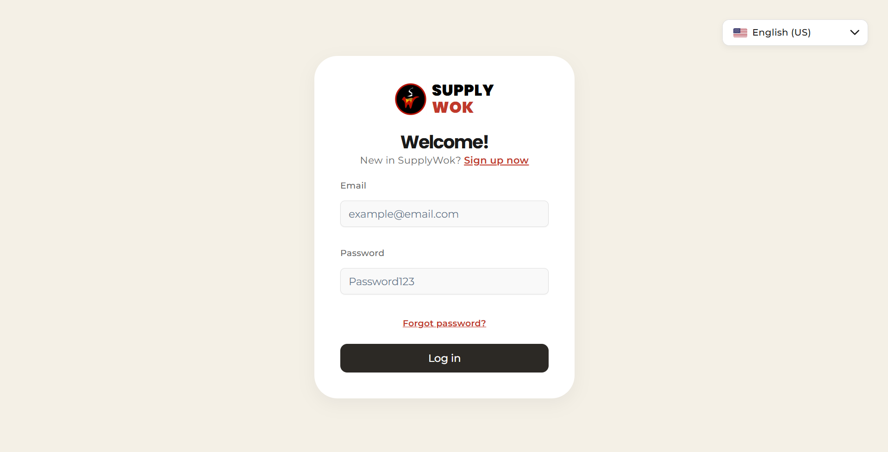

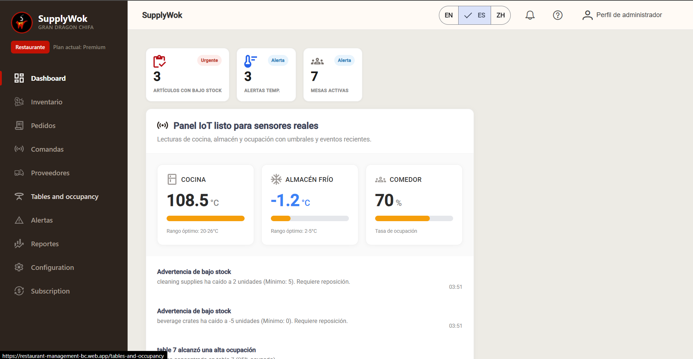

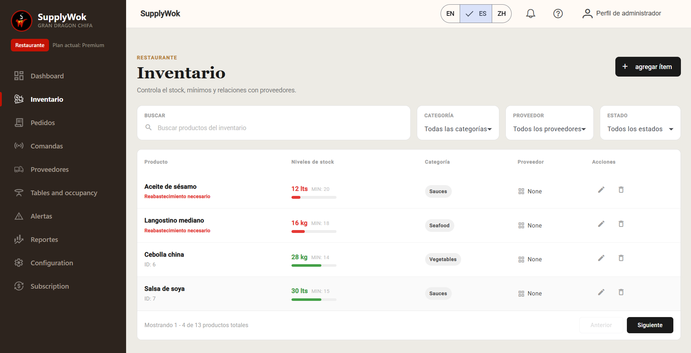

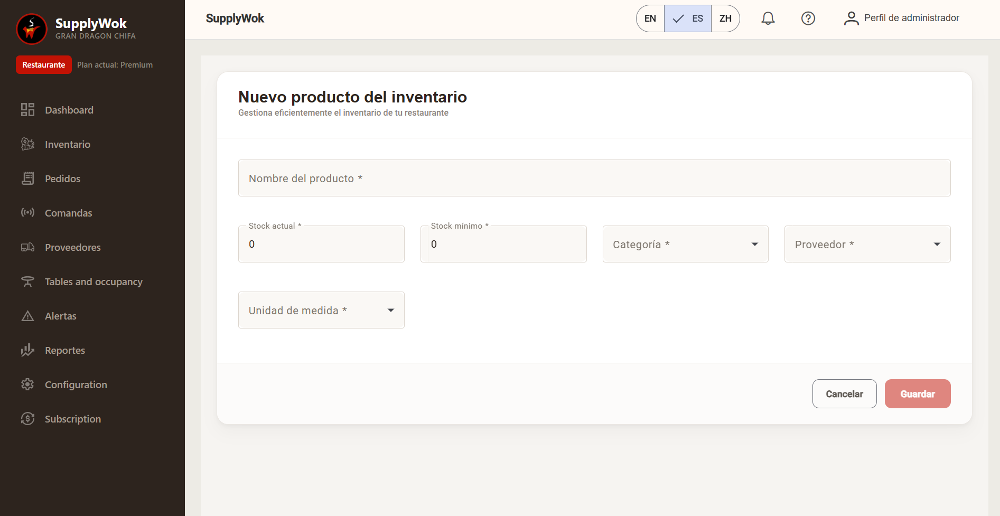

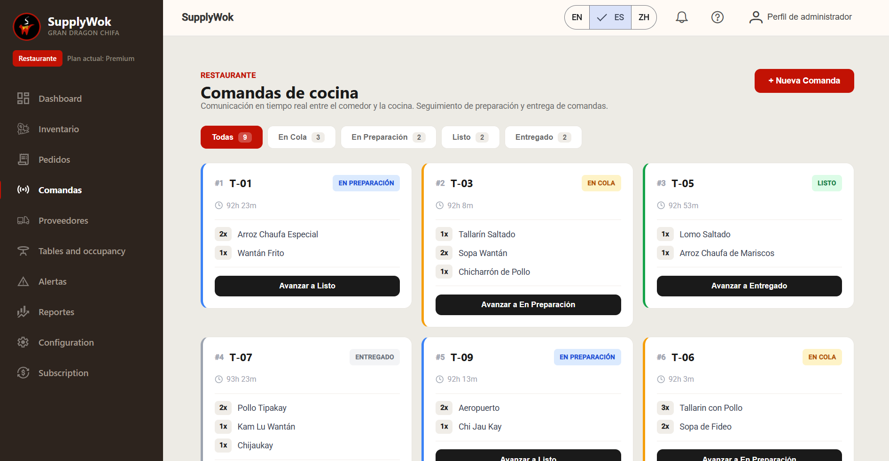

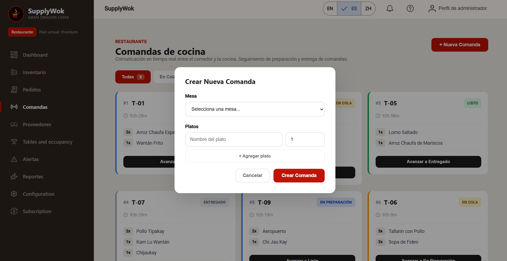

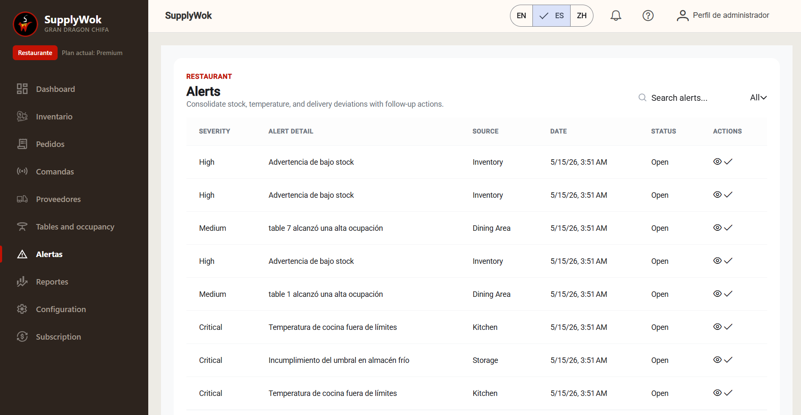

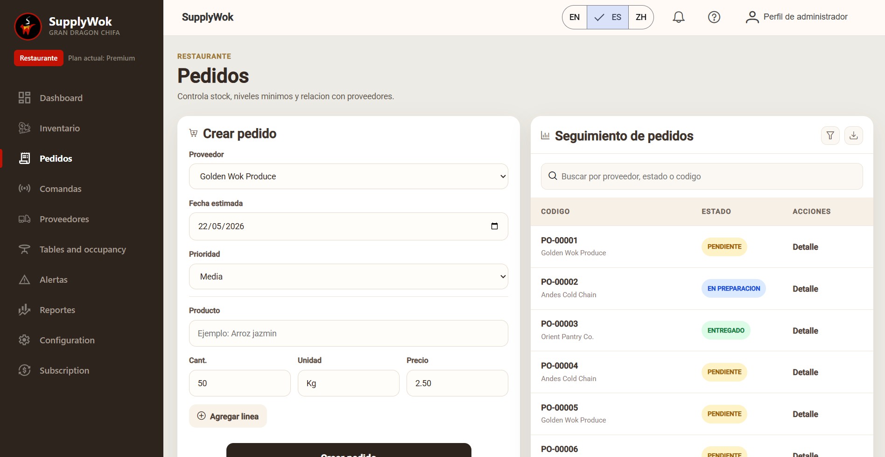

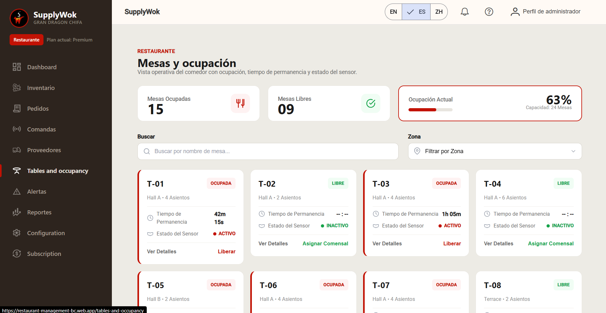

**Link del video de explicación del Sprint:** https://www.youtube.com/watch?v=GsYC-nSofsI

#### 5.2.2.6. Services Documentation Evidence for Sprint Review.

Durante el Sprint 2 se desarrolló una Fake API utilizando JSON Server y MockAPI para proporcionar datos temporales al frontend. Gracias a esta implementación fue posible simular las operaciones CRUD y validar el correcto funcionamiento de los distintos módulos de la plataforma. En esta iteración se implementaron los endpoints correspondientes a los recursos purchase-orders, suppliers, tables, comandas y restaurants. A continuación, se presenta la documentación de cada uno de ellos.

**JSON Server URL:** https://my-json-server.typicode.com/joanfpp2-ai/supplywok-db-server


### Purchase Orders

| Método HTTP | Endpoint | Descripción |
|--------------|----------|-------------|
| GET | `/purchase-orders` | Obtiene la lista de órdenes de compra. |
| GET | `/purchase-orders/{id}` | Obtiene una orden de compra por su identificador. |
| POST | `/purchase-orders` | Registra una nueva orden de compra. |
| PUT | `/purchase-orders/{id}` | Actualiza una orden de compra existente. |
| DELETE | `/purchase-orders/{id}` | Elimina una orden de compra. |

### Suppliers

| Método HTTP | Endpoint | Descripción |
|--------------|----------|-------------|
| GET | `/suppliers` | Obtiene la lista de proveedores. |
| GET | `/suppliers/{id}` | Obtiene un proveedor por su identificador. |
| POST | `/suppliers` | Registra un nuevo proveedor. |
| PUT | `/suppliers/{id}` | Actualiza la información de un proveedor. |
| DELETE | `/suppliers/{id}` | Elimina un proveedor. |

### Tables

| Método HTTP | Endpoint | Descripción |
|--------------|----------|-------------|
| GET | `/tables` | Obtiene la lista de mesas del restaurante. |
| GET | `/tables/{id}` | Obtiene una mesa por su identificador. |
| POST | `/tables` | Registra una nueva mesa. |
| PUT | `/tables/{id}` | Actualiza la información de una mesa. |
| DELETE | `/tables/{id}` | Elimina una mesa. |

### Comandas

| Método HTTP | Endpoint | Descripción |
|--------------|----------|-------------|
| GET | `/comandas` | Obtiene la lista de comandas registradas. |
| GET | `/comandas/{id}` | Obtiene una comanda por su identificador. |
| POST | `/comandas` | Registra una nueva comanda. |
| PUT | `/comandas/{id}` | Actualiza la información de una comanda. |
| DELETE | `/comandas/{id}` | Elimina una comanda. |

### Restaurants

| Método HTTP | Endpoint | Descripción |
|--------------|----------|-------------|
| GET | `/restaurants` | Obtiene la información de los restaurantes. |
| GET | `/restaurants/{id}` | Obtiene un restaurante por su identificador. |
| POST | `/restaurants` | Registra un nuevo restaurante. |
| PUT | `/restaurants/{id}` | Actualiza la información de un restaurante. |
| DELETE | `/restaurants/{id}` | Elimina un restaurante. |

#### 5.2.2.7. Software Deployment Evidence for Sprint Review.

En esta sección se presentan las evidencias correspondientes al despliegue del frontend de SupplyWok y de la Fake API implementada mediante JSON Server, permitiendo que ambos componentes se encuentren disponibles para su acceso y evaluación durante el Sprint 2.

**Deploy del Json Server**

1. Se accedió al servicio My JSON Server mediante el link https://my-json-server.typicode.com/ y se siguieron los pasos necesarios para publicar el repositorio que contiene el archivo db.json.

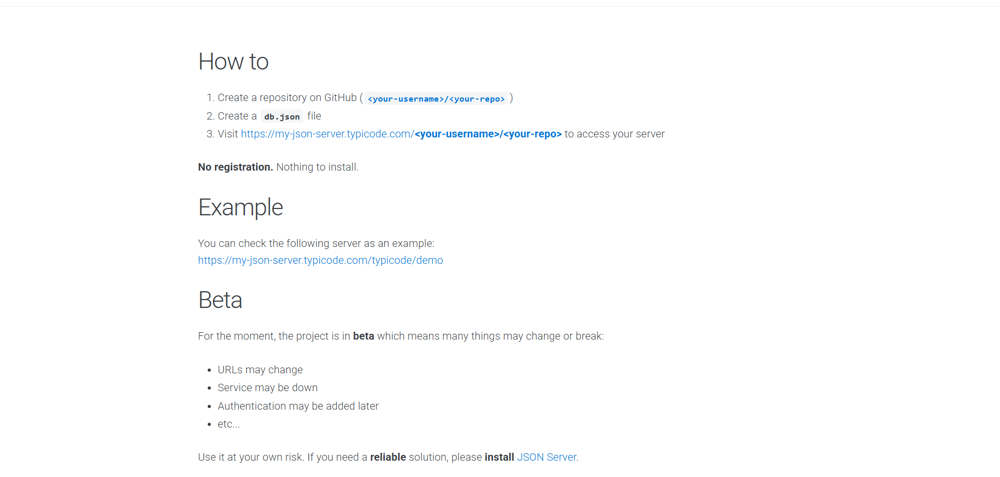

2. Se creó un repositorio en GitHub y se cargó el archivo db.json, el cual almacena la información utilizada por la Fake API

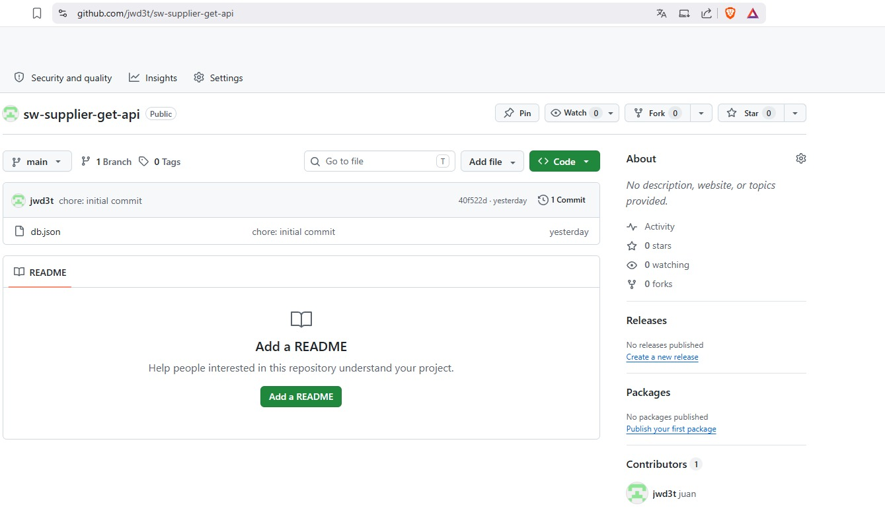

3. Finalmente, se verificó el acceso a la Fake API mediante la URL pública generada por My JSON Server https://my-json-server.typicode.com/joanfpp2-ai/supplywok-db-server, comprobando la disponibilidad de los recursos y endpoints implementados.


**Deploy de la Plataforma en Firebase**

1. Se accedió a Firebase mediante el link https://firebase.google.com/ y se creó un nuevo proyecto para alojar la aplicación web.

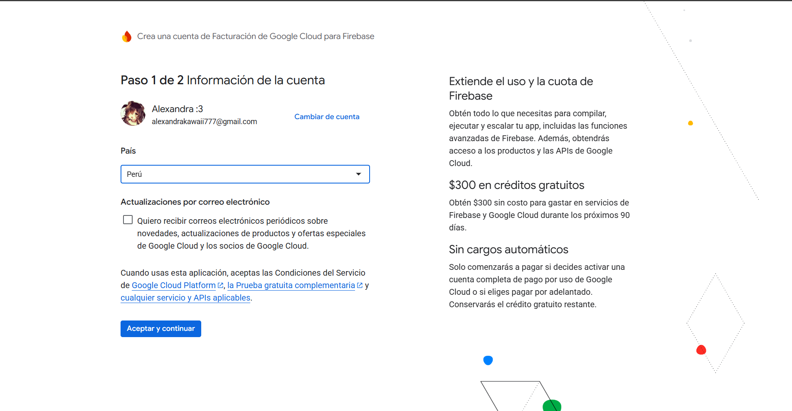

2. Mediante la terminal de JetBrains y las herramientas de Firebase CLI, se realizó el despliegue del frontend, obteniendo una URL pública para acceder a la aplicación.

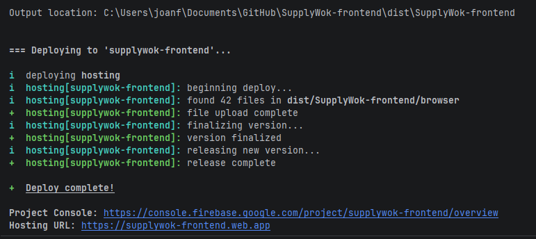

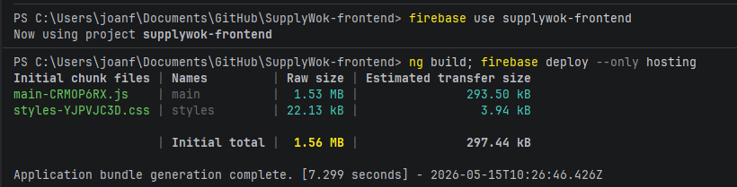

Con el despliegue del frontend y de la Fake API fue posible validar el funcionamiento de la plataforma en un entorno accesible desde Internet, permitiendo consumir los datos simulados mediante JSON Server sin depender aún de un backend implementado.

#### 5.2.2.8. Team Collaboration Insights during Sprint.

Durante el Sprint 2, el equipo trabajó de manera colaborativa en el desarrollo del frontend de SupplyWok y de la Fake API, utilizando una estrategia de trabajo basada en ramas de Git y GitHub. Las tareas fueron distribuidas de manera que cada integrante asumiera el desarrollo de los módulos relacionados con su bounded context priorizado, incluyendo la implementación de las interfaces correspondientes, la configuración de la Fake API y el registro de los datos necesarios en el archivo db.json para su consumo por parte del frontend. A continuación, se presentan las evidencias de la colaboración de todos los integrantes del equipo en el repositorio del frontend, a partir de los analíticos de GitHub, incluyendo las contribuciones realizadas, el historial de commits y la actividad desarrollada durante el Sprint.


Como se observa en la sección Contributors del repositorio del frontend, durante el Sprint 2 se realizaron más de 20 commits, reflejando la participación de cada integrante en el desarrollo de las tareas asignadas y el trabajo colaborativo realizado durante la iteración.


Como se observa en el detalle de la sección Contributors, todos los integrantes realizaron contribuciones al repositorio. En promedio, cada miembro efectuó aproximadamente 6 commits y contribuyó un minimo de 2100 líneas de código agregadas.


Como se observa en la sección Pulse del repositorio del frontend, durante la última semana se integraron 7 Pull Requests y se registraron 52 commits distribuidos entre la rama principal y las distintas ramas de desarrollo (feature branches) de cada integrante. Asimismo, la rama principal del proyecto recibió 24 commits, reflejando el avance continuo del frontend, la integración de funcionalidades y las correcciones realizadas durante el Sprint 2.

### 5.2.3. Sprint 3

En esta sección se registra y explica el avance realizado durante el Sprint 3 en términos de producto y trabajo colaborativo. El enfoque principal de este Sprint es el desarrollo e implementación de los servicios backend mediante Java y Spring Boot para los bounded contexts priorizados, así como la validación y correcto funcionamiento de sus endpoints REST.

#### 5.2.3.1. Sprint Planning 3

Durante la reunión de Sprint Planning del Sprint 3, se estableció como objetivo principal avanzar significativamente en el desarrollo backend de la plataforma **SupplyWok**, planteando alcanzar aproximadamente el 60% de implementación de los servicios backend del sistema. Para ello, se priorizó el desarrollo de los bounded contexts correspondientes al núcleo del negocio, incluyendo **Inventory Management**, **Supply and Purchasing**, **Operational Monitoring and IoT Alerts**, **Restaurant Management** y **Supplier Management & Operations**. Asimismo, el equipo revisó los resultados obtenidos durante el sprint anterior e identificó oportunidades de mejora con el fin de corregir errores, optimizar el proceso de desarrollo y garantizar una base sólida para las siguientes etapas del proyecto.

**Sprint Planning 3**

| **Sprint #** | 3 |
|---|---|
| **Date** | 05-06-2026 |
| **Time** | 15:00 |
| **Location** | Virtual, Discord |
| **Prepared by** | Zayd Ayasta, Juan Wang |
| **Attendees** | Marcelo Cuadros, Alexandra Meza, Joan Payano, Zayd Ayasta, Juan Wang |
| **Sprint 2 Review Summary** | Durante el Sprint 2 se completó el desarrollo de la aplicación frontend utilizando una Fake API para simular la comunicación con los servicios backend. Se implementaron las principales interfaces y flujos de usuario previstos para la plataforma, obteniendo resultados satisfactorios en términos de funcionalidad, organización del código y experiencia de usuario. Como parte del feedback recibido, se destacó la calidad de la implementación realizada; sin embargo, se recomendó fortalecer la documentación técnica del proyecto para facilitar su comprensión, mantenimiento y futura integración con los servicios backend reales.|
| **Sprint 2 Retrospective Summary** | El equipo consideró que la distribución de tareas y la colaboración durante el Sprint 2 fueron adecuadas, permitiendo cumplir los objetivos establecidos dentro del plazo previsto. Asimismo, se identificó como principal oportunidad de mejora la elaboración de una documentación más completa y detallada, tanto del proceso de desarrollo como de los componentes implementados, con el fin de mejorar la comunicación interna y facilitar el trabajo en las siguientes iteraciones.|
| **Sprint 3 Goal** | Nuestro enfoque en este sprint es habilitar la gestión de inventarios, proveedores, compras y monitoreo operativo mediante los servicios principales de negocio de SupplyWok. Creemos que esto proporcionará un mayor control de las operaciones y una gestión más eficiente de la cadena de suministro para restaurantes y administradores. Esto se confirmará cuando los módulos de Inventory Management, Supply and Purchasing, Operational Monitoring and IoT Alerts, Restaurant Management y Supplier Management & Operations puedan ejecutar sus procesos mediante APIs funcionales y validadas. |
| **Sprint 3 Velocity** | Límite de **35 SP** |
| **Sum of Story Points** | **35 SP** | 

#### 5.2.3.2. Aspect Leaders and Collaborators.

En esta sección se presenta la matriz de liderazgo y colaboración correspondiente al Sprint 3. Dado que el objetivo principal de esta iteración es avanzar en el desarrollo backend de SupplyWok, los aspectos considerados corresponden a los bounded contexts de negocio. Para cada aspecto se asigna un líder responsable de coordinar el desarrollo y uno o más colaboradores encargados de apoyar en la implementación, validación y pruebas de los servicios y endpoints asociados.

**Link el Sprint 3 Board:** https://trello.com/invite/b/6a32b75e1ae8d9ce0c6a80c5/ATTI1c7df3100c5d6f7a9b96e772b7dfaf15012EAD3F/mi-tablero-de-trello

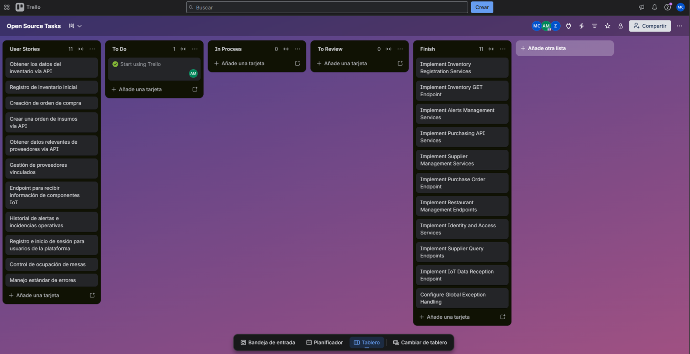

**Consider Aspects** 

- **Inventory Management Bounded Context**: Es el encargado de gestionar la informacion de los recursos de inventario de cada restaurante.

- **Supply and Purchasing Bounded Context**: Es el encargado de gestionar las órdenes de suplementos realizadas por cada restaurante.

- **Restaurant Management Bounded Context**: Es el encargado de gestionar todo lo relacionado con la operación del establecimiento.

- **Operational Monitoring and IoT Alerts Bounded Context**: Es el encargado de gestionar la información recopilada por los sensores del restaurante.

- **Supplier Management & Operations Bounded Context**: Es el encargado de gestionar la información de los proveedores y sus pedidos.

- **Identity & Access Bounded Context**: Es el encargado de gestionar todo lo relacionado con la autenticación y administración de cuentas.

- **Shared Bounded Context**: Contiene Value Objects y componenetes visuales comunes que son reutilizados por múltiples bounded contexts del sistema.

| Team Member | GitHub username | Inventory Management Bounded BC | Supply and Purchasing BC / Shared BC | Restaurant Management BC | Supplier Management & Operations BC | Operational Monitoring and IoT Alerts BC / Identity & Access BC  |
|---|---|---|---|---|---|---|
| Cuadros, Marcelo | Marcelo-alt-lab | C | C | C | - | L |
| Payano, Joan | Nounz27             | - | C | L | C | C |
| Meza, Alexandra | AlexandraYMS     | L | C | - | C | C |
| Ayasta, Zayd | Zayd Ayasta         | C | L | C | C | - |
| Wang, Juan | jwd3t                 | C | - | C | L | C |

#### 5.2.3.3. Sprint Backlog 3

En esta sección se presenta el Sprint Backlog correspondiente al Sprint 3. Los elementos incluidos fueron seleccionados en función del Sprint Goal establecido para esta iteración, el cual busca habilitar los procesos principales de gestión de inventarios, proveedores, compras y monitoreo operativo de SupplyWok mediante servicios backend funcionales. Para ello, se definieron las historias de usuario y tareas necesarias para implementar, validar y documentar los endpoints REST de los bounded contexts priorizados, asegurando su correcto funcionamiento antes de la integración con los componentes frontend de la plataforma.

**Link el Sprint 3 Board:** https://trello.com/invite/b/6a32b75e1ae8d9ce0c6a80c5/ATTI1c7df3100c5d6f7a9b96e772b7dfaf15012EAD3F/mi-tablero-de-trello


**Sprint 3 Backlog**

| US Id | US Title                                                   | Task Id | Task Title                                | Description                                                                                                      | Estimation (Hours) | Assigned To     | Status |
| ----- | ---------------------------------------------------------- | ------- | ----------------------------------------- | ---------------------------------------------------------------------------------------------------------------- | ------------------ | --------------- | ------ |
| US34  | Obtener los datos del inventario vía API                   | T-01    | Implement Inventory GET Endpoint          | Desarrollar endpoint GET para consultar inventario de un restaurante y exponer la información mediante API REST. | 8                  | Alexandra Meza  | Done   |
| US01  | Registro de inventario inicial                             | T-02    | Implement Inventory Registration Services | Implementar entidades, repositorios y servicios para registrar insumos en inventario.                            | 6                  | Alexandra Meza  | Done   |
| US09  | Creación de orden de compra                                | T-03    | Implement Purchase Order Endpoint         | Desarrollar endpoint POST para registrar órdenes de compra.                                                      | 6                  | Zayd Ayasta     | Done   |
| US37  | Crear una orden de insumos vía API                         | T-04    | Implement Purchasing API Services         | Implementar servicios de aplicación, validaciones y persistencia para órdenes de compra.                         | 6                  | Zayd Ayasta     | Done   |
| US38  | Obtener datos relevantes de proveedores vía API            | T-05    | Implement Supplier Query Endpoints        | Desarrollar endpoints para consulta de proveedores y catálogos asociados.                                        | 6                  | Juan Wang       | Done   |
| US12  | Gestión de proveedores vinculados                          | T-06    | Implement Supplier Management Services    | Implementar entidades y lógica de negocio para gestión de proveedores.                                           | 5                  | Juan Wang       | Done   |
| US42  | Endpoint para recibir información de componentes IoT       | T-07    | Implement IoT Data Reception Endpoint     | Implementar endpoint para recepción de información proveniente de sensores IoT.                                  | 8                  | Marcelo Cuadros | Done   |
| US18  | Historial de alertas e incidencias operativas              | T-08    | Implement Alerts Management Services      | Implementar servicios y endpoints para consulta de alertas operativas registradas.                               | 6                  | Marcelo Cuadros | Done   |
| US26  | Registro e inicio de sesión para usuarios de la plataforma | T-09    | Implement Identity and Access Services    | Implementar servicios base de autenticación y gestión de usuarios.                                               | 5                  | Marcelo Cuadros | Done   |
| US17  | Control de ocupación de mesas                              | T-10    | Implement Restaurant Management Endpoints | Implementar endpoints relacionados con la gestión operativa del restaurante.                                     | 5                  | Joan Payano     | Done   |
| US36  | Manejo estándar de errores                                 | T-11    | Configure Global Exception Handling       | Implementar manejo centralizado de excepciones y respuestas HTTP estandarizadas.                                 | 4                  | Zayd Ayasta     | Done   |
| US39  | Evitar almacenamientos en errores                          | T-12    | Configure Transaction Management          | Configurar validaciones y transacciones para evitar persistencia de datos inválidos.                             | 3                  | Zayd Ayasta     | Done   |


#### 5.2.3.4. Development Evidence for Sprint Review.

En esta sección se presentan los avances realizados durante el Sprint 3 en la implementación de los componentes backend de SupplyWok. El trabajo desarrollado se centró en la construcción de los bounded contexts priorizados del núcleo del negocio, incluyendo la implementación de entidades de dominio, repositorios, servicios de aplicación y endpoints REST mediante Java y Spring Boot.

| Repository                       | Branch                        | Commit Id | Commit Message                                                                          | Commit Message Body                                                                             | Commited on (Date) |
| -------------------------------- | ----------------------------- | --------- | --------------------------------------------------------------------------------------- | ----------------------------------------------------------------------------------------------- | ------------------ |
| Aurora-startup/SupplyWok-backend | feature/shared                | 9e50ab7   | feat(shared): implement shared layer                                                    | Implementación de la capa compartida utilizada por los diferentes bounded contexts del sistema. | 2026-06-10         |
| Aurora-startup/SupplyWok-backend | develop                       | 32c9e97   | chore: configure application properties and add dependencies for PostgreSQL and OpenAPI | Configuración inicial del proyecto, dependencias de PostgreSQL y documentación OpenAPI.         | 2026-06-10         |
| Aurora-startup/SupplyWok-backend | feature/iot                   | d9c9842   | feat(iot): implement iot layer with sensor aggregate                                    | Implementación del bounded context de monitoreo IoT y agregado Sensor.                          | 2026-06-10         |
| Aurora-startup/SupplyWok-backend | feature/restaurant-management | 8b85738   | feat(restaurant-management): implement restaurant management bounded context            | Desarrollo del bounded context Restaurant Management.                                           | 2026-06-11         |
| Aurora-startup/SupplyWok-backend | feature/inventory-management  | 27c933e   | Add value objects for inventory management bounded context                              | Implementación de value objects para Inventory Management.                                      | 2026-06-12         |
| Aurora-startup/SupplyWok-backend | feature/inventory-management  | dcfa1ef   | Add aggregates and entities                                                             | Incorporación de agregados y entidades del dominio para Inventory Management.                   | 2026-06-12         |
| Aurora-startup/SupplyWok-backend | feature/inventory-management  | 4f8aef7   | Finish domain package of inventory management bounded context                           | Finalización de la estructura del dominio para Inventory Management.                            | 2026-06-13         |
| Aurora-startup/SupplyWok-backend | feature/suppliers             | 48967ca   | feat(suppliers): add clients endpoint                                                   | Implementación del endpoint para consulta de clientes asociados a proveedores.                  | 2026-06-17         |
| Aurora-startup/SupplyWok-backend | feature/suppliers             | 30598b0   | feat(suppliers): add catalog endpoint by supplier id                                    | Implementación del endpoint para consulta de catálogo por proveedor.                            | 2026-06-18         |
| Aurora-startup/SupplyWok-backend | feature/purchasing            | e25f995   | feat: add purchase order management endpoints and domain                                | Desarrollo del dominio y endpoints para la gestión de órdenes de compra.                        | 2026-06-18         |
| Aurora-startup/SupplyWok-backend | feature/purchasing            | 00bef77   | feat: align inventory persistence and activity endpoints                                | Ajuste de persistencia y endpoints relacionados con actividades de inventario.                  | 2026-06-18         |
| Aurora-startup/SupplyWok-backend | feature/purchasing            | 4a31215   | feat: add supplier identity acl contract                                                | Implementación del contrato ACL para integración con el contexto de proveedores.                | 2026-06-18         |
| Aurora-startup/SupplyWok-backend | feature/alerts                | 427701d   | feat(alerts): add alerts aggregate and controllers                                      | Implementación de agregados y controladores para el módulo de alertas operativas.               | 2026-06-18         |
| Aurora-startup/SupplyWok-backend | feature/alerts                | 7e87e5    | refactor(alerts): replace external services with IoT and inventory context facades      | Refactorización para integrar el módulo de alertas con los contextos IoT e Inventory.           | 2026-06-18         |
| Aurora-startup/SupplyWok-backend | feature/restaurant-management | c4ba83c   | fix: add CrossOrigin and clean imports in restaurant management controllers             | Corrección de configuración CORS y limpieza de imports en los controladores.                    | 2026-06-18         |

#### 5.2.3.5. Execution Evidence for Sprint Review

Durante el Sprint 3 se completó la implementación y validación de los principales servicios backend de SupplyWok correspondientes a los bounded contexts priorizados del núcleo del negocio. Como parte de la revisión del sprint, se verificó el correcto funcionamiento de los endpoints REST desarrollados mediante pruebas realizadas en Swagger/OpenAPI, comprobando la ejecución satisfactoria de las operaciones expuestas por la API. Ademas, se validó la persistencia de la información en la base de datos PostgreSQL mediante pgAdmin.

| Componente | Descripción | Enlace |
|------------|-------------|--------|
| Backend | Backend desplegado con la documentacion Open Api | https://supplywok-backend.onrender.com/swagger-ui/index.html |
| Repositorio Backend | Código fuente del backend | https://github.com/Aurora-startup/SupplyWok-backend |

En las siguientes evidencias se muestran los endpoints implementados donde se puede observar la exposición de las operaciones CRUD y servicios específicos desarrollados durante el sprint.

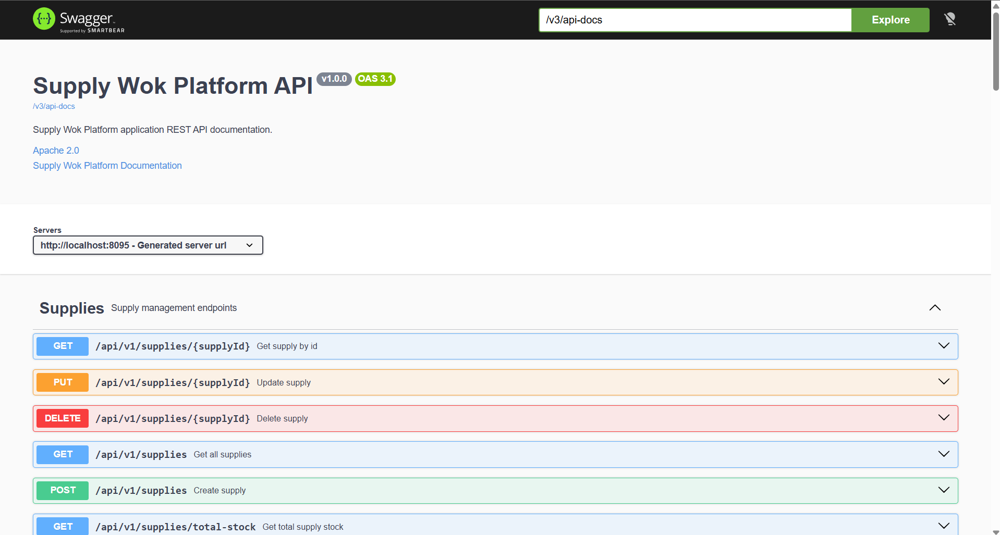

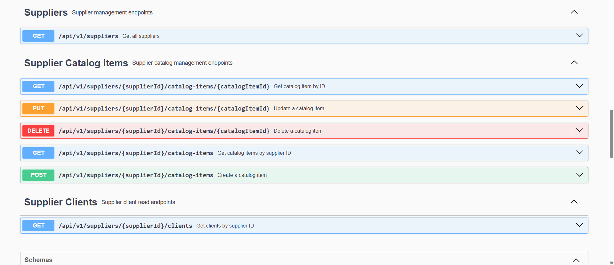

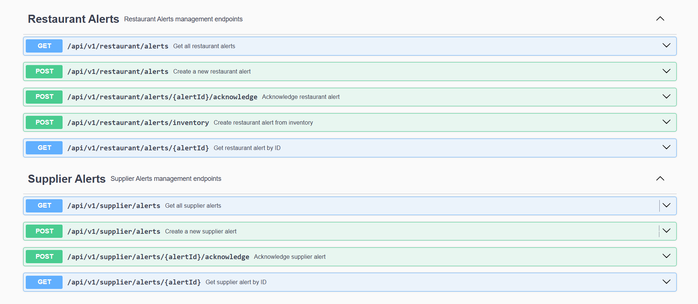

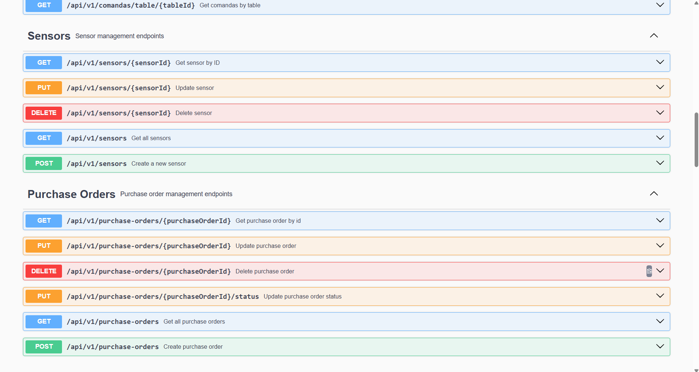

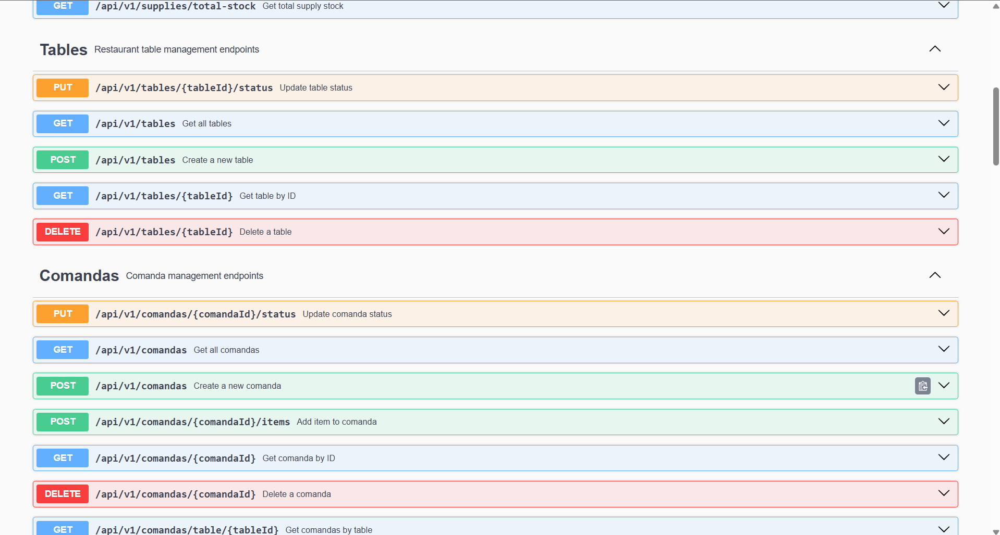

Adicionalmente, se realizó la validación de persistencia utilizando pgAdmin, comprobando que las operaciones ejecutadas desde la API generaban correctamente los registros correspondientes dentro de la base de datos PostgreSQL de SupplyWok. Esta verificación permitió asegurar la correcta comunicación entre la capa de aplicación y la capa de almacenamiento.

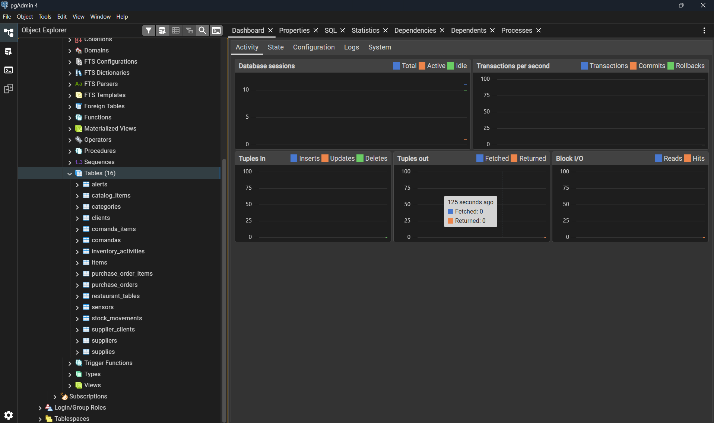

**Link del video de explicación del Sprint:** https://www.youtube.com/watch?v=GsYC-nSofsI

#### 5.2.3.6. Services Documentation Evidence for Sprint Review

Durante el Sprint 3 se documentaron los servicios web desarrollados para los bounded contexts priorizados de SupplyWok utilizando OpenAPI/Swagger. La documentación generada permite visualizar y comprender la estructura de los endpoints implementados, incluyendo los métodos HTTP soportados, parámetros de entrada, cuerpos de solicitud, respuestas esperadas y códigos de estado asociados. A continuación, se presenta el detalle de los endpoints documentados, los enlaces correspondientes a la documentación generada y evidencias de interacción utilizando datos de prueba.

**Repository URL:** https://github.com/Aurora-startup/SupplyWok-backend

**OpenAPI Documentation URL:** https://supplywok-backend.onrender.com/swagger-ui/index.html

### Supplies

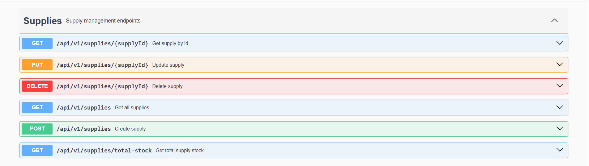

| Endpoint | Método HTTP | Acción implementada | Sintaxis de llamada | Parámetros | Ejemplo Request | Ejemplo Response | Explicación Response |
| :--- | :--- | :--- | :--- | :--- | :--- | :--- | :--- |
| /api/v1/supplies/<br>{supplyId} | GET | Obtener suministro por ID | GET /api/v1/supplies/<br>{supplyId} | supplyId (integer) | N/A | {"id": 1, "name": "Rice", ...} | Retorna la información del suministro solicitado. |
| /api/v1/supplies/<br>{supplyId} | PUT | Actualizar suministro | PUT /api/v1/supplies/<br>{supplyId} | supplyId (integer) | {"name": "Rice", "unitOfMeasure": "Kilograms", "minimumStockLevel": 25, "category": "Grains"} | {"id": 1, "name": "Rice", "unitOfMeasure": "Kilograms", "currentStock": 80, ...} | Retorna el suministro actualizado. |
| /api/v1/supplies/<br>{supplyId} | DELETE | Eliminar suministro | DELETE /api/v1/supplies/<br>{supplyId} | supplyId (integer) | N/A | {"message": "Suministro eliminado"} | Confirma la eliminación del suministro. |
| /api/v1/supplies | GET | Obtener todos los suministros | GET /api/v1/supplies | Ninguno | N/A | [{"id": 1, "name": "Rice", ...}] | Retorna la lista de suministros registrados. |
| /api/v1/supplies | POST | Crear suministro | POST /api/v1/supplies | Ninguno | {"name": "Rice", "unitOfMeasure": "Kilograms", "currentStock": 80, "minimumStockLevel": 20, "category": "Grains"} | {"id": 1, "name": "Rice", ...} | Retorna el suministro creado. |
| /api/v1/supplies/total-stock | GET | Obtener stock total | GET /api/v1/supplies/total-stock | Ninguno | N/A | {"totalStock": 150} | Retorna la cantidad total disponible. |


### Tables

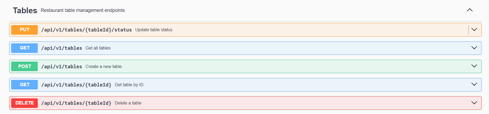

| Endpoint  | Método HTTP | Acción implementada   | Sintaxis de llamada  | Parámetros | Ejemplo Request  | Ejemplo Response   | Explicación Response   |
| ------ | ----------- | -------- | ------------ | ------- | ----- | ----- | --------- |
| /api/v1/tables                  | POST        | Crear una nueva mesa          | POST /api/v1/tables | Ninguno    | json { "number": 1, "capacity": 4 }  | json { "id": 1, "number": 1, "capacity": 4, "status": "AVAILABLE" }      | Crea una nueva mesa en el restaurante y devuelve la información registrada. |
| /api/v1/tables/<br>{tableId} | GET         | Obtener mesa por ID           | GET /api/v1/tables/<br>{tableId}        | tableId  | N/A (No requiere body)                 | json { "id": 1, "number": 1, "capacity": 4, "status": "AVAILABLE" }      | Devuelve la información detallada de una mesa específica.                   |
| /api/v1/tables   | GET         | Obtener todas las mesas       | GET /api/v1/tables  | Ninguno    | N/A (No requiere body)   | json [ { "id": 1, "number": 1, "capacity": 4, "status": "AVAILABLE" } ] | Devuelve la lista completa de mesas registradas en el restaurante.          |
| /api/v1/tables/<br>{tableId}/status | PUT         | Actualizar estado de una mesa | PUT /api/v1/tables/<br>{tableId}/status | tableId  | json { "status": "OCCUPIED" }        | json { "id": 1, "number": 1, "capacity": 4, "status": "OCCUPIED" }       | Actualiza el estado de la mesa y devuelve la información actualizada.       |
| /api/v1/tables/<br>{tableId}        | DELETE      | Eliminar una mesa             | DELETE /api/v1/tables/<br>{tableId} | tableId  | N/A (No requiere body)  | Sin contenido (200 OK)| Elimina la mesa especificada del sistema.                                   |


### Comandas

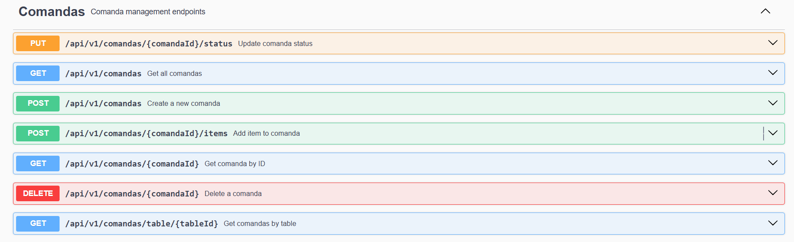

| Endpoint                              | Método HTTP | Acción implementada              | Sintaxis de llamada                       | Parámetros  | Ejemplo Request                                                                  | Ejemplo Response                                                                                                                                    | Explicación Response                                                                 |
| ------------------------------------- | ----------- | -------------------------------- | ----------------------------------------- | ----------- | -------------------------------------------------------------------------------- | --------------------------------------------------------------------------------------------------------------------------------------------------- | ------------------------------------------------------------------------------------ |
| /api/v1/comandas                    | POST        | Crear una nueva comanda          | POST /api/v1/comandas                   | Ninguno     | json { "tableId": 1 }                                                          | json { "id": 1, "tableId": 1, "status": "OPEN", "items": [] }                                                                                   | Crea una nueva comanda asociada a una mesa y devuelve la información registrada.     |
| /api/v1/comandas/<br>{comandaId}        | GET         | Obtener comanda por ID           | GET /api/v1/comandas/<br>{comandaId}        | comandaId | N/A (No requiere body)                                                           | json { "id": 1, "tableId": 1, "status": "OPEN", "items": [] }                                                                                     | Devuelve la información detallada de una comanda específica.                         |
| /api/v1/comandas                    | GET         | Obtener todas las comandas       | GET /api/v1/comandas                    | Ninguno     | N/A (No requiere body)                                                           | json [ { "id": 1, "tableId": 1, "status": "OPEN", "items": [] } ]                                                                               | Devuelve la lista completa de comandas registradas.                                  |
| /api/v1/comandas/table/<br>{tableId}    | GET         | Obtener comandas por mesa        | GET /api/v1/comandas/table/<br>{tableId}    | tableId   | N/A (No requiere body)                                                           | json [ { "id": 1, "tableId": 1, "status": "OPEN", "items": [] } ]                                                                                  | Devuelve todas las comandas asociadas a una mesa específica.                         |
| /api/v1/comandas/<br>{comandaId}/status | PUT         | Actualizar estado de una comanda | PUT /api/v1/comandas/<br>{comandaId}/status | comandaId | json { "status": "SENT_TO_KITCHEN" }                                           | json { "id": 1, "tableId": 1, "status": "SENT_TO_KITCHEN", "items": [] }                                                                          | Actualiza el estado de la comanda y devuelve la información actualizada.             |
| /api/v1/comandas/<br>{comandaId}/items  | POST        | Agregar un ítem a una comanda    | POST /api/v1/comandas/<br>{comandaId}/items | comandaId | json { "productName": "Lomo Saltado", "quantity": 2, "notes": "Sin cebolla" }  | json { "id": 1, "tableId": 1, "status": "OPEN", "items": [ { "id": 1, "productName": "Lomo Saltado", "quantity": 2, "notes": "Sin cebolla" } ] }  | Agrega un producto a la comanda y devuelve la comanda actualizada con el nuevo ítem. |
| /api/v1/comandas/<br>{comandaId}        | DELETE      | Eliminar una comanda             | DELETE /api/v1/comandas/<br>{comandaId}     | comandaId | N/A (No requiere body)                                                           | Sin contenido (200 OK)                                                                                                                             | Elimina la comanda indicada del sistema.                                             |


### Sensors

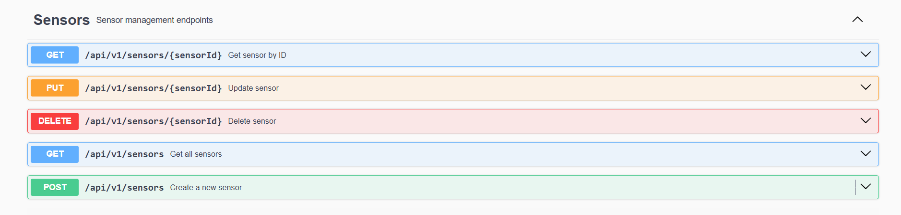

| Endpoint                     | Método HTTP | Acción implementada        | Sintaxis de llamada                 | Parámetros | Ejemplo Request                                                                                                                                    | Ejemplo Response                                                                                                                                            | Explicación Response                                                               |
| ---------------------------- | ----------- | -------------------------- | ----------------------------------- | ---------- | -------------------------------------------------------------------------------------------------------------------------------------------------- | ----------------------------------------------------------------------------------------------------------------------------------------------------------- | ---------------------------------------------------------------------------------- |
| /api/v1/sensors            | POST        | Crear un nuevo sensor      | POST /api/v1/sensors              | Ninguno    | json { "name": "Temperature Sensor 1", "minValue": -20.0, "maxValue": 60.0, "enabled": true, "lastValue": 22.5, "type": "Temperature" }          | json { "id": 1, "name": "Temperature Sensor 1", "minValue": -20.0, "maxValue": 60.0, "enabled": true, "lastValue": 22.5, "type": "Temperature" }          | Crea un nuevo sensor en el sistema y devuelve la información registrada.           |
| /api/v1/sensors/{sensorId} | GET         | Obtener sensor por ID      | GET /api/v1/sensors/{sensorId}    | sensorId | N/A (No requiere body)                                                                                                                             | json { "id": 1, "name": "Temperature Sensor 1", "minValue": -20.0, "maxValue": 60.0, "enabled": true, "lastValue": 22.5, "type": "Temperature" }         | Devuelve la información detallada de un sensor específico.                         |
| /api/v1/sensors            | GET         | Obtener todos los sensores | GET /api/v1/sensors               | Ninguno    | N/A (No requiere body)                                                                                                                             | json [ { "id": 1, "name": "Temperature Sensor 1", "minValue": -20.0, "maxValue": 60.0, "enabled": true, "lastValue": 22.5, "type": "Temperature" } ]     | Devuelve la lista completa de sensores registrados.                                |
| /api/v1/sensors/{sensorId} | PUT         | Actualizar sensor          | PUT /api/v1/sensors/{sensorId}    | sensorId | json { "name": "Temperature Sensor 1 Updated", "minValue": -20.0, "maxValue": 60.0, "enabled": true, "lastValue": 23.5, "type": "Temperature" }  | json { "id": 1, "name": "Temperature Sensor 1 Updated", "minValue": -20.0, "maxValue": 60.0, "enabled": true, "lastValue": 23.5, "type": "Temperature" }  | Actualiza la información de un sensor existente y devuelve los datos actualizados. |
| /api/v1/sensors/{sensorId} | DELETE      | Eliminar sensor            | DELETE /api/v1/sensors/{sensorId} | sensorId | N/A (No requiere body)                                                                                                                             | Sin contenido (204 No Content)                                                                                                                              | Elimina el sensor indicado del sistema.                                            |


### Purchase Orders

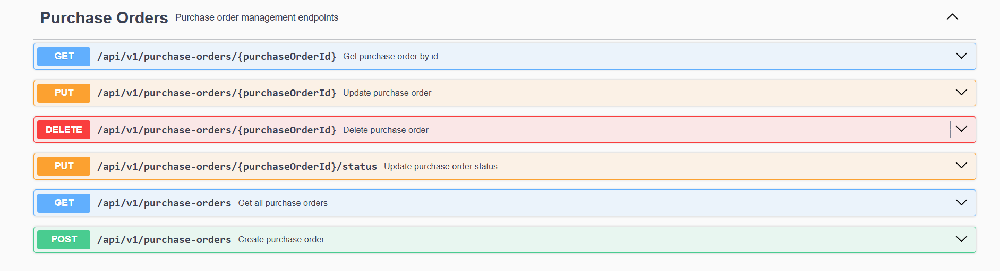

| Endpoint                                           | Método HTTP | Acción implementada                      | Sintaxis de llamada                                    | Parámetros        | Ejemplo Request                                                                                                                                                                                                                                                                                                              | Ejemplo Response                                                                                                                                                                                                                                       | Explicación Response                                                                        |
| -------------------------------------------------- | ----------- | ---------------------------------------- | ------------------------------------------------------ | ----------------- | ---------------------------------------------------------------------------------------------------------------------------------------------------------------------------------------------------------------------------------------------------------------------------------------------------------------------------- | ------------------------------------------------------------------------------------------------------------------------------------------------------------------------------------------------------------------------------------------------------ | ------------------------------------------------------------------------------------------- |
| /api/v1/purchase-orders                        | POST        | Crear una nueva orden de compra          | POST /api/v1/purchase-orders`                         | Ninguno           | json { "code": "PO-24021", "supplierId": 201, "supplierName": "Golden Wok Produce", "restaurantName": "Gran Dragon Chifa", "orderDate": "2026-05-10", "estimatedDate": "2026-05-11", "priority": "High", "status": "Pending", "items": [{"productName": "Rice", "quantity": 25.00, "unitPrice": 4.50, "unitType": "kg"}] }` | json { "id": 1, "code": "PO-24021", "supplierId": 201, "supplierName": "Golden Wok Produce", "restaurantName": "Gran Dragon Chifa", "orderDate": "2026-05-10", "estimatedDate": "2026-05-11", "priority": "High", "status": "Pending", "items": [] } | Crea una nueva orden de compra y devuelve la información registrada.                        |
| /api/v1/purchase-orders                        | GET         | Obtener todas las órdenes de compra      | GET /api/v1/purchase-orders                         | Ninguno           | N/A (No requiere body)                                                                                                                                                                                                                                                                                                       | json [ { "id": 1, "code": "PO-24021", "supplierName": "Golden Wok Produce", "status": "Pending" } ]                                                                                                                                                 | Devuelve la lista completa de órdenes de compra registradas.                                |
| /api/v1/purchase-orders/{purchaseOrderId}        | GET         | Obtener orden de compra por ID           | GET /api/v1/purchase-orders/{purchaseOrderId}        | purchaseOrderId | N/A (No requiere body)                                                                                                                                                                                                                                                                                                       | json { "id": 1, "code": "PO-24021", "supplierId": 201, "restaurantName": "Gran Dragon Chifa", "status": "Pending" }`                                                                                                                                  | Devuelve la información detallada de una orden de compra específica.                        |
| /api/v1/purchase-orders/{purchaseOrderId}        | PUT         | Actualizar una orden de compra           | PUT /api/v1/purchase-orders/{purchaseOrderId}        | `purchaseOrderId | json { "code": "PO-24021", "supplierId": 201, "supplierName": "Golden Wok Produce", "restaurantName": "Gran Dragon Chifa", "orderDate": "2026-05-10", "estimatedDate": "2026-05-12", "priority": "High", "status": "Confirmed", "items": [] }                                                                              | json { "id": 1, "code": "PO-24021", "status": "Confirmed" }                                                                                                                                                                                          | Actualiza los datos de una orden de compra existente y devuelve la información actualizada. |
| /api/v1/purchase-orders/{purchaseOrderId}/status` | PUT         | Actualizar estado de una orden de compra | PUT /api/v1/purchase-orders/{purchaseOrderId}/status | purchaseOrderId | json { "status": "In Transit" }                                                                                                                                                                                                                                                                                            | json { "id": 1, "code": "PO-24021", "status": "In Transit" }                                                                                                                                                                                         | Actualiza únicamente el estado de la orden de compra.                                       |
| /api/v1/purchase-orders/{purchaseOrderId}        | DELETE      | Eliminar una orden de compra             | DELETE /api/v1/purchase-orders/{purchaseOrderId}     | purchaseOrderId` | N/A (No requiere body)                                                                                                                                                                                                                                                                                                       | Sin contenido (204 No Content)                                                                                                                                                                                                                       | Elimina la orden de compra especificada del sistema.                                        |


### Restaurant Alerts

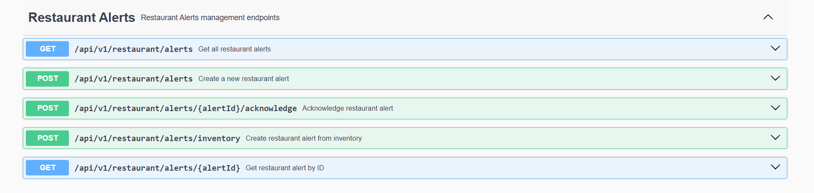

| Endpoint                                          | Método HTTP | Acción implementada                                             | Sintaxis de llamada                                    | Parámetros | Ejemplo Request                                                                                   | Ejemplo Response                                                                                                                                                                                | Explicación Response                                                                                                                                               |
| ------------------------------------------------- | ----------- | --------------------------------------------------------------- | ------------------------------------------------------ | ---------- | ------------------------------------------------------------------------------------------------- | ----------------------------------------------------------------------------------------------------------------------------------------------------------------------------------------------- | ------------------------------------------------------------------------------------------------------------------------------------------------------------------ |
| /api/v1/restaurant/alerts                       | POST        | Crear una nueva alerta de restaurante                           | POST /api/v1/restaurant/alerts                       | Ninguno    | json { "severity": "Critical", "detail": "Sensor value exceeded safety limit.", "sensorId": 1 }` | `json { "id": 1, "severity": "Critical", "detail": "Sensor value exceeded safety limit.", "status": "Pending", "alertType": "RESTAURANT", "sensorId": 1, "sensorName": "Kitchen Temp Sensor" } | Crea una nueva alerta asociada a un restaurante y devuelve la información registrada.                                                                              |
| /api/v1/restaurant/alerts/inventory             | POST        | Crear alerta de restaurante basada en diferencias de inventario | POST /api/v1/restaurant/alerts/inventory             | Ninguno    | json { "sensorId": 1 }                                                                          | json { "id": 1, "severity": "High", "detail": "Inventory stock differs from sensor value.", "status": "Pending", "alertType": "RESTAURANT", "sensorId": 1 }                                   | Genera una alerta cuando existe una diferencia entre el inventario y el último valor registrado por el sensor. Si los valores coinciden devuelve 204 No Content. |
| /api/v1/restaurant/alerts/{alertId}             | GET         | Obtener alerta de restaurante por ID                            | GET /api/v1/restaurant/alerts/{alertId}              | alertId  | N/A (No requiere body)                                                                            | json { "id": 1, "severity": "Critical", "detail": "Sensor value exceeded safety limit.", "status": "Pending", "alertType": "RESTAURANT", "sensorId": 1 }                                      | Devuelve la información detallada de una alerta específica de restaurante.                                                                                         |
| /api/v1/restaurant/alerts                       | GET         | Obtener todas las alertas de restaurante                        | GET /api/v1/restaurant/alerts                        | Ninguno    | N/A (No requiere body)                                                                            | json [ { "id": 1, "severity": "Critical", "detail": "Sensor value exceeded safety limit.", "status": "Pending", "alertType": "RESTAURANT" } ]                                                 | Devuelve la lista completa de alertas registradas para restaurantes.                                                                                               |
| /api/v1/restaurant/alerts/{alertId}/acknowledge | POST        | Confirmar una alerta de restaurante                             | POST /api/v1/restaurant/alerts/{alertId}/acknowledge | alertId  | N/A (No requiere body)                                                                            | json { "id": 1, "severity": "Critical", "detail": "Sensor value exceeded safety limit.", "status": "Acknowledged", "alertType": "RESTAURANT" }                                                | Actualiza el estado de la alerta a "Acknowledged", indicando que fue revisada correctamente.                                                                       |
                                         |

### Suppliers Alerts

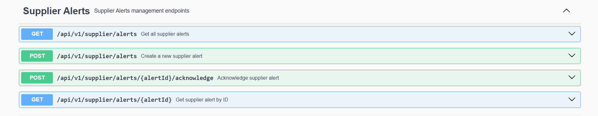

| Endpoint                                        | Método HTTP | Acción implementada                      | Sintaxis de llamada                                  | Parámetros | Ejemplo Request                                                                      | Ejemplo Response                                                                                                                                                                                                                | Explicación Response                                                                     |
| ----------------------------------------------- | ----------- | ---------------------------------------- | ---------------------------------------------------- | ---------- | ------------------------------------------------------------------------------------ | ------------------------------------------------------------------------------------------------------------------------------------------------------------------------------------------------------------------------------- | ---------------------------------------------------------------------------------------- |
| /api/v1/supplier/alerts                       | POST        | Crear una nueva alerta de proveedor      | POST /api/v1/supplier/alerts`                       | Ninguno    | json { "severity": "High", "detail": "Supplier has delayed a critical shipment." } | json { "id": 1, "severity": "High", "detail": "Supplier has delayed a critical shipment.", "status": "Pending", "createdAt": "2026-06-19T03:30:00.000+00:00", "alertType": "SUPPLIER", "sensorId": null, "sensorName": null } | Crea una nueva alerta relacionada con un proveedor y devuelve la información registrada. |
| /api/v1/supplier/alerts/{alertId}             | GET         | Obtener alerta de proveedor por ID       | GET /api/v1/supplier/alerts/{alertId}              | alertId  | N/A (No requiere body)                                                               | json { "id": 1, "severity": "High", "detail": "Supplier has delayed a critical shipment.", "status": "Pending" }                                                                                                             | Devuelve la información detallada de una alerta específica.                              |
| /api/v1/supplier/alerts         | GET         | Obtener todas las alertas de proveedores | GET /api/v1/supplier/alerts                        | Ninguno    | N/A (No requiere body)                                                               | json [ { "id": 1, "severity": "High", "detail": "Supplier has delayed a critical shipment.", "status": "Pending" } ]                                                                                                          | Devuelve la lista completa de alertas registradas para proveedores.                      |
| /api/v1/supplier/alerts/{alertId}/acknowledge | POST        | Confirmar una alerta de proveedor        | POST /api/v1/supplier/alerts/{alertId}/acknowledge | alertId  | N/A (No requiere body)                                                               | json { "id": 1, "severity": "High", "detail": "Supplier has delayed a critical shipment.", "status": "Acknowledged" }                                                                                                        | Actualiza el estado de la alerta indicando que fue revisada o confirmada correctamente.  |


### Suppliers

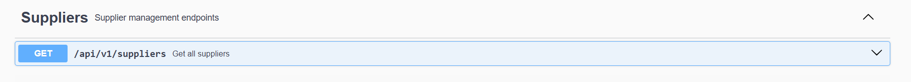

| Endpoint            | Método HTTP | Acción implementada           | Sintaxis de llamada     | Parámetros | Ejemplo Request        | Ejemplo Response                                                                                                                                                                                                                                                                        | Explicación Response                                                 |
| ------------------- | ----------- | ----------------------------- | ----------------------- | ---------- | ---------------------- | --------------------------------------------------------------------------------------------------------------------------------------------------------------------------------------------------------------------------------------------------------------------------------------- | -------------------------------------------------------------------- |
| /api/v1/suppliers | GET         | Obtener todos los proveedores | GET /api/v1/suppliers | Ninguno    | N/A (No requiere body) | json [ { "id": 1, "uuid": "550e8400-e29b-41d4-a716-446655440000", "name": "Golden Wok Produce", "contactName": "Marta Ruiz", "email": "marta@goldenwok.com", "phone": "+51 999 888 777", "category": "Vegetables", "linkedDate": "2026-06-18", "sla": "24h", "responseTime": "2h" } ] | Devuelve la lista completa de proveedores registrados en el sistema. |


### Suppliers Catalog Items

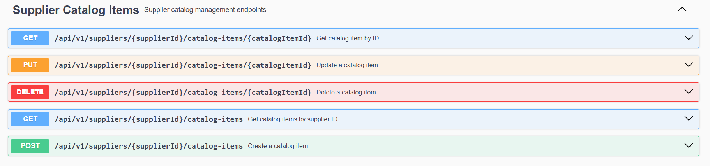

| Endpoint                                                       | Método HTTP | Acción implementada                                      | Sintaxis de llamada                                                   | Parámetros                    | Ejemplo Request                                                                                                                                  | Ejemplo Response                                                                                                                                          | Explicación Response                                                                                        |
| -------------------------------------------------------------- | ----------- | -------------------------------------------------------- | --------------------------------------------------------------------- | ----------------------------- | ------------------------------------------------------------------------------------------------------------------------------------------------ | --------------------------------------------------------------------------------------------------------------------------------------------------------- | ----------------------------------------------------------------------------------------------------------- |
| /api/v1/suppliers/{supplierId}/catalog-items                 | POST        | Crear un nuevo producto en el catálogo del proveedor     | POST /api/v1/suppliers/{supplierId}/catalog-items                   | supplierId                 | json { "name": "Cebolla china", "category": "Vegetables", "price": 2.90, "unit": "KG", "deliveryConditions": "Next-day before 11:00" }         | json { "id": 1, "name": "Cebolla china", "category": "Vegetables", "price": 2.90, "unit": "KG", "deliveryConditions": "Next-day before 11:00" }         | Crea un nuevo producto dentro del catálogo del proveedor especificado y devuelve la información registrada. |
| /api/v1/suppliers/{supplierId}/catalog-items                 | GET         | Obtener todos los productos del catálogo de un proveedor | GET /api/v1/suppliers/{supplierId}/catalog-items                    | supplierId                  | N/A (No requiere body)                                                                                                                           | json [ { "id": 1, "name": "Cebolla china", "category": "Vegetables", "price": 2.90, "unit": "KG" } ]                                                    | Devuelve la lista de productos asociados al proveedor indicado.                                             |
| /api/v1/suppliers/{supplierId}/catalog-items/{catalogItemId} | GET         | Obtener producto del catálogo por ID                     | GET /api/v1/suppliers/{supplierId}/catalog-items/{catalogItemId}    | supplierId, catalogItemId | N/A (No requiere body)                                                                                                                           | json { "id": 1, "name": "Cebolla china", "category": "Vegetables", "price": 2.90, "unit": "KG", "deliveryConditions": "Next-day before 11:00" }         | Devuelve la información detallada de un producto específico del catálogo del proveedor.                     |
| /api/v1/suppliers/{supplierId}/catalog-items/{catalogItemId} | PUT         | Actualizar un producto del catálogo                      | PUT /api/v1/suppliers/{supplierId}/catalog-items/{catalogItemId}    | supplierId , catalogItemId | json { "name": "Cebolla china premium", "category": "Vegetables", "price": 3.20, "unit": "KG", "deliveryConditions": "Next-day before 11:00" } | json { "id": 1, "name": "Cebolla china premium", "category": "Vegetables", "price": 3.20, "unit": "KG", "deliveryConditions": "Next-day before 11:00" } | Actualiza la información del producto del catálogo y devuelve los datos modificados.                        |
| /api/v1/suppliers/{supplierId}/catalog-items/{catalogItemId} | DELETE      | Eliminar un producto del catálogo                        | DELETE /api/v1/suppliers/{supplierId}/catalog-items/{catalogItemId} | supplierId, catalogItemId | N/A (No requiere body)                                                                                                                           | Sin contenido (204 No Content)                                                                                                                          | Elimina el producto indicado del catálogo del proveedor.                                                    |


### Suppliers Clients

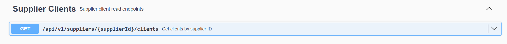

| Endpoint                                 | Método HTTP | Acción implementada                       | Sintaxis de llamada                          | Parámetros   | Ejemplo Request        | Ejemplo Response                                                                                  | Explicación Response                                                           |
| ---------------------------------------- | ----------- | ----------------------------------------- | -------------------------------------------- | ------------ | ---------------------- | ------------------------------------------------------------------------------------------------- | ------------------------------------------------------------------------------ |
| /api/v1/suppliers/{supplierId}/clients | GET   | Obtener clientes asociados a un proveedor | GET /api/v1/suppliers/{supplierId}/clients | `supplierId | N/A (No requiere body) | json [ { "id": 1, "name": "Gran Dragon Chifa", "district": "San Isidro", "status": "active" } ] | Devuelve la lista de clientes o restaurantes vinculados al proveedor indicado. |

#### 5.2.3.7. Software Deployment Evidence for Sprint Review.

En esta sección se presentan las evidencias correspondientes al despliegue del backend de SupplyWok en un entorno cloud utilizando la plataforma Render. El objetivo de este proceso fue poner a disposición los servicios web desarrollados para que puedan ser consumidos por el frontend de la aplicación en el siguiente Sprint, permitiendo la comunicación entre ambos componentes a través de Internet. Asimismo, el despliegue permitió validar el correcto funcionamiento de los endpoints implementados mediante el uso de Swagger, verificando que las operaciones de la API respondieran correctamente.

Primero, se realizó el despliegue del backend mediante la creación de un nuevo Web Service en Render, enlazado al repositorio de GitHub correspondiente al proyecto backend de SupplyWok (Aurora-Startup/SupplyWok-backend). Para la construcción y ejecución del servicio se utilizó Docker, permitiendo que Render implemente el Dockerfile previamente configurado dentro del proyecto.

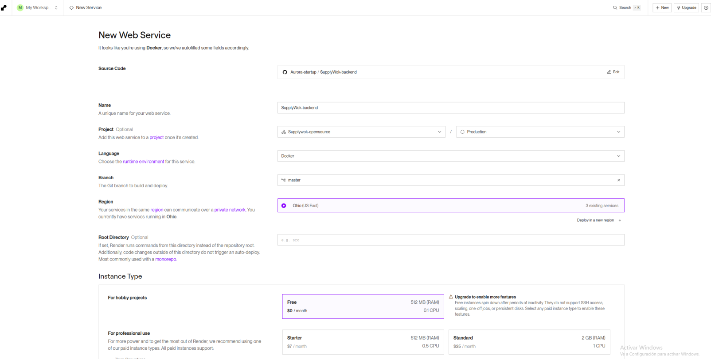

Posteriormente, se configuraron las variables de entorno necesarias para establecer la conexión con la base de datos PostgreSQL. Esta configuración permitió mantener separada la información sensible del código fuente y garantizar la correcta comunicación entre el backend y la base de datos desplegada.

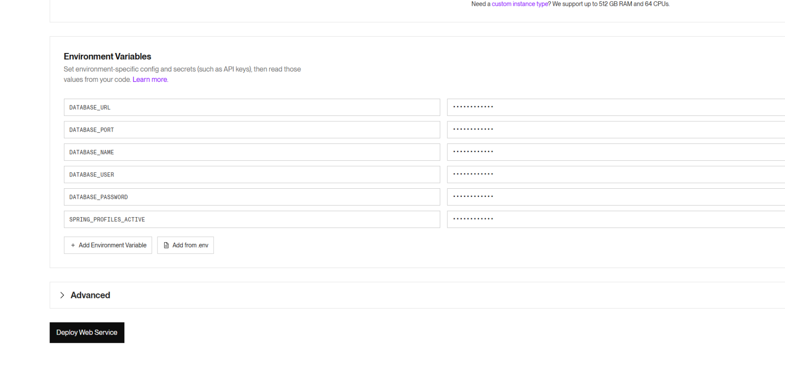

Luego, se realizó el despliegue de la base de datos PostgreSQL dentro del entorno cloud, permitiendo que los servicios backend puedan acceder y gestionar la información almacenada durante la ejecución de los endpoints.

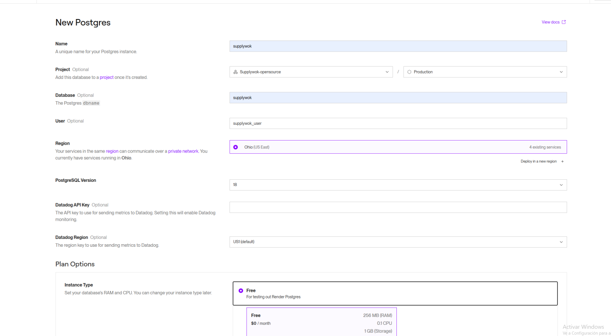

Finalmente, después de completar el despliegue del backend y la base de datos PostgreSQL, se realizó la validación del funcionamiento del servicio mediante el acceso a la documentación interactiva generada por Swagger. Esta validación permitió comprobar la disponibilidad de los endpoints de SupplyWok y verificar que las operaciones implementadas respondieran correctamente en el entorno desplegado.

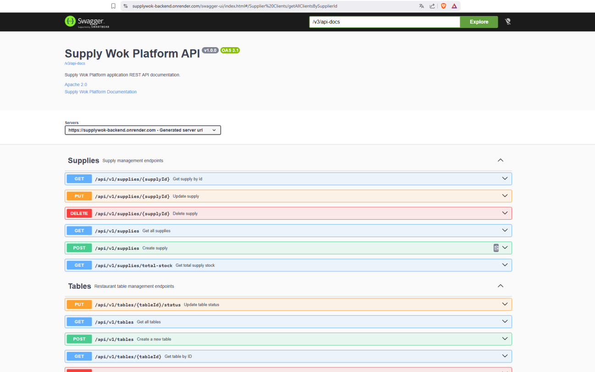

#### 5.2.3.8. Team Collaboration Insights during Sprint

Durante el Sprint 3, el equipo trabajó de manera colaborativa en el desarrollo de los servicios backend de SupplyWok utilizando una estrategia basada en ramas de Git y GitHub. Las tareas fueron distribuidas entre los integrantes de acuerdo con los bounded contexts priorizados, permitiendo que cada miembro asumiera la responsabilidad principal de un área específica del negocio. En este sprint, todos los integrantes contribuyeron activamente mediante commits, revisiones e integración de cambios en el repositorio del proyecto. A continuación, se presentan evidencias de colaboración obtenidas a partir de los analíticos de GitHub, incluyendo contribuciones, historial de commits y actividad realizada durante el sprint.

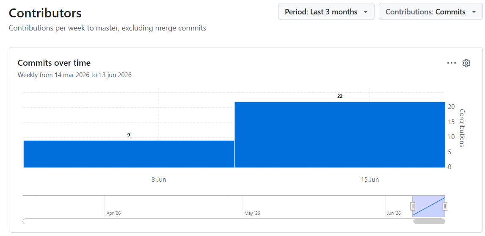

Como se observa en la sección Contributors del repositorio backend, durante el Sprint 3 se realizaron un total de 31 commits, reflejando una participación activa por parte de los miembros del equipo en el desarrollo de los servicios y endpoints de la plataforma.

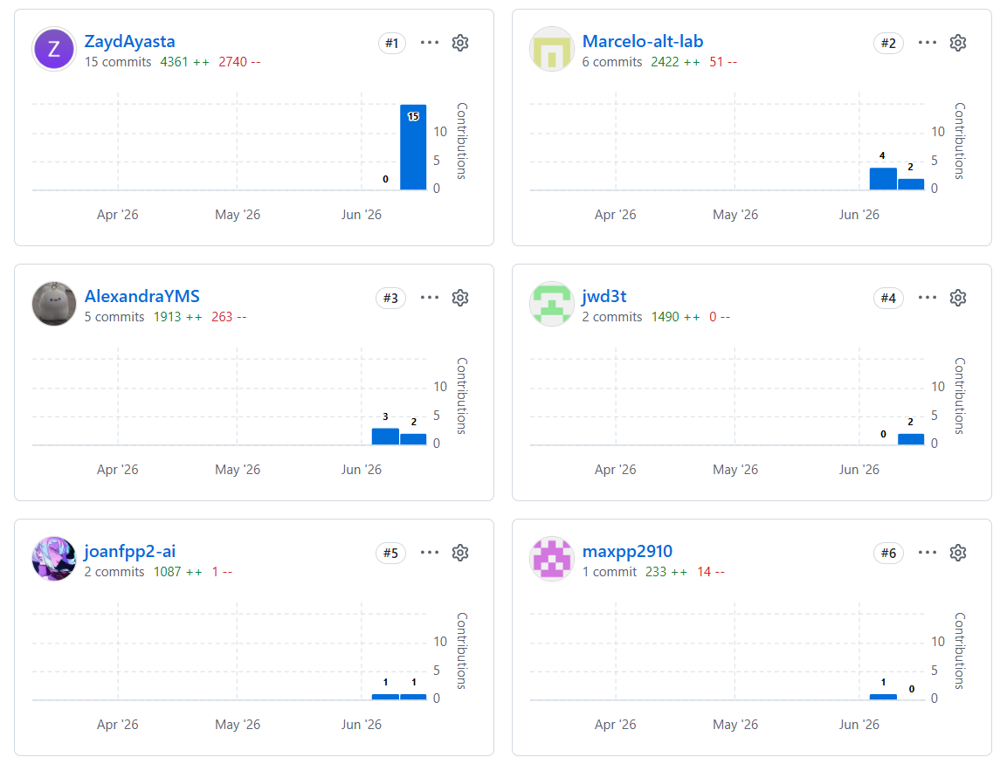

Como se observa en el detalle de la sección Contributors, todos los integrantes realizaron contribuciones al repositorio. En promedio, cada miembro efectuó aproximadamente 5 commits y contribuyó con alrededor de 2300 líneas de código agregadas, evidenciando una distribución equilibrada del trabajo durante el sprint.

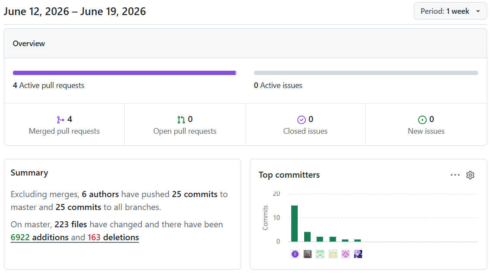

Como se observa en la sección Pulse del repositorio backend, durante la última semana se integraron 4 Pull Requests y se registraron 25 commits excluyendo merges. Asimismo, la rama principal del proyecto acumuló 6922 líneas agregadas y 163 líneas eliminadas, reflejando el avance significativo realizado en la implementación de los bounded contexts y servicios backend planificados para este sprint.

### 5.2.4. Sprint 4

En esta sección se registra y explica el avance realizado durante el Sprint 4 en términos de producto y trabajo colaborativo. El objetivo principal de este Sprint fue integrar los endpoints REST desarrollados en el Sprint anterior con el frontend de la aplicación, además de realizar los ajustes y correcciones finales necesarios para completar el desarrollo de la plataforma SupplyWok.

#### 5.2.4.1. Sprint Planning 4

a con el fin de corregir errores, optimizar el proceso de desarrollo y garantizar una base sólida para las siguientes etapas del proyecto.
Durante la reunión de Sprint Planning del Sprint 4, se estableció como objetivo principal conectar el backend con el frontend y corregir errores e inconsistencias estéticas en la plataforma **SupplyWok**. Asimismo, se planteó completar y refinar al 100% los módulos correspondientes a los bounded contexts que conforman el núcleo del negocio, entre ellos **Inventory Management**, **Supply and Purchasing**, **Operational Monitoring and IoT Alerts**, **Restaurant Management** y **Supplier Management & Operations**. Además, se propuso implementar bounded contexts complementarios, como **Identity and Access Management**, **Analytics** y **Subscription**. Finalmente, el equipo revisó los resultados obtenidos durante el sprint anterior e identificó oportunidades de mejora con el propósito de corregir errores, optimizar el proceso de desarrollo y consolidar una base sólida para la culminación del proyecto.

**Sprint Planning 4**

| **Sprint #** | 4 |
|---|---|
| **Date** | 10-07-2026 |
| **Time** | 17:00 |
| **Location** | Virtual, Discord |
| **Prepared by** | Zayd Ayasta, Juan Wang |
| **Attendees** | Marcelo Cuadros, Alexandra Meza, Zayd Ayasta, Juan Wang |
| **Sprint 3 Review Summary** | Durante el Sprint 3 se desarrolló el backend de la plataforma SupplyWok, implementando una API REST mediante Spring Boot junto con los endpoints correspondientes a los bounded contexts priorizados del núcleo del negocio. Entre los principales recursos implementados se encuentran Supplies, Comandas, Sensors, Purchase Orders, Restaurant Alerts, Supplier Alerts, Suppliers, Supplier Catalog Items y Supplier Clients. Asimismo, se validó el correcto funcionamiento de los servicios mediante Swagger.|
| **Sprint 3 Retrospective Summary** | El equipo consideró que el desarrollo del backend y la distribución de tareas durante el Sprint 3 permitieron cumplir satisfactoriamente los objetivos establecidos para la iteración. Como oportunidad de mejora, se acordó reforzar la documentación de los sprints anteriores, integrar completamente el frontend con el backend y corregir las incidencias funcionales y visuales identificadas antes de la entrega final. |
| **Sprint 4 Goal** | El objetivo principal de este Sprint es integrar el frontend con el backend de SupplyWok, implementar los bounded contexts complementarios (Identity and Access Management, Analytics y Subscription) y realizar las correcciones funcionales y visuales necesarias para completar la plataforma. El Sprint se considerará exitoso cuando los módulos del sistema consuman correctamente los servicios REST implementados y la aplicación funcione de manera integrada en un entorno desplegado. |
| **Sprint 4 Velocity** | Límite de **35 SP** |
| **Sum of Story Points** | **35 SP** | 

#### 5.2.4.2. Aspect Leaders and Collaborators.

En esta sección se presenta la matriz de liderazgo y colaboración correspondiente al Sprint 4. Dado que el objetivo principal de esta iteración es integrar el frontend con el backend, implementar los bounded contexts complementarios y realizar los ajustes finales de la plataforma, los aspectos considerados corresponden tanto a los bounded contexts del núcleo del negocio como a los complementarios. Para cada aspecto se asigna un líder responsable de coordinar el desarrollo y uno o más colaboradores encargados de apoyar en la integración, validación y conclusión de cada módulo de la plataforma.

**Link el Sprint 4 Board:** https://trello.com/invite/b/6a4ee984c4b0aa1e9470163b/ATTIdf910080a7b46fd8535e0d4de97848a7D3B19B31/supplywok-sprint-backlog-4

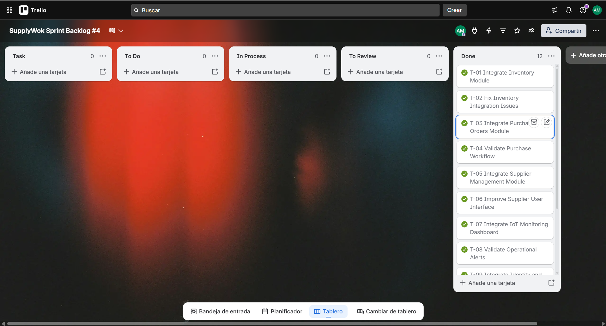

**Consider Aspects** 

- **Inventory Management Bounded Context**: Es el encargado de gestionar la informacion de los recursos de inventario de cada restaurante.

- **Supply and Purchasing Bounded Context**: Es el encargado de gestionar las órdenes de suplementos realizadas por cada restaurante.

- **Restaurant Management Bounded Context**: Es el encargado de gestionar todo lo relacionado con la operación del establecimiento.

- **Operational Monitoring and IoT Alerts Bounded Context**: Es el encargado de gestionar la información recopilada por los sensores del restaurante.

- **Supplier Management & Operations Bounded Context**: Es el encargado de gestionar la información de los proveedores y sus pedidos.

- **Identity and Access Management**: Es el encargado de gestionar la autenticación de los usuarios, la administración de cuentas y el control de acceso a la plataforma.

- **Analytics**: Es el encargado de gestionar las métricas e indicadores de la plataforma, permitiendo visualizar información relevante sobre la actividad de los usuarios.

- **Subscription**: Es el encargado de administrar los planes de suscripción de los usuarios. 

- **Shared Bounded Context**: Contiene Value Objects y componenetes visuales comunes que son reutilizados por múltiples bounded contexts del sistema.

| Team Member | GitHub username | Inventory Management Bounded BC | Supply and Purchasing BC / Shared BC | Restaurant Management BC / Subscription BC | Supplier Management & Operations BC / Analytics BC | Operational Monitoring and IoT Alerts BC / Identity and Access Management BC  |
|---|---|---|---|---|---|---|
| Cuadros, Marcelo | Marcelo-alt-lab | C | C | C | - | L |
| Payano, Joan | Nounz27             | - | C | L | C | C |
| Meza, Alexandra | AlexandraYMS     | L | C | - | C | C |
| Ayasta, Zayd | Zayd Ayasta         | C | L | C | C | - |
| Wang, Juan | jwd3t                 | C | - | C | L | C |

#### 5.2.4.3. Sprint Backlog 4  

En esta sección se presenta el Sprint Backlog correspondiente al Sprint 4. Los elementos incluidos fueron definidos en función del Sprint Goal establecido para esta iteración, orientado a integrar el frontend con el backend de SupplyWok, implementar los bounded contexts complementarios y realizar los ajustes finales de la plataforma. Para ello, se planificaron las historias de usuario y las tareas necesarias para completar la integración de los servicios REST, validar el funcionamiento de los distintos módulos, corregir incidencias funcionales y visuales, y preparar la versión final del sistema para su despliegue.

**Link el Sprint 4 Board:** https://trello.com/invite/b/6a4ee984c4b0aa1e9470163b/ATTIdf910080a7b46fd8535e0d4de97848a7D3B19B31/supplywok-sprint-backlog-4


**Sprint 4 Backlog**

| US Id | US Title                                                   | Task Id | Task Title                                 | Description                                                                                                                 | Estimation (Hours) | Assigned To     | Status |
| ----- | ---------------------------------------------------------- | ------- | ------------------------------------------ | --------------------------------------------------------------------------------------------------------------------------- | ------------------ | --------------- | ------ |
| US34  | Obtener los datos del inventario vía API                   | T-01    | Integrate Inventory Module                 | Integrar el módulo de inventario del frontend con los endpoints REST y validar el consumo correcto de la información.       | 6                  | Alexandra Meza  | Done   |
| US01  | Registro de inventario inicial                             | T-02    | Fix Inventory Integration Issues           | Corregir errores funcionales y realizar ajustes visuales en el registro y gestión del inventario.                          | 5                  | Alexandra Meza  | Done   |
| US09  | Creación de orden de compra                                | T-03    | Integrate Purchase Orders Module           | Integrar el módulo de órdenes de compra con el backend y validar las operaciones de registro y consulta.                   | 6                  | Zayd Ayasta     | Done   |
| US37  | Crear una orden de insumos vía API                         | T-04    | Validate Purchase Workflow                 | Corregir incidencias detectadas durante la integración y validar el flujo completo de creación de órdenes.                 | 5                  | Zayd Ayasta     | Done   |
| US38  | Obtener datos relevantes de proveedores vía API            | T-05    | Integrate Supplier Management Module       | Integrar el módulo de proveedores con los servicios REST y verificar el consumo de datos.                                  | 6                  | Juan Wang       | Done   |
| US12  | Gestión de proveedores vinculados                          | T-06    | Improve Supplier User Interface            | Corregir inconsistencias visuales y optimizar la experiencia de usuario del módulo de proveedores.                         | 4                  | Juan Wang       | Done   |
| US42  | Endpoint para recibir información de componentes IoT       | T-07    | Integrate IoT Monitoring Dashboard         | Integrar el panel de monitoreo con los servicios del backend y validar la visualización de sensores y alertas.             | 6                  | Marcelo Cuadros | Done   |
| US18  | Historial de alertas e incidencias operativas              | T-08    | Validate Operational Alerts                | Verificar el funcionamiento del módulo de alertas y corregir errores detectados durante las pruebas de integración.         | 5                  | Marcelo Cuadros | Done   |
| US26  | Registro e inicio de sesión para usuarios de la plataforma | T-09    | Integrate Identity and Access Management   | Integrar las funcionalidades de autenticación y gestión de usuarios entre el frontend y el backend.                        | 6                  | Marcelo Cuadros | Done   |
| US17  | Control de ocupación de mesas                              | T-10    | Integrate Restaurant Management Module     | Validar el funcionamiento del módulo de mesas y realizar ajustes funcionales y visuales tras la integración.               | 5                  | Joan Payano     | Done   |
| US36  | Manejo estándar de errores                                 | T-11    | Resolve Integration Issues                 | Corregir errores generales detectados durante la integración entre el frontend y el backend.                               | 4                  | Zayd Ayasta     | Done   |
| US39  | Evitar almacenamientos en errores                          | T-12    | Perform Final Integration Validation       | Realizar pruebas finales de integración para garantizar la correcta persistencia y recuperación de los datos de la plataforma. | 3                  | Zayd Ayasta     | Done   |


#### 5.2.4.4. Development Evidence for Sprint Review.

En esta sección se presentan los avances realizados durante el Sprint 4 en el cierre integral de SupplyWok. El trabajo desarrollado abarcó la consolidación del backend, la integración completa del frontend con los servicios REST, la estabilización de bounded contexts complementarios como Identity and Access Management y la aplicación de ajustes funcionales y visuales finales tanto en la Web Application como en la Landing Page. Asimismo, se llevaron a cabo pruebas de integración y despliegue para validar el correcto funcionamiento del producto como una solución unificada.

| Repository                       | Branch                        | Commit Id | Commit Message                                                                          | Commit Message Body                                                                             | Commited on (Date) |
| -------------------------------- | ----------------------------- | --------- | --------------------------------------------------------------------------------------- | ----------------------------------------------------------------------------------------------- | ------------------ |
| Aurora-startup/SupplyWok-backend | master                        | e90b159   | feat(devops): add environment-specific application properties                           | Configuración de propiedades por entorno para facilitar el despliegue y la integración final.   | 2026-06-20         |
| Aurora-startup/SupplyWok-backend | develop                       | e64ab31   | feat(iam): implement authentication and authorization infrastructure with Spring Security| Implementación de la infraestructura de autenticación y autorización para el bounded context IAM.| 2026-07-03         |
| Aurora-startup/SupplyWok-backend | develop                       | df88a5c   | feat(iam): update user command parameter names and fix package references               | Ajuste final del módulo IAM y corrección de referencias para estabilizar la integración.         | 2026-07-08         |
| Aurora-startup/SupplyWok-frontend| develop                       | bb49d21   | chore(env): update supplyWok platform base URLs to production backend in environment files| Actualización de URLs de entorno para consumir la API desplegada en producción.                  | 2026-07-08         |
| Aurora-startup/SupplyWok-frontend| develop                       | 1493a8e   | feat(supplier-management): enhance UI, profile integration, and i18n for suppliers      | Refinamiento visual y funcional del módulo de proveedores ya conectado al backend.               | 2026-07-08         |
| Aurora-startup/SupplyWok-landing-page | main                    | 515e696   | feat: replace video embeds with images for orders, suppliers, inventory, and clients    | Ajustes finales de la landing page para mejorar presentación y compatibilidad del contenido.     | 2026-07-08         |
| Aurora-startup/SupplyWok-landing-page | main                    | 6e25fb8   | feat: update image sources and styles for better visual presentation                     | Mejora visual final de la landing page para la entrega del producto.                             | 2026-07-08         |

#### 5.2.4.5. Execution Evidence for Sprint Review

Durante el Sprint 4 se realizó la integración final de los componentes frontend y backend de SupplyWok, permitiendo que los distintos módulos de la plataforma consuman los servicios REST implementados en los sprints anteriores. Como parte de la revisión del sprint, se verificó el correcto funcionamiento de los flujos principales de la aplicación, validando la comunicación entre la interfaz de usuario y la API mediante pruebas funcionales. Asimismo, se realizaron ajustes y correcciones en los módulos integrados, comprobando la correcta visualización, recuperación, registro y actualización de la información dentro de la plataforma.

| Componente | Descripción | Enlace |
|------------|-------------|--------|
| Landing Page | Pagina promocional de SupplyWok | https://aurora-startup.github.io/SupplyWok-landing-page/ |
| Frontend | Plataforma web de SupplyWok (Usuario: restaurante@ejemplo.com Contraseña: Password123! / Usuario: proveedor@ejemplo.com Contraseña: Password123!) | https://supplywok-frontend-1e9a7.web.app/ |
| Backend | Backend desplegado con la documentacion Open Api | https://supplywok-backend.onrender.com/swagger-ui/index.html#/ |
| Repositorio Landing Page | Código fuente del landing page | https://github.com/Aurora-startup/SupplyWok-landing-page |
| Repositorio Frontend | Código fuente del frontend | https://github.com/Aurora-startup/SupplyWok-frontend |
| Repositorio Backend | Código fuente del backend | https://github.com/Aurora-startup/SupplyWok-backend |

En las siguientes evidencias se presentan los módulos finales de la plataforma SupplyWok, junto con sus principales funcionalidades implementadas y el resultado de la integración realizada durante el Sprint 4.


#### 5.2.4.6. Services Documentation Evidence for Sprint Review

Durante el Sprint 4 se mantuvo la documentación de los endpoints desarrollados en el Sprint 3 para los bounded contexts priorizados de SupplyWok, utilizando OpenAPI/Swagger como herramienta de referencia. Debido a que los servicios principales del backend no presentaron modificaciones, la documentación existente continuó siendo válida para la integración de la plataforma. Sin embargo, durante esta iteración se incorporaron 3 nuevos endpoints correspondientes a los bounded contexts complementarios implementados, ampliando la documentación de los servicios disponibles.

**Repository URL:** https://github.com/Aurora-startup/SupplyWok-backend

**OpenAPI Documentation URL:** https://supplywok-backend.onrender.com/swagger-ui/index.html

### Authentication

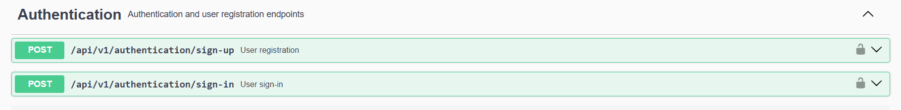

| Endpoint                       | Método HTTP | Acción implementada        | Sintaxis de llamada                 | Parámetros | Ejemplo Request                                                                                            | Ejemplo Response                                                                                         | Explicación Response                                                                                                                                        |
| ------------------------------ | ----------- | -------------------------- | ----------------------------------- | ---------- | ---------------------------------------------------------------------------------------------------------- | -------------------------------------------------------------------------------------------------------- | ----------------------------------------------------------------------------------------------------------------------------------------------------------- |
| /api/v1/authentication/sign-up | POST        | Registrar un nuevo usuario | POST /api/v1/authentication/sign-up | Ninguno    | { email: [john.doe@example.com](mailto:john.doe@example.com), password: SecurePass123!, role: Restaurant } | { id: 1, email: [john.doe@example.com](mailto:john.doe@example.com), roles: [Restaurant] }               | Retorna la información del usuario registrado, incluyendo su identificador, correo electrónico y los roles asignados al completar el registro exitosamente. |
| /api/v1/authentication/sign-in | POST        | Autenticar un usuario      | POST /api/v1/authentication/sign-in | Ninguno    | { email: [john.doe@example.com](mailto:john.doe@example.com), password: SecurePass123! }                   | { id: 1, username: [john.doe@example.com](mailto:john.doe@example.com), token: eyJhbGciOiJIUzI1NiJ9... } | Retorna la información básica del usuario autenticado junto con un token JWT, el cual debe utilizarse para acceder a los endpoints protegidos de la API.    |


### Users

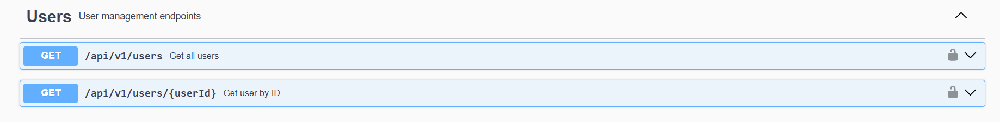

| Endpoint               | Método HTTP | Acción implementada        | Sintaxis de llamada        | Parámetros                        | Ejemplo Request | Ejemplo Response                                                                                                                                                                           | Explicación Response                                                                                                                                      |
| ---------------------- | ----------- | -------------------------- | -------------------------- | --------------------------------- | --------------- | ------------------------------------------------------------------------------------------------------------------------------------------------------------------------------------------ | --------------------------------------------------------------------------------------------------------------------------------------------------------- |
| /api/v1/users          | GET         | Obtener todos los usuarios | GET /api/v1/users          | Ninguno                           | Ninguno         | [{ id: 1, email: [john.doe@example.com](mailto:john.doe@example.com), roles: [Restaurant] }, { id: 2, email: [jane.smith@example.com](mailto:jane.smith@example.com), roles: [Supplier] }] | Retorna una lista con todos los usuarios registrados en el sistema, incluyendo su identificador, correo electrónico y los roles asignados.                |
| /api/v1/users/{userId} | GET         | Obtener un usuario por ID  | GET /api/v1/users/{userId} | userId: Identificador del usuario | Ninguno         | { id: 1, email: [john.doe@example.com](mailto:john.doe@example.com), roles: [Restaurant] }                                                                                                 | Retorna la información del usuario correspondiente al identificador proporcionado, incluyendo su identificador, correo electrónico y los roles asignados. |


### Profiles

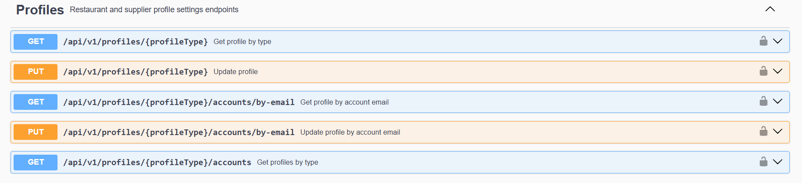

| Endpoint                                         | Método HTTP | Acción implementada                         | Sintaxis de llamada                                                                                            | Parámetros                                                                                  | Ejemplo Request                                                                                                                                                                                                                                                                                | Ejemplo Response                                                                                                                                                                                               | Explicación Response                                                                                                     |
| ------------------------------------------------ | ----------- | ------------------------------------------- | -------------------------------------------------------------------------------------------------------------- | ------------------------------------------------------------------------------------------- | ---------------------------------------------------------------------------------------------------------------------------------------------------------------------------------------------------------------------------------------------------------------------------------------------- | -------------------------------------------------------------------------------------------------------------------------------------------------------------------------------------------------------------- | ------------------------------------------------------------------------------------------------------------------------ |
| /api/v1/profiles/{profileType}                   | GET         | Obtener el perfil por tipo                  | GET /api/v1/profiles/{profileType}                                                                             | profileType: Tipo de perfil (restaurant o supplier)                                         | Ninguno                                                                                                                                                                                                                                                                                        | { businessName: Wok House, firstName: John, lastName: Doe, accountEmail: [john.doe@example.com](mailto:john.doe@example.com), city: Lima, country: Perú, emailNotifications: true, smsNotifications: false } | Retorna la información de configuración correspondiente al tipo de perfil especificado.                                  |
| /api/v1/profiles/{profileType}/accounts          | GET         | Obtener todos los perfiles por tipo         | GET /api/v1/profiles/{profileType}/accounts                                                                    | profileType: Tipo de perfil (restaurant o supplier)                                         | Ninguno                                                                                                                                                                                                                                                                                        | [{ businessName: Wok House, accountEmail: [john.doe@example.com](mailto:john.doe@example.com) }, { businessName: Wok House, accountEmail: [jane.smith@example.com](mailto:jane.smith@example.com) }]      | Retorna una lista con todos los perfiles asociados al tipo especificado.                                                 |
| /api/v1/profiles/{profileType}/accounts/by-email | GET         | Obtener un perfil por correo electrónico    | GET /api/v1/profiles/{profileType}/accounts/by-email?email=[john.doe@example.com](mailto:john.doe@example.com) | profileType: Tipo de perfil (restaurant o supplier), email: Correo electrónico de la cuenta | Ninguno                                                                                                                                                                                                                                                                                        | { businessName: Wok House, firstName: John, lastName: Doe, accountEmail: [john.doe@example.com](mailto:john.doe@example.com), city: Lima, country: Perú }                                                    | Retorna el perfil asociado al correo electrónico indicado dentro del tipo de perfil especificado.                        |
| /api/v1/profiles/{profileType}                   | PUT         | Actualizar un perfil                        | PUT /api/v1/profiles/{profileType}                                                                             | profileType: Tipo de perfil (restaurant o supplier)                                         | { businessName: Pizza House, firstName: John, lastName: Doe, accountEmail: [john.doe@example.com](mailto:john.doe@example.com), street: Av. Los Olivos 123, district: San Miguel, city: Lima, country: Perú, supportContact: +51987654321, emailNotifications: true, smsNotifications: false } | { businessName: Pizza House, firstName: John, lastName: Doe, accountEmail: [john.doe@example.com](mailto:john.doe@example.com), city: Lima, country: Perú, emailNotifications: true, smsNotifications: false } | Retorna la información del perfil después de actualizar correctamente los datos proporcionados.                          |
| /api/v1/profiles/{profileType}/accounts/by-email | PUT         | Actualizar un perfil por correo electrónico | PUT /api/v1/profiles/{profileType}/accounts/by-email?email=[john.doe@example.com](mailto:john.doe@example.com) | profileType: Tipo de perfil (restaurant o supplier), email: Correo electrónico de la cuenta | { businessName: Pizza House, firstName: John, lastName: Doe, street: Av. Los Olivos 123, district: San Miguel, city: Lima, country: Perú, supportContact: +51987654321, emailNotifications: true, smsNotifications: false }                                                                    | { businessName: Pizza House, firstName: John, lastName: Doe, accountEmail: [john.doe@example.com](mailto:john.doe@example.com), city: Lima, country: Perú, emailNotifications: true, smsNotifications: false } | Retorna la información del perfil asociado al correo electrónico indicado después de actualizar correctamente sus datos. |


### Supplies


| Endpoint | Método HTTP | Acción implementada | Sintaxis de llamada | Parámetros | Ejemplo Request | Ejemplo Response | Explicación Response |
| :--- | :--- | :--- | :--- | :--- | :--- | :--- | :--- |
| /api/v1/supplies/<br>{supplyId} | GET | Obtener suministro por ID | GET /api/v1/supplies/<br>{supplyId} | supplyId (integer) | N/A | {"id": 1, "name": "Rice", ...} | Retorna la información del suministro solicitado. |
| /api/v1/supplies/<br>{supplyId} | PUT | Actualizar suministro | PUT /api/v1/supplies/<br>{supplyId} | supplyId (integer) | {"name": "Rice", "unitOfMeasure": "Kilograms", "minimumStockLevel": 25, "category": "Grains"} | {"id": 1, "name": "Rice", "unitOfMeasure": "Kilograms", "currentStock": 80, ...} | Retorna el suministro actualizado. |
| /api/v1/supplies/<br>{supplyId} | DELETE | Eliminar suministro | DELETE /api/v1/supplies/<br>{supplyId} | supplyId (integer) | N/A | {"message": "Suministro eliminado"} | Confirma la eliminación del suministro. |
| /api/v1/supplies | GET | Obtener todos los suministros | GET /api/v1/supplies | Ninguno | N/A | [{"id": 1, "name": "Rice", ...}] | Retorna la lista de suministros registrados. |
| /api/v1/supplies | POST | Crear suministro | POST /api/v1/supplies | Ninguno | {"name": "Rice", "unitOfMeasure": "Kilograms", "currentStock": 80, "minimumStockLevel": 20, "category": "Grains"} | {"id": 1, "name": "Rice", ...} | Retorna el suministro creado. |
| /api/v1/supplies/total-stock | GET | Obtener stock total | GET /api/v1/supplies/total-stock | Ninguno | N/A | {"totalStock": 150} | Retorna la cantidad total disponible. |


### Tables


| Endpoint  | Método HTTP | Acción implementada   | Sintaxis de llamada  | Parámetros | Ejemplo Request  | Ejemplo Response   | Explicación Response   |
| ------ | ----------- | -------- | ------------ | ------- | ----- | ----- | --------- |
| /api/v1/tables                  | POST        | Crear una nueva mesa          | POST /api/v1/tables | Ninguno    | json { "number": 1, "capacity": 4 }  | json { "id": 1, "number": 1, "capacity": 4, "status": "AVAILABLE" }      | Crea una nueva mesa en el restaurante y devuelve la información registrada. |
| /api/v1/tables/<br>{tableId} | GET         | Obtener mesa por ID           | GET /api/v1/tables/<br>{tableId}        | tableId  | N/A (No requiere body)                 | json { "id": 1, "number": 1, "capacity": 4, "status": "AVAILABLE" }      | Devuelve la información detallada de una mesa específica.                   |
| /api/v1/tables   | GET         | Obtener todas las mesas       | GET /api/v1/tables  | Ninguno    | N/A (No requiere body)   | json [ { "id": 1, "number": 1, "capacity": 4, "status": "AVAILABLE" } ] | Devuelve la lista completa de mesas registradas en el restaurante.          |
| /api/v1/tables/<br>{tableId}/status | PUT         | Actualizar estado de una mesa | PUT /api/v1/tables/<br>{tableId}/status | tableId  | json { "status": "OCCUPIED" }        | json { "id": 1, "number": 1, "capacity": 4, "status": "OCCUPIED" }       | Actualiza el estado de la mesa y devuelve la información actualizada.       |
| /api/v1/tables/<br>{tableId}        | DELETE      | Eliminar una mesa             | DELETE /api/v1/tables/<br>{tableId} | tableId  | N/A (No requiere body)  | Sin contenido (200 OK)| Elimina la mesa especificada del sistema.                                   |


### Comandas


| Endpoint                              | Método HTTP | Acción implementada              | Sintaxis de llamada                       | Parámetros  | Ejemplo Request                                                                  | Ejemplo Response                                                                                                                                    | Explicación Response                                                                 |
| ------------------------------------- | ----------- | -------------------------------- | ----------------------------------------- | ----------- | -------------------------------------------------------------------------------- | --------------------------------------------------------------------------------------------------------------------------------------------------- | ------------------------------------------------------------------------------------ |
| /api/v1/comandas                    | POST        | Crear una nueva comanda          | POST /api/v1/comandas                   | Ninguno     | json { "tableId": 1 }                                                          | json { "id": 1, "tableId": 1, "status": "OPEN", "items": [] }                                                                                   | Crea una nueva comanda asociada a una mesa y devuelve la información registrada.     |
| /api/v1/comandas/<br>{comandaId}        | GET         | Obtener comanda por ID           | GET /api/v1/comandas/<br>{comandaId}        | comandaId | N/A (No requiere body)                                                           | json { "id": 1, "tableId": 1, "status": "OPEN", "items": [] }                                                                                     | Devuelve la información detallada de una comanda específica.                         |
| /api/v1/comandas                    | GET         | Obtener todas las comandas       | GET /api/v1/comandas                    | Ninguno     | N/A (No requiere body)                                                           | json [ { "id": 1, "tableId": 1, "status": "OPEN", "items": [] } ]                                                                               | Devuelve la lista completa de comandas registradas.                                  |
| /api/v1/comandas/table/<br>{tableId}    | GET         | Obtener comandas por mesa        | GET /api/v1/comandas/table/<br>{tableId}    | tableId   | N/A (No requiere body)                                                           | json [ { "id": 1, "tableId": 1, "status": "OPEN", "items": [] } ]                                                                                  | Devuelve todas las comandas asociadas a una mesa específica.                         |
| /api/v1/comandas/<br>{comandaId}/status | PUT         | Actualizar estado de una comanda | PUT /api/v1/comandas/<br>{comandaId}/status | comandaId | json { "status": "SENT_TO_KITCHEN" }                                           | json { "id": 1, "tableId": 1, "status": "SENT_TO_KITCHEN", "items": [] }                                                                          | Actualiza el estado de la comanda y devuelve la información actualizada.             |
| /api/v1/comandas/<br>{comandaId}/items  | POST        | Agregar un ítem a una comanda    | POST /api/v1/comandas/<br>{comandaId}/items | comandaId | json { "productName": "Lomo Saltado", "quantity": 2, "notes": "Sin cebolla" }  | json { "id": 1, "tableId": 1, "status": "OPEN", "items": [ { "id": 1, "productName": "Lomo Saltado", "quantity": 2, "notes": "Sin cebolla" } ] }  | Agrega un producto a la comanda y devuelve la comanda actualizada con el nuevo ítem. |
| /api/v1/comandas/<br>{comandaId}        | DELETE      | Eliminar una comanda             | DELETE /api/v1/comandas/<br>{comandaId}     | comandaId | N/A (No requiere body)                                                           | Sin contenido (200 OK)                                                                                                                             | Elimina la comanda indicada del sistema.                                             |


### Sensors


| Endpoint                     | Método HTTP | Acción implementada        | Sintaxis de llamada                 | Parámetros | Ejemplo Request                                                                                                                                    | Ejemplo Response                                                                                                                                            | Explicación Response                                                               |
| ---------------------------- | ----------- | -------------------------- | ----------------------------------- | ---------- | -------------------------------------------------------------------------------------------------------------------------------------------------- | ----------------------------------------------------------------------------------------------------------------------------------------------------------- | ---------------------------------------------------------------------------------- |
| /api/v1/sensors            | POST        | Crear un nuevo sensor      | POST /api/v1/sensors              | Ninguno    | json { "name": "Temperature Sensor 1", "minValue": -20.0, "maxValue": 60.0, "enabled": true, "lastValue": 22.5, "type": "Temperature" }          | json { "id": 1, "name": "Temperature Sensor 1", "minValue": -20.0, "maxValue": 60.0, "enabled": true, "lastValue": 22.5, "type": "Temperature" }          | Crea un nuevo sensor en el sistema y devuelve la información registrada.           |
| /api/v1/sensors/{sensorId} | GET         | Obtener sensor por ID      | GET /api/v1/sensors/{sensorId}    | sensorId | N/A (No requiere body)                                                                                                                             | json { "id": 1, "name": "Temperature Sensor 1", "minValue": -20.0, "maxValue": 60.0, "enabled": true, "lastValue": 22.5, "type": "Temperature" }         | Devuelve la información detallada de un sensor específico.                         |
| /api/v1/sensors            | GET         | Obtener todos los sensores | GET /api/v1/sensors               | Ninguno    | N/A (No requiere body)                                                                                                                             | json [ { "id": 1, "name": "Temperature Sensor 1", "minValue": -20.0, "maxValue": 60.0, "enabled": true, "lastValue": 22.5, "type": "Temperature" } ]     | Devuelve la lista completa de sensores registrados.                                |
| /api/v1/sensors/{sensorId} | PUT         | Actualizar sensor          | PUT /api/v1/sensors/{sensorId}    | sensorId | json { "name": "Temperature Sensor 1 Updated", "minValue": -20.0, "maxValue": 60.0, "enabled": true, "lastValue": 23.5, "type": "Temperature" }  | json { "id": 1, "name": "Temperature Sensor 1 Updated", "minValue": -20.0, "maxValue": 60.0, "enabled": true, "lastValue": 23.5, "type": "Temperature" }  | Actualiza la información de un sensor existente y devuelve los datos actualizados. |
| /api/v1/sensors/{sensorId} | DELETE      | Eliminar sensor            | DELETE /api/v1/sensors/{sensorId} | sensorId | N/A (No requiere body)                                                                                                                             | Sin contenido (204 No Content)                                                                                                                              | Elimina el sensor indicado del sistema.                                            |


### Purchase Orders


| Endpoint                                           | Método HTTP | Acción implementada                      | Sintaxis de llamada                                    | Parámetros        | Ejemplo Request                                                                                                                                                                                                                                                                                                              | Ejemplo Response                                                                                                                                                                                                                                       | Explicación Response                                                                        |
| -------------------------------------------------- | ----------- | ---------------------------------------- | ------------------------------------------------------ | ----------------- | ---------------------------------------------------------------------------------------------------------------------------------------------------------------------------------------------------------------------------------------------------------------------------------------------------------------------------- | ------------------------------------------------------------------------------------------------------------------------------------------------------------------------------------------------------------------------------------------------------ | ------------------------------------------------------------------------------------------- |
| /api/v1/purchase-orders                        | POST        | Crear una nueva orden de compra          | POST /api/v1/purchase-orders`                         | Ninguno           | json { "code": "PO-24021", "supplierId": 201, "supplierName": "Golden Wok Produce", "restaurantName": "Gran Dragon Chifa", "orderDate": "2026-05-10", "estimatedDate": "2026-05-11", "priority": "High", "status": "Pending", "items": [{"productName": "Rice", "quantity": 25.00, "unitPrice": 4.50, "unitType": "kg"}] }` | json { "id": 1, "code": "PO-24021", "supplierId": 201, "supplierName": "Golden Wok Produce", "restaurantName": "Gran Dragon Chifa", "orderDate": "2026-05-10", "estimatedDate": "2026-05-11", "priority": "High", "status": "Pending", "items": [] } | Crea una nueva orden de compra y devuelve la información registrada.                        |
| /api/v1/purchase-orders                        | GET         | Obtener todas las órdenes de compra      | GET /api/v1/purchase-orders                         | Ninguno           | N/A (No requiere body)                                                                                                                                                                                                                                                                                                       | json [ { "id": 1, "code": "PO-24021", "supplierName": "Golden Wok Produce", "status": "Pending" } ]                                                                                                                                                 | Devuelve la lista completa de órdenes de compra registradas.                                |
| /api/v1/purchase-orders/{purchaseOrderId}        | GET         | Obtener orden de compra por ID           | GET /api/v1/purchase-orders/{purchaseOrderId}        | purchaseOrderId | N/A (No requiere body)                                                                                                                                                                                                                                                                                                       | json { "id": 1, "code": "PO-24021", "supplierId": 201, "restaurantName": "Gran Dragon Chifa", "status": "Pending" }`                                                                                                                                  | Devuelve la información detallada de una orden de compra específica.                        |
| /api/v1/purchase-orders/{purchaseOrderId}        | PUT         | Actualizar una orden de compra           | PUT /api/v1/purchase-orders/{purchaseOrderId}        | `purchaseOrderId | json { "code": "PO-24021", "supplierId": 201, "supplierName": "Golden Wok Produce", "restaurantName": "Gran Dragon Chifa", "orderDate": "2026-05-10", "estimatedDate": "2026-05-12", "priority": "High", "status": "Confirmed", "items": [] }                                                                              | json { "id": 1, "code": "PO-24021", "status": "Confirmed" }                                                                                                                                                                                          | Actualiza los datos de una orden de compra existente y devuelve la información actualizada. |
| /api/v1/purchase-orders/{purchaseOrderId}/status` | PUT         | Actualizar estado de una orden de compra | PUT /api/v1/purchase-orders/{purchaseOrderId}/status | purchaseOrderId | json { "status": "In Transit" }                                                                                                                                                                                                                                                                                            | json { "id": 1, "code": "PO-24021", "status": "In Transit" }                                                                                                                                                                                         | Actualiza únicamente el estado de la orden de compra.                                       |
| /api/v1/purchase-orders/{purchaseOrderId}        | DELETE      | Eliminar una orden de compra             | DELETE /api/v1/purchase-orders/{purchaseOrderId}     | purchaseOrderId` | N/A (No requiere body)                                                                                                                                                                                                                                                                                                       | Sin contenido (204 No Content)                                                                                                                                                                                                                       | Elimina la orden de compra especificada del sistema.                                        |


### Restaurant Alerts


| Endpoint                                          | Método HTTP | Acción implementada                                             | Sintaxis de llamada                                    | Parámetros | Ejemplo Request                                                                                   | Ejemplo Response                                                                                                                                                                                | Explicación Response                                                                                                                                               |
| ------------------------------------------------- | ----------- | --------------------------------------------------------------- | ------------------------------------------------------ | ---------- | ------------------------------------------------------------------------------------------------- | ----------------------------------------------------------------------------------------------------------------------------------------------------------------------------------------------- | ------------------------------------------------------------------------------------------------------------------------------------------------------------------ |
| /api/v1/restaurant/alerts                       | POST        | Crear una nueva alerta de restaurante                           | POST /api/v1/restaurant/alerts                       | Ninguno    | json { "severity": "Critical", "detail": "Sensor value exceeded safety limit.", "sensorId": 1 }` | `json { "id": 1, "severity": "Critical", "detail": "Sensor value exceeded safety limit.", "status": "Pending", "alertType": "RESTAURANT", "sensorId": 1, "sensorName": "Kitchen Temp Sensor" } | Crea una nueva alerta asociada a un restaurante y devuelve la información registrada.                                                                              |
| /api/v1/restaurant/alerts/inventory             | POST        | Crear alerta de restaurante basada en diferencias de inventario | POST /api/v1/restaurant/alerts/inventory             | Ninguno    | json { "sensorId": 1 }                                                                          | json { "id": 1, "severity": "High", "detail": "Inventory stock differs from sensor value.", "status": "Pending", "alertType": "RESTAURANT", "sensorId": 1 }                                   | Genera una alerta cuando existe una diferencia entre el inventario y el último valor registrado por el sensor. Si los valores coinciden devuelve 204 No Content. |
| /api/v1/restaurant/alerts/{alertId}             | GET         | Obtener alerta de restaurante por ID                            | GET /api/v1/restaurant/alerts/{alertId}              | alertId  | N/A (No requiere body)                                                                            | json { "id": 1, "severity": "Critical", "detail": "Sensor value exceeded safety limit.", "status": "Pending", "alertType": "RESTAURANT", "sensorId": 1 }                                      | Devuelve la información detallada de una alerta específica de restaurante.                                                                                         |
| /api/v1/restaurant/alerts                       | GET         | Obtener todas las alertas de restaurante                        | GET /api/v1/restaurant/alerts                        | Ninguno    | N/A (No requiere body)                                                                            | json [ { "id": 1, "severity": "Critical", "detail": "Sensor value exceeded safety limit.", "status": "Pending", "alertType": "RESTAURANT" } ]                                                 | Devuelve la lista completa de alertas registradas para restaurantes.                                                                                               |
| /api/v1/restaurant/alerts/{alertId}/acknowledge | POST        | Confirmar una alerta de restaurante                             | POST /api/v1/restaurant/alerts/{alertId}/acknowledge | alertId  | N/A (No requiere body)                                                                            | json { "id": 1, "severity": "Critical", "detail": "Sensor value exceeded safety limit.", "status": "Acknowledged", "alertType": "RESTAURANT" }                                                | Actualiza el estado de la alerta a "Acknowledged", indicando que fue revisada correctamente.                                                                       |
                                         |

### Suppliers Alerts


| Endpoint                                        | Método HTTP | Acción implementada                      | Sintaxis de llamada                                  | Parámetros | Ejemplo Request                                                                      | Ejemplo Response                                                                                                                                                                                                                | Explicación Response                                                                     |
| ----------------------------------------------- | ----------- | ---------------------------------------- | ---------------------------------------------------- | ---------- | ------------------------------------------------------------------------------------ | ------------------------------------------------------------------------------------------------------------------------------------------------------------------------------------------------------------------------------- | ---------------------------------------------------------------------------------------- |
| /api/v1/supplier/alerts                       | POST        | Crear una nueva alerta de proveedor      | POST /api/v1/supplier/alerts`                       | Ninguno    | json { "severity": "High", "detail": "Supplier has delayed a critical shipment." } | json { "id": 1, "severity": "High", "detail": "Supplier has delayed a critical shipment.", "status": "Pending", "createdAt": "2026-06-19T03:30:00.000+00:00", "alertType": "SUPPLIER", "sensorId": null, "sensorName": null } | Crea una nueva alerta relacionada con un proveedor y devuelve la información registrada. |
| /api/v1/supplier/alerts/{alertId}             | GET         | Obtener alerta de proveedor por ID       | GET /api/v1/supplier/alerts/{alertId}              | alertId  | N/A (No requiere body)                                                               | json { "id": 1, "severity": "High", "detail": "Supplier has delayed a critical shipment.", "status": "Pending" }                                                                                                             | Devuelve la información detallada de una alerta específica.                              |
| /api/v1/supplier/alerts         | GET         | Obtener todas las alertas de proveedores | GET /api/v1/supplier/alerts                        | Ninguno    | N/A (No requiere body)                                                               | json [ { "id": 1, "severity": "High", "detail": "Supplier has delayed a critical shipment.", "status": "Pending" } ]                                                                                                          | Devuelve la lista completa de alertas registradas para proveedores.                      |
| /api/v1/supplier/alerts/{alertId}/acknowledge | POST        | Confirmar una alerta de proveedor        | POST /api/v1/supplier/alerts/{alertId}/acknowledge | alertId  | N/A (No requiere body)                                                               | json { "id": 1, "severity": "High", "detail": "Supplier has delayed a critical shipment.", "status": "Acknowledged" }                                                                                                        | Actualiza el estado de la alerta indicando que fue revisada o confirmada correctamente.  |


### Suppliers


| Endpoint            | Método HTTP | Acción implementada           | Sintaxis de llamada     | Parámetros | Ejemplo Request        | Ejemplo Response                                                                                                                                                                                                                                                                        | Explicación Response                                                 |
| ------------------- | ----------- | ----------------------------- | ----------------------- | ---------- | ---------------------- | --------------------------------------------------------------------------------------------------------------------------------------------------------------------------------------------------------------------------------------------------------------------------------------- | -------------------------------------------------------------------- |
| /api/v1/suppliers | GET         | Obtener todos los proveedores | GET /api/v1/suppliers | Ninguno    | N/A (No requiere body) | json [ { "id": 1, "uuid": "550e8400-e29b-41d4-a716-446655440000", "name": "Golden Wok Produce", "contactName": "Marta Ruiz", "email": "marta@goldenwok.com", "phone": "+51 999 888 777", "category": "Vegetables", "linkedDate": "2026-06-18", "sla": "24h", "responseTime": "2h" } ] | Devuelve la lista completa de proveedores registrados en el sistema. |


### Suppliers Catalog Items


| Endpoint                                                       | Método HTTP | Acción implementada                                      | Sintaxis de llamada                                                   | Parámetros                    | Ejemplo Request                                                                                                                                  | Ejemplo Response                                                                                                                                          | Explicación Response                                                                                        |
| -------------------------------------------------------------- | ----------- | -------------------------------------------------------- | --------------------------------------------------------------------- | ----------------------------- | ------------------------------------------------------------------------------------------------------------------------------------------------ | --------------------------------------------------------------------------------------------------------------------------------------------------------- | ----------------------------------------------------------------------------------------------------------- |
| /api/v1/suppliers/{supplierId}/catalog-items                 | POST        | Crear un nuevo producto en el catálogo del proveedor     | POST /api/v1/suppliers/{supplierId}/catalog-items                   | supplierId                 | json { "name": "Cebolla china", "category": "Vegetables", "price": 2.90, "unit": "KG", "deliveryConditions": "Next-day before 11:00" }         | json { "id": 1, "name": "Cebolla china", "category": "Vegetables", "price": 2.90, "unit": "KG", "deliveryConditions": "Next-day before 11:00" }         | Crea un nuevo producto dentro del catálogo del proveedor especificado y devuelve la información registrada. |
| /api/v1/suppliers/{supplierId}/catalog-items                 | GET         | Obtener todos los productos del catálogo de un proveedor | GET /api/v1/suppliers/{supplierId}/catalog-items                    | supplierId                  | N/A (No requiere body)                                                                                                                           | json [ { "id": 1, "name": "Cebolla china", "category": "Vegetables", "price": 2.90, "unit": "KG" } ]                                                    | Devuelve la lista de productos asociados al proveedor indicado.                                             |
| /api/v1/suppliers/{supplierId}/catalog-items/{catalogItemId} | GET         | Obtener producto del catálogo por ID                     | GET /api/v1/suppliers/{supplierId}/catalog-items/{catalogItemId}    | supplierId, catalogItemId | N/A (No requiere body)                                                                                                                           | json { "id": 1, "name": "Cebolla china", "category": "Vegetables", "price": 2.90, "unit": "KG", "deliveryConditions": "Next-day before 11:00" }         | Devuelve la información detallada de un producto específico del catálogo del proveedor.                     |
| /api/v1/suppliers/{supplierId}/catalog-items/{catalogItemId} | PUT         | Actualizar un producto del catálogo                      | PUT /api/v1/suppliers/{supplierId}/catalog-items/{catalogItemId}    | supplierId , catalogItemId | json { "name": "Cebolla china premium", "category": "Vegetables", "price": 3.20, "unit": "KG", "deliveryConditions": "Next-day before 11:00" } | json { "id": 1, "name": "Cebolla china premium", "category": "Vegetables", "price": 3.20, "unit": "KG", "deliveryConditions": "Next-day before 11:00" } | Actualiza la información del producto del catálogo y devuelve los datos modificados.                        |
| /api/v1/suppliers/{supplierId}/catalog-items/{catalogItemId} | DELETE      | Eliminar un producto del catálogo                        | DELETE /api/v1/suppliers/{supplierId}/catalog-items/{catalogItemId} | supplierId, catalogItemId | N/A (No requiere body)                                                                                                                           | Sin contenido (204 No Content)                                                                                                                          | Elimina el producto indicado del catálogo del proveedor.                                                    |


### Suppliers Clients


| Endpoint                                 | Método HTTP | Acción implementada                       | Sintaxis de llamada                          | Parámetros   | Ejemplo Request        | Ejemplo Response                                                                                  | Explicación Response                                                           |
| ---------------------------------------- | ----------- | ----------------------------------------- | -------------------------------------------- | ------------ | ---------------------- | ------------------------------------------------------------------------------------------------- | ------------------------------------------------------------------------------ |
| /api/v1/suppliers/{supplierId}/clients | GET   | Obtener clientes asociados a un proveedor | GET /api/v1/suppliers/{supplierId}/clients | `supplierId | N/A (No requiere body) | json [ { "id": 1, "name": "Gran Dragon Chifa", "district": "San Isidro", "status": "active" } ] | Devuelve la lista de clientes o restaurantes vinculados al proveedor indicado. |

#### 5.2.4.7. Software Deployment Evidence for Sprint Review

En esta sección se presentan las evidencias correspondientes al despliegue y validación final de la solución SupplyWok durante el Sprint 4. El objetivo de esta actividad fue asegurar que la versión integrada del sistema quedara disponible en la nube y lista para ser consumida por el frontend, mientras que la landing page y la Web Application permanecían alineadas con la versión final del backend publicada.

**Deploy del Frontend**

Se realizó un nuevo despliegue del frontend de SupplyWok en Firebase Hosting utilizando la terminal integrada de JetBrains, publicando la versión final de la aplicación con las mejoras e integraciones desarrolladas durante el Sprint 4.

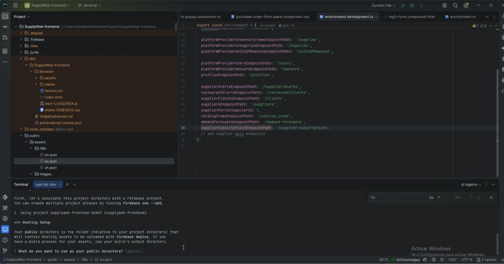

Se puede evidenciar el correcto despliegue de la plataforma mediante los mensajes de inicio registrados por Spring Boot, los cuales confirman que la aplicación se ejecutó satisfactoriamente y quedó disponible para recibir solicitudes.

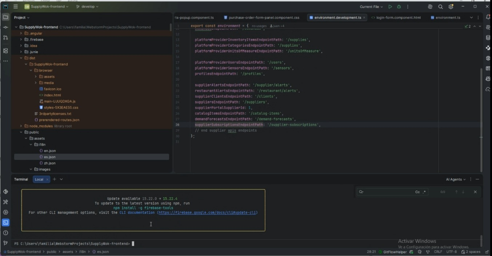


**Deploy del Backend**

Primero, se verificó la disponibilidad de la base de datos PostgreSQL utilizada por la plataforma, confirmando que la instancia se encontraba activa y accesible para el entorno desplegado.

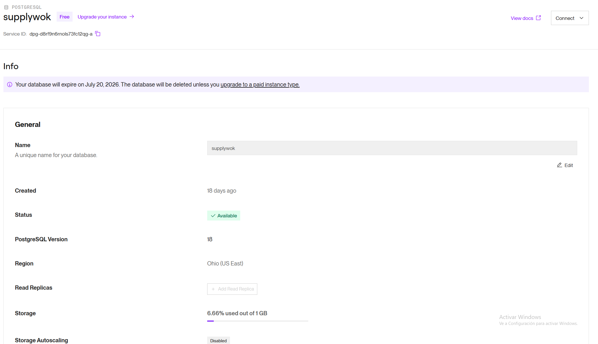

Posteriormente, se revisó el servicio backend en Render y se ejecutó el proceso de despliegue manual para publicar la versión más reciente del sistema.

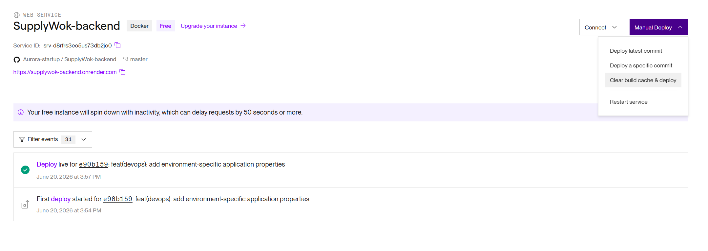

A continuación, se registró el inicio del nuevo despliegue asociado a la versión integrada del backend.

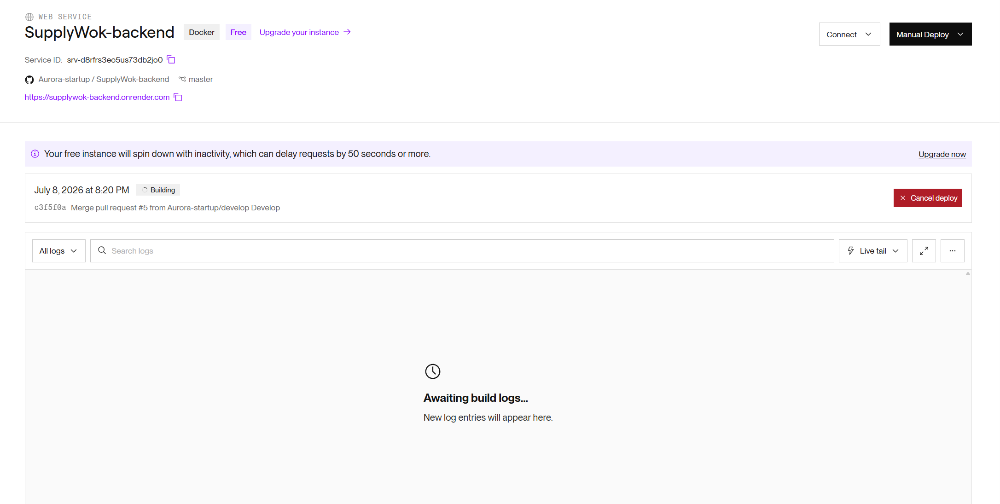

Finalmente, se verificó el progreso de la construcción y arranque del servicio, observando en los logs la ejecución del backend con Spring Boot y el perfil de producción activo. De manera complementaria, el frontend quedó publicado en Firebase Hosting y la landing page en GitHub Pages, completando así el despliegue de los tres componentes del producto.

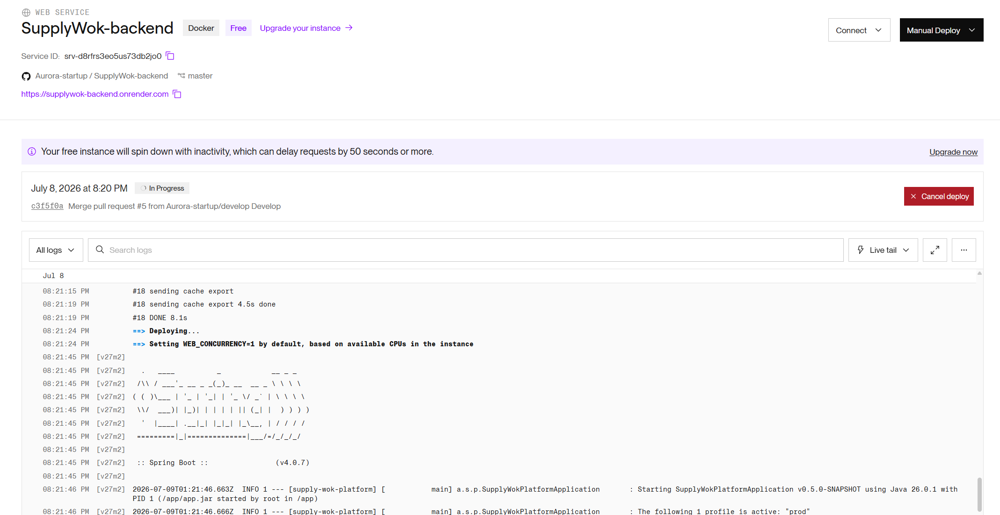

#### 5.2.4.8. Team Collaboration Insights during Sprint

Durante el Sprint 4, el equipo trabajó en el cierre completo del producto, realizando ajustes finales en backend, frontend y landing page, además de la integración de componentes con el entorno desplegado. Los commits consignados en la sección de Development Evidence muestran trabajo distribuido entre los tres repositorios principales del proyecto. Para evidenciar esta colaboración, se recopilaron analíticos de los repositorios del backend, frontend y landing page, correspondientes al periodo de cierre del sprint.

La primera evidencia corresponde al repositorio del backend. En la sección Contributors se observa una participación sostenida de 4 autores principales durante el último mes, con actividad concentrada en la consolidación de bounded contexts, ajustes de integración y preparación de la versión final del servicio desplegado.

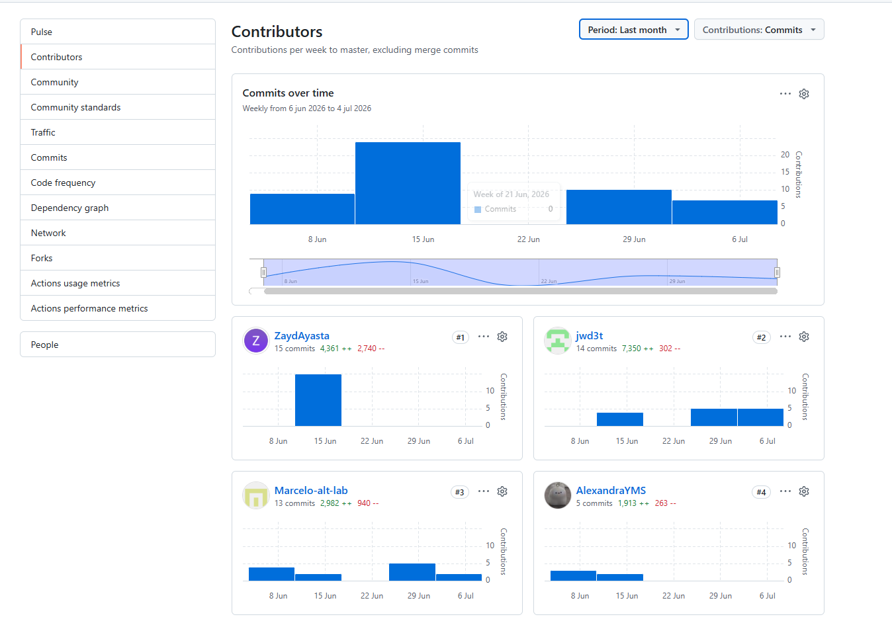

Como se aprecia en el detalle de contribuciones del backend, **ZaydAvasta** realizó 15 commits con 4361 líneas agregadas y 2740 eliminadas, **jwd3t** realizó 14 commits con 7350 líneas agregadas y 302 eliminadas, **Marcelo-alt-lab** realizó 13 commits con 2982 líneas agregadas y 940 eliminadas, y **AlexandraYMS** realizó 5 commits con 1913 líneas agregadas y 263 eliminadas. Esto evidencia una distribución activa del trabajo técnico en la implementación, corrección y estabilización final de la API.

La siguiente imagen corresponde a la sección Pulse del backend, en la que se observa que, durante la última semana analizada, 2 autores enviaron 17 commits a `master` y 17 commits al total de ramas. Además, se registró 1 pull request merged, 189 archivos modificados, 5573 adiciones y 425 eliminaciones, junto con la publicación de 1 release. Estas métricas reflejan la intensidad del trabajo de cierre técnico y despliegue del backend en la etapa final del sprint.

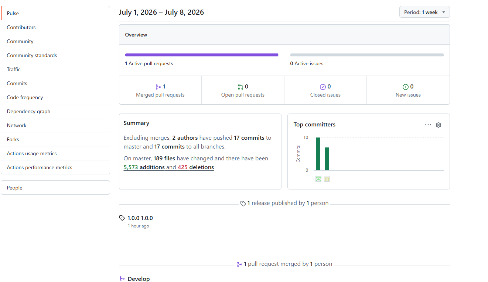

Como segunda evidencia, se recopilaron los analíticos del repositorio del frontend web, ya que este componente concentró buena parte de la integración visible del sistema durante el sprint.

La siguiente evidencia muestra la sección Contributors del repositorio del frontend. En ella se observa que participaron 2 autores principales y que, excluyendo merges, se registraron 9 commits hacia `main` durante el periodo analizado. Esta actividad refleja el trabajo de ajuste funcional, integración con el backend desplegado y refinamiento de la experiencia de usuario previo a la entrega final.

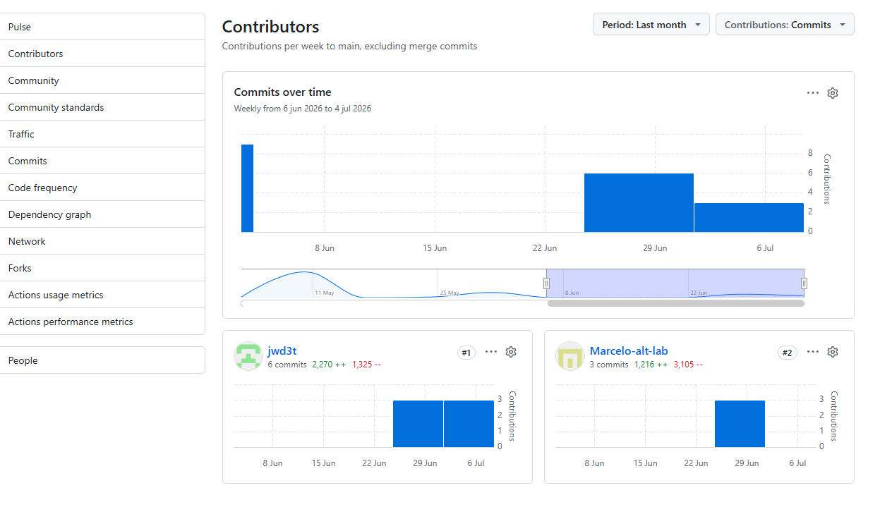

Como se aprecia en el detalle de contribuciones, el usuario **jwd3t** realizó 6 commits con 2270 líneas agregadas y 1325 eliminadas, mientras que **Marcelo-alt-lab** realizó 3 commits con 1216 líneas agregadas y 3105 eliminadas. Esto evidencia una participación conjunta en la integración final del frontend, incluyendo mejoras visuales, ajustes de rutas, consumo de servicios y consolidación de funcionalidades clave.

La siguiente imagen corresponde a la sección Pulse del mismo repositorio. En ella se observa que, excluyendo merges, 2 autores enviaron 9 commits a la rama principal y 18 commits al total de ramas. Además, se registraron 2 pull requests merged, 118 archivos modificados, 2690 adiciones y 3634 eliminaciones, métricas coherentes con una etapa intensiva de integración, limpieza y estabilización del frontend antes de la entrega.

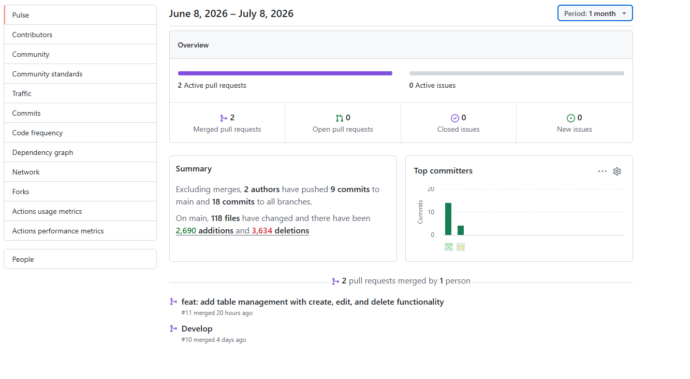

Como evidencia complementaria del cierre del producto, también se recopilaron analíticos del repositorio de la landing page. Estos muestran actividad final de ajuste visual y de contenido para alinear la presentación pública de SupplyWok con la versión final del sistema.

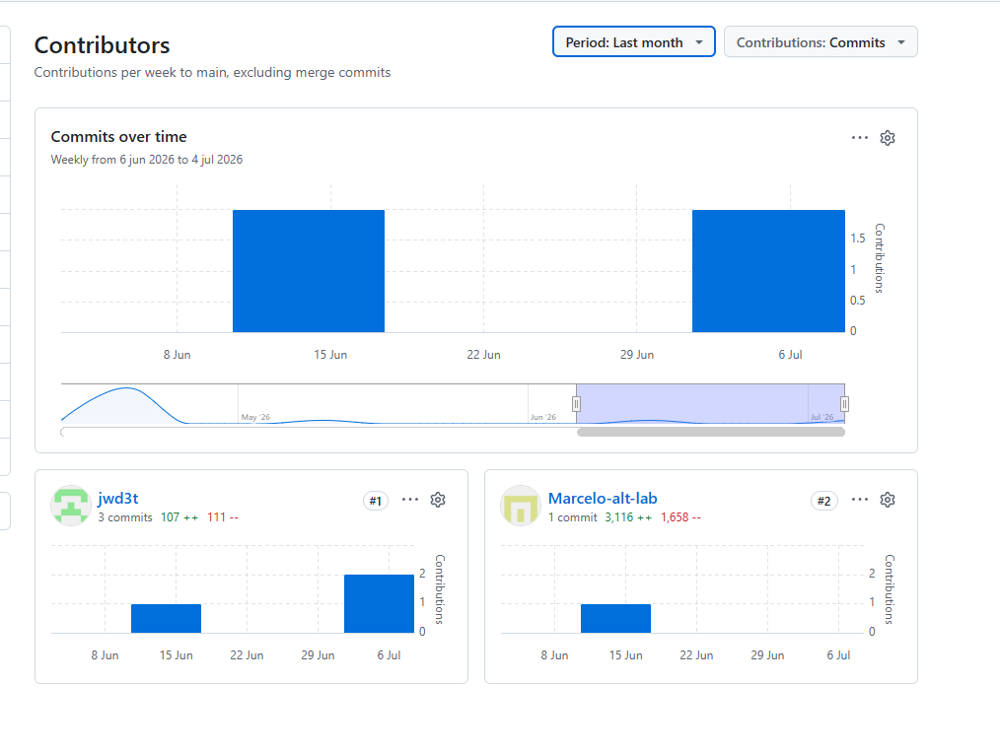

En este repositorio participaron 2 autores principales y se registraron 4 commits a la rama principal, junto con 2 pull requests merged, 34 archivos modificados, 3166 adiciones y 1712 eliminaciones. Estos cambios estuvieron orientados a la mejora de recursos visuales, organización del contenido y presentación final del producto.

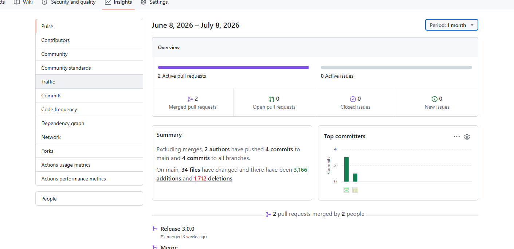

## 5.3. Validation Interviews.

En esta sección se presentan las actividades de validación realizadas con usuarios pertenecientes a los segmentos objetivos de SupplyWok. El objetivo de estas entrevistas fue recopilar retroalimentación sobre la propuesta de valor, la experiencia de navegación en la Landing Page y el uso de las funcionalidades implementadas en la plataforma. Los resultados obtenidos permitieron identificar fortalezas, oportunidades de mejora y validar los principales supuestos planteados durante el desarrollo del proyecto.

### 5.3.1. Diseño de Entrevistas.
En esta sección se presenta el diseño de las sesiones de validación realizadas sobre la Landing Page y la Web Application de SupplyWok. A diferencia de las entrevistas de descubrimiento desarrolladas durante el needfinding, estas sesiones tuvieron como objetivo evaluar el comportamiento de usuarios representativos al interactuar con la propuesta de valor del producto y con los principales flujos de la solución digital implementada.

Las sesiones de validación se diseñaron para observar si los participantes comprendían el propósito del producto, si podían navegar por las vistas principales sin asistencia excesiva y si lograban completar tareas representativas del core business. Asimismo, se buscó recopilar comentarios espontáneos de los participantes sobre claridad, utilidad, confianza, facilidad de uso y valor percibido de la solución.

Para ello, se trabajó con usuarios correspondientes a los dos segmentos objetivos del proyecto: dueños o administradores de restaurantes chifa y proveedores de insumos para restaurantes. Cada sesión fue moderada por un integrante del equipo y registrada en video como evidencia de validación.

**Objetivo general de validación**

- Verificar si los usuarios comprenden la propuesta de valor de SupplyWok al interactuar con la Landing Page.
- Evaluar si los usuarios pueden navegar por la Web Application y completar tareas clave sin fricción significativa.
- Identificar problemas de usabilidad, arquitectura de información y diseño inclusivo en los flujos implementados.
- Recoger observaciones cualitativas que permitan priorizar mejoras para las siguientes iteraciones del producto.

**Segmentos validados**

- **Segmento 1:** Dueños o administradores de restaurantes chifa.
- **Segmento 2:** Proveedores de insumos para restaurantes.

**Escenarios y tareas de validación**

Las sesiones se estructuraron alrededor de tareas concretas, alineadas con los flujos principales del producto.

**Para el segmento de restaurantes**

- Identificar, a partir de la Landing Page, cuál es la propuesta de valor principal de SupplyWok.
- Navegar desde la Landing Page hacia la aplicación.
- Iniciar sesión y reconocer el propósito general del dashboard.
- Ubicar módulos clave como inventario, pedidos, alertas o mesas.
- Interpretar la información presentada en una vista principal del sistema.

**Para el segmento de proveedores**

- Identificar, a partir de la Landing Page, cómo SupplyWok puede aportar valor al proveedor.
- Navegar desde la Landing Page hacia la aplicación.
- Iniciar sesión en la vista de proveedor.
- Ubicar funcionalidades principales como clientes, catálogo, órdenes o demanda proyectada.
- Interpretar la información mostrada en una vista principal del panel del proveedor.

**Preguntas de validación posteriores a la demostración**

Después de mostrar la Landing Page y los principales flujos de la Web Application, el moderador realizó preguntas orientadas a recoger la percepción del participante sobre la utilidad, claridad y aplicabilidad real de la solución.

- Después de ver la aplicación, ¿te parece útil para tu trabajo o negocio?
- ¿Qué parte de la aplicación te gustó más?
- ¿Hubo algo que no entendiste o que te confundió?
- ¿Usarías una aplicación como esta en la vida real? ¿Por qué?
- ¿Qué cambiarías o mejorarías?

### 5.3.2. Registro de Entrevistas.
En esta sección se presenta el registro de las sesiones de validación realizadas con representantes de los segmentos objetivo. Cada sesión permitió observar cómo los usuarios interactuaron con el Landing Page y con la Web Application, así como registrar comentarios, dudas y observaciones generadas durante la navegación.

Las entrevistas de validación fueron registradas en video y consolidadas en un único material de evidencia, siguiendo las indicaciones del project statement. En cada caso se documenta la información del participante, el segmento representado, la fecha de la sesión y un resumen de los principales hallazgos obtenidos.

**Video consolidado de validación**
- **Enlace en Microsoft Stream:** [Vídeo de Validación](https://upcedupe-my.sharepoint.com/:v:/g/personal/u202318609_upc_edu_pe/IQCOSQpG7nmNRZpSWlNHbKVcATPs70bPkNvFhoz2TeEb9eA?e=BhExXc)
- **Captura de evidencia:**  
  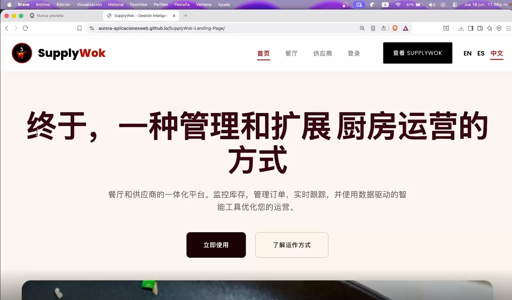

### Segmento Objetivo Dueños de Restaurantes

#### Entrevista de validación #1


**Resumen de la sesión:**

El primer entrevistado Weiquan Wang, un dueño de restaurante de 55 años ubicado en el Callao, logró comprender la idea general de la landing page y también el flujo principal de la aplicación, especialmente las pantallas de inventario, pedidos, comandas, mesas y alertas. Su percepción general fue positiva, ya que consideró que el sistema era fácil de usar y que podría manejarlo sin demasiada dificultad; sin embargo, aportó una observación importante sobre el módulo de pedidos, indicando que sería más práctico no agregar productos uno por uno, sino contar con una forma más rápida de seleccionar varios insumos en una sola acción.

| Detalle | Información |
|---|---|
| **Entrevistador** | Juan Sung Jau Wang Chen |
| **Entrevistado** | Weiquan Wang |
| **Segmento objetivo** | Restaurante  |
| **Edad** | 55 |
| **Ubicación** | La Perla, Callao |
| **Duración / Empieza en** | [14:18 minutos] / [0:00] |
| **Enlace** | [Ver entrevista](https://upcedupe-my.sharepoint.com/:v:/g/personal/u202318609_upc_edu_pe/IQCOSQpG7nmNRZpSWlNHbKVcATPs70bPkNvFhoz2TeEb9eA?e=BhExXc) |

*Tabla. Registro de validación 1*

#### Entrevista de validación #2
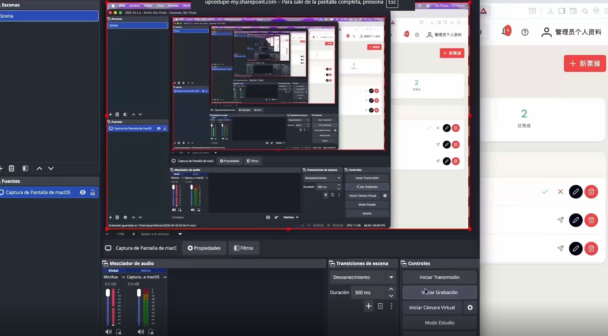

**Resumen de la sesión:**

La segunda entrevistada Ana Chen, una dueña de restaurante de 50 años de Callao, entendió de forma clara las funciones principales de la aplicación, sobre todo el inventario, la creación de órdenes a proveedores, los tickets de cocina, la gestión de mesas y las alertas. Comentó que el sistema le parecía sencillo y fácil de seguir, sin encontrar grandes dificultades en su uso; no obstante, brindó una sugerencia bastante valiosa al señalar que, en la sección de pedidos, sería más útil manejar horarios de entrega además de la prioridad, ya que en la práctica casi todos los pedidos se consideran importantes y lo realmente decisivo suele ser el momento en que deben recibirse.

| Detalle | Información |
|---|---|
| **Entrevistador** | Juan Sung Jau Wang Chen |
| **Entrevistado** | Ana Chen |
| **Segmento objetivo** | Restaurante |
| **Edad** | 50 |
| **Ubicación** | La Perla, Callao |
| **Duración / Empieza en** | [12 minutos] / [14:20] |
| **Enlace** | [Ver entrevista](https://upcedupe-my.sharepoint.com/:v:/g/personal/u202318609_upc_edu_pe/IQCOSQpG7nmNRZpSWlNHbKVcATPs70bPkNvFhoz2TeEb9eA?e=BhExXc) |

*Tabla. Registro de validación 2*

#### Entrevista de validación #3


**Resumen de la sesión:**

La tercera entrevistada, Lili, de 54 años y dueña de un restaurante chifa en La Perla, mostró una validación claramente favorable tanto de la landing page como de la aplicación. Después de revisar las pantallas principales, afirmó que la plataforma le parecía útil para su trabajo diario, que el flujo era entendible y que no percibía confusión importante en el uso de las funciones. Entre todos los módulos presentados, destacó especialmente el de alertas como la parte que más le interesó, señalando además que sí utilizaría la aplicación en un contexto real y que, al menos en esta etapa, no veía cambios urgentes que realizar.

| Detalle | Información |
|---|---|
| **Entrevistador** | Juan Sung Jau Wang Chen |
| **Entrevistado** | Lily 蔡 |
| **Segmento objetivo** | Restaurante  |
| **Edad** | 54 |
| **Ubicación** | La Perla, Callao |
| **Duración / Empieza en** | [8 minutos] / [26:18] |
| **Enlace** | [Ver entrevista](https://upcedupe-my.sharepoint.com/:v:/g/personal/u202318609_upc_edu_pe/IQCOSQpG7nmNRZpSWlNHbKVcATPs70bPkNvFhoz2TeEb9eA?e=BhExXc) |

*Tabla. Registro de validación 3*


### Segmento Objetivo Proveedores

#### Entrevista de validación #4


**Resumen de la sesión:**

El cuarto entrevistado, Alberto Copa Villa, de 37 años, trabajador de una carnicería en La Perla y representante del perfil proveedor, valoró de manera positiva la propuesta para este segundo segmento de usuarios, especialmente en las pantallas de órdenes, clientes, delivery planning, alertas, demanda y catálogo. Indicó que las funcionalidades que más le llamaron la atención fueron las alertas, el control del stock y la planificación de rutas, ya que las percibió como herramientas útiles para el trabajo real de un proveedor. Además, propuso dos mejoras importantes: reemplazar o complementar la prioridad de las órdenes con horarios de entrega más concretos, y añadir dentro de la misma aplicación una función de mensajería o chat tipo WhatsApp para comunicarse con los restaurantes sin depender de otros medios externos.

| Detalle | Información |
|---|---|
| **Entrevistador** | Juan Sung Jau Wang Chen |
| **Entrevistado** | Alberto Copa Villa |
| **Segmento objetivo** | Proveedor |
| **Edad** | 37 |
| **Ubicación** | La Perla, Callao |
| **Duración / Empieza en** | [8 minutos] / [34:00] |
| **Enlace** | [Ver entrevista](https://upcedupe-my.sharepoint.com/:v:/g/personal/u202318609_upc_edu_pe/IQCOSQpG7nmNRZpSWlNHbKVcATPs70bPkNvFhoz2TeEb9eA?e=BhExXc) |

*Tabla. Registro de validación 3*


### 5.3.3. Evaluaciones según heurísticas.
Como complemento a la observación de las sesiones de validación, el equipo realizó una evaluación de experiencia de usuario basada en heurísticas. Esta revisión tomó como referencia los criterios de usabilidad, diseño inclusivo y arquitectura de información indicados en el project statement del curso.

El objetivo de esta evaluación fue sistematizar los principales problemas detectados durante la interacción de los usuarios con el Landing Page y la Web Application, asignándoles un nivel de severidad y relacionándolos con la heurística o principio incumplido. De este modo, los hallazgos cualitativos obtenidos en las entrevistas de validación pudieron complementarse con una revisión experta centrada en identificar oportunidades concretas de mejora para la siguiente iteración del producto.

**Aplicación evaluada**

- **Site o app a evaluar:** SupplyWok
- **Auditor:** Aurora
- **Clientes participantes:** Usuarios de los segmentos restaurante y proveedor entrevistados durante la validación

**Tareas evaluadas**

- Comprender la propuesta de valor del Landing Page.
- Navegar hacia la Web Application desde los call to action.
- Reconocer el propósito del dashboard según el rol del usuario.
- Ubicar funcionalidades principales del sistema.
- Interpretar información clave en vistas como inventario, pedidos, clientes o catálogo.

**Escala de severidad utilizada**

| Nivel | Descripción |
|---|---|
| 1 | Problema superficial que no afecta significativamente la experiencia. |
| 2 | Problema menor que genera fricción, pero puede ser superado por el usuario. |
| 3 | Problema mayor que ocurre con frecuencia o dificulta seriamente completar la tarea. |
| 4 | Problema muy grave que impide continuar con el uso de la herramienta. |

**Tabla resumen de hallazgos**

| # | Problema | Escala de severidad | Heurística o principio violado |
|---|---|---|---|
| 1 | La aplicación no ofrece una guía inicial ni ayuda contextual para usuarios nuevos. | 3 | Ayuda y documentación |
| 2 | No existen diálogos de confirmación antes de ejecutar acciones destructivas como eliminar registros. | 4 | Prevención de errores |
| 3 | Se identificaron inconsistencias visuales entre pantallas, componentes y estilos del sistema. | 2 | Consistencia y estándares |

**Descripción de problemas**

**Problema #1: Ausencia de guía de uso o acompañamiento inicial**

- **Severidad:** 3
- **Heurística violada:** Ayuda y documentación
- **Problema:** Durante la evaluación se observó que la aplicación no brinda una orientación inicial para usuarios nuevos. No se encontraron mensajes introductorios, explicaciones contextuales ni elementos que indiquen con claridad cómo iniciar el uso de los módulos principales. Esto puede dificultar la adopción de la plataforma, especialmente para usuarios que ingresan por primera vez y aún no conocen la lógica del sistema ni el propósito de cada sección.
- **Recomendación:** Incorporar una breve guía de bienvenida, textos de apoyo o mensajes contextuales que orienten al usuario sobre el propósito de cada módulo y las acciones principales que puede realizar.

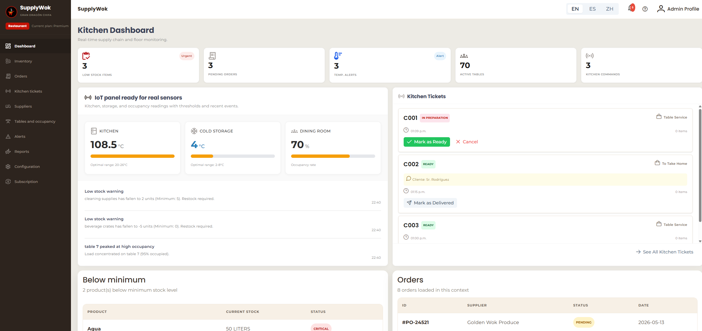

**Problema #2: Falta de confirmación antes de eliminar información**

- **Severidad:** 4
- **Heurística violada:** Prevención de errores
- **Problema:** Se identificó que la aplicación no presenta un cuadro de confirmación antes de ejecutar acciones irreversibles como la eliminación de registros. Esta situación representa un riesgo importante, ya que el usuario puede borrar información por equivocación sin una oportunidad previa para cancelar la acción. La ausencia de esta validación reduce la sensación de control y puede ocasionar pérdida accidental de datos.
- **Recomendación:** Implementar diálogos de confirmación antes de eliminar elementos, con mensajes claros sobre la acción que se va a realizar y opciones visibles para confirmar o cancelar.

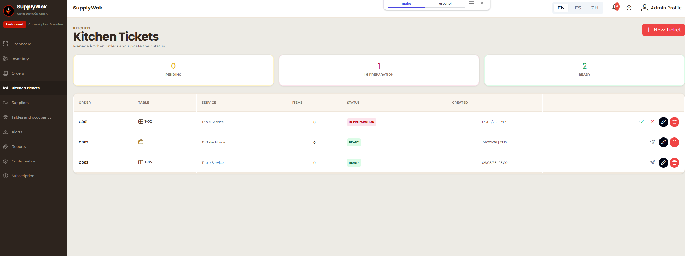
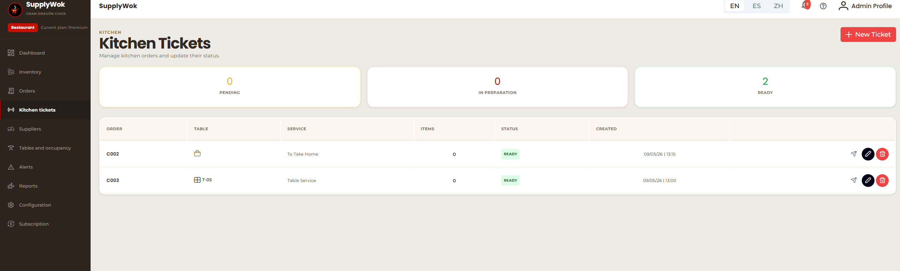

**Problema #3: Inconsistencias visuales en el diseño de la interfaz**

- **Severidad:** 2
- **Heurística violada:** Consistencia y estándares
- **Problema:** Durante la revisión se detectaron diferencias visuales entre pantallas y componentes, como variaciones en estilos, jerarquías visuales, tamaños o distribución de elementos. Aunque estas diferencias no impiden por completo el uso del sistema, sí afectan la percepción de uniformidad y profesionalismo de la plataforma, y obligan al usuario a reinterpretar cada pantalla en lugar de reconocer patrones consistentes.
- **Recomendación:** Definir y aplicar criterios visuales uniformes para componentes, botones, tablas, encabezados, colores, espaciados y estilos tipográficos en todas las vistas del sistema.


**Conclusión de la evaluación heurística**

La evaluación heurística permitió identificar problemas relevantes que complementan los hallazgos obtenidos en las entrevistas de validación. En particular, se evidenció la necesidad de mejorar el acompañamiento al usuario, reforzar la prevención de errores en acciones sensibles y unificar la experiencia visual del sistema. Estos aspectos no siempre son mencionados de forma explícita por los entrevistados, pero sí impactan de manera significativa en la usabilidad general de la plataforma.

La incorporación de estas mejoras contribuirá a que SupplyWok ofrezca una experiencia más clara, confiable y consistente, alineada con los principios de diseño centrado en el usuario y con los criterios de calidad esperados para una aplicación web funcional.

## 5.4. Video About-the-Product.


* Microsoft Stream: [URL del video](https://upcedupe-my.sharepoint.com/:v:/g/personal/u202318609_upc_edu_pe/IQAQFG5C3_5eQ78sex-VMP4KAcv3Iyv9JT4jLLZW0l7N0Ew?e=S18gWf)
* YouTube: [Url del video en YouTube](https://youtu.be/AzOyy7Oak_w)


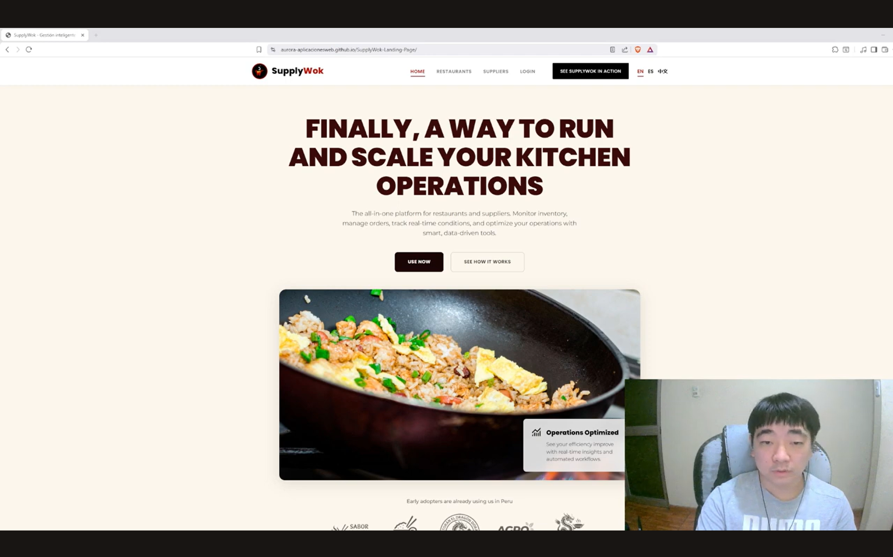

## Conclusiones y Recomendaciones

### Conclusiones

En conclusión, el desarrollo de SupplyWok permitió comprender de manera profunda las problemáticas relacionadas con la gestión de inventarios, compras, mesas, comandas y proveedores en restaurantes tipo Chifa. Mediante entrevistas y actividades de validación se identificaron necesidades reales tanto de los dueños de estos negocios como de sus proveedores, las cuales sirvieron como base para definir los requerimientos funcionales de la plataforma. Asimismo, la aplicación de técnicas de diseño centrado en el usuario, incluyendo la elaboración de historias de usuario, wireframes, mockups y prototipos interactivos, permitió visualizar tempranamente la propuesta de solución y alinear a todo el equipo hacia una misma visión y objetivo del proyecto.

El desarrollo de la Landing Page de SupplyWok permitió fortalecer y ampliar nuestros conocimientos en tecnologías de desarrollo web como HTML, CSS y JavaScript. Además, se implementó un sistema de internacionalización que permitió ofrecer el contenido en tres idiomas diferentes, incluyendo el chino, debido a que gran parte del segmento objetivo está conformado por propietarios de restaurantes Chifa. Esto contribuyó a mejorar la accesibilidad y el alcance de la propuesta de valor de la plataforma.

Por otro lado, el desarrollo del frontend utilizando Angular y TypeScript permitió enfocarnos en la implementación de las funcionalidades principales de la plataforma mediante el uso de una Fake API que simulaba el comportamiento del backend durante las primeras etapas del proyecto. Esta estrategia facilitó el desarrollo paralelo de la interfaz de usuario y la lógica de negocio, además de permitir la validación temprana de los flujos funcionales de la aplicación. Asimismo, el despliegue de la solución en GitHub permitió poner la plataforma a disposición de los usuarios para realizar pruebas y obtener retroalimentación.

El desarrollo del backend representó la etapa de consolidación de la arquitectura de SupplyWok, permitiendo implementar la lógica de negocio, la persistencia de datos y la comunicación mediante APIs REST. Durante esta fase se aplicaron conceptos de Domain-Driven Design (DDD) y la definición de Bounded Contexts para organizar el sistema de manera modular y escalable, facilitando la separación de responsabilidades entre los diferentes dominios de la plataforma. Asimismo, el despliegue del backend en Render permitió integrar los distintos componentes del sistema y sentó las bases para el funcionamiento completo de la solución en un entorno real.

Finalmente, el desarrollo de SupplyWok fue una experiencia exitosa que permitió profundizar los conocimientos del equipo en todas las fases del ciclo de vida de una aplicación web, desde el análisis de requisitos y diseño de la experiencia de usuario hasta el desarrollo frontend, backend y despliegue en la nube. Si bien aún existen oportunidades de mejora relacionadas con la consistencia visual de algunas interfaces y la aplicación de ciertos estándares de programación, se logró construir una plataforma funcional, completa y de complejidad considerable, capaz de responder a las necesidades identificadas durante la etapa de investigación y validación con los usuarios.


### Recomendaciones

Como resultado de la experiencia obtenida durante el desarrollo de SupplyWok, se recomienda que en proyectos futuros cada integrante del equipo asuma la responsabilidad principal de un Bounded Context específico. Esta estrategia permite una mejor comprensión del dominio asignado, facilita la implementación correcta de las reglas de negocio y reduce la posibilidad de inconsistencias entre los diferentes módulos del sistema.

También se recomienda mantener una documentación clara y actualizada durante todo el ciclo de vida del proyecto. Documentar adecuadamente los requisitos, decisiones de diseño, modelos de dominio, APIs y arquitectura del sistema permite que todos los integrantes compartan una misma visión de la solución, reduciendo malentendidos y facilitando tanto el desarrollo como el mantenimiento de la plataforma. Una documentación sólida resulta especialmente importante en proyectos que involucran múltiples componentes interconectados.

Por otro lado, es recomendable establecer fechas límite internas previas a las fechas oficiales de entrega. Esto permite disponer de tiempo suficiente para realizar pruebas, correcciones, integración de componentes, resolución de conflictos y validación de funcionalidades antes de la entrega final. La existencia de estos plazos internos contribuye a disminuir riesgos, mejorar la calidad del producto entregado y reducir la presión sobre el equipo durante las últimas etapas del proyecto.

Finalmente, se recomienda continuar fortaleciendo la aplicación mediante la incorporación de pruebas automatizadas, mejoras en la experiencia de usuario y nuevas funcionalidades basadas en la retroalimentación obtenida de los usuarios finales. De esta manera, la plataforma podrá evolucionar de forma continua y adaptarse mejor a las necesidades cambiantes de los restaurantes que constituyen su segmento objetivo.

## Video About-The-Team

### Enlaces del Video

* Microsoft Stream: [https://1drv.ms/v/c/0ca1e208970c48ab/IQB4PPLyCwhVSb1oNJZi9T-eATNYEMI0ZzkXVuDqS6ommVw?e=nEUjMA](https://1drv.ms/v/c/0ca1e208970c48ab/IQB4PPLyCwhVSb1oNJZi9T-eATNYEMI0ZzkXVuDqS6ommVw?e=nEUjMA)
* YouTube: [https://www.youtube.com/watch?v=Ccdvj5WbxWQ](https://www.youtube.com/watch?v=Ccdvj5WbxWQ)

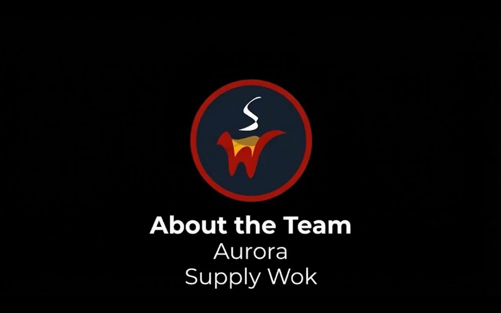


