# Capítulo V: Product Implementation, Validation & Deployment.

## 5.1. Software Configuration Management. 
Para tener consistencia y seguimiento del desarrollo de la plataforma, se ha definido una serie de herramientas y estrategias de desarrollo. El metodo cubre la configuracion del entorno de desarrollo, la gestion del codigo y el despliegue, alineado a las buenas practicas de ingenieria de software y metodologias agiles.

### 5.1.1. Software Development Environment Configuration.
Para facilitar la colaboración del equipo en todas las actividades del ciclo de vida de desarrollo de SupplyWok, se ha definido un entorno de desarrollo común. Este entorno está compuesto por herramientas especializadas para la gestión del proyecto, diseño UX/UI, modelado, desarrollo, pruebas, documentación y despliegue. La selección de estas herramientas se basa en criterios de eficiencia, compatibilidad con tecnologías open-source (Java + web), y alineación con prácticas recomendadas de la industria.

|  Categoría   | Herramienta   | Propósito | Tipo de acceso/enlace |
|:---:|:---:|:---:|:---:|
|    Project Management   |         Trello        |Gestión del backlog, tareas y sprints del equipo usando metodología ágil (Scrum).|   [https://trello.com](https://trello.com) |
| Requirements Management |       UXPressia       |Creación de User Personas, Journey Maps y artefactos de needfinding.|[https://uxpressia.com](https://uxpressia.com)|
|   Product UX/UI Design  |         Figma         |Diseño de wireframes, mockups y prototipos de la aplicación web y móvil.|[https://figma.com](https://figma.com)|
|   Modelado de Software  |    LucidChart / Miro / Structurizr|Modelado de arquitectura (UML, C4, Event Storming, Bounded Contexts).|[https://www.lucidchart.com/](https://www.lucidchart.com/)/[https://miro.com/](https://miro.com/) / [https://structurizr.com/](https://structurizr.com/)|
|   Frontend Development  |   Visual Studio Code  |Desarrollo del Landing Page y Web Application (HTML, CSS, JavaScript).|[https://code.visualstudio.com](https://code.visualstudio.com)|
|   Backend Development   |IntelliJ IDEA|     Desarrollo del RESTful API en Java (Spring Boot) siguiendo arquitectura orientada a servicios.    |[https://www.jetbrains.com/idea/](https://www.jetbrains.com/idea/)               |
|       API Testing       |Postman|Pruebas y validación de endpoints del API RESTful.|[https://www.postman.com](https://www.postman.com)|
|     Version Control     |         GitHub        | Control de versiones del código fuente y documentación colaborativa (GitFlow + Conventional Commits). |[https://github.com](https://github.com)|
|  Software Documentation |        Markdown       |Redacción del informe del proyecto bajo enfoque Docs-as-Code.                     |Compatible con GitHub / editores de texto|


### 5.1.2. Source Code Management. 
Los repositorios utilizados para el desarrollo de código fuente son los siguientes:

<div align="center">

| Producto Digital | URL del Repositorio | 
|:----------------:|:-------------------:|
| Landing Page | https://github.com/Aurora-startup/SupplyWok-landing-page | 
| Web Services (Backend API) |https://github.com/Aurora-startup/SupplyWok-backend  |
| Frontend Web Application | https://github.com/Aurora-startup/SupplyWok-frontend|

</div>


**Modelos de Ramificación**

Se implementará GitFlow, un modelo de ramificación estructurado, el cual permite separar de manera clara las etapas de desarrollo, pruebas, liberación y mantenimiento.

**La estructura de ramas en GitFlow será:**

- _Main_: Contiene el código en estado estable y listo para producción.
- _Develop_: Rama de integración para desarrollo activo.
- _Feature branches_: Para nuevas funcionalidades.
    - Convención: `feature/nombre-descriptivo`  
    - Ejemplo: `feature/US007-business-profiles`
- _Release branches_: Para preparar versiones antes de pasar a producción.
    - Convención: `release/X.Y.Z`  
    - Ejemplo: `release/1.0.0`
- _Hotfix branches_: Para correcciones urgentes.
    - Convención: `hotfix/X.Y.Z`  
    - Ejemplo: `hotfix/1.0.1`        

**Versionado Semántico (Semantic Versioning)**

- Se utiliza Semantic Versioning 2.0.0, con el esquema MAJOR.MINOR.PATCH:

    - **MAJOR:** Cambios incompatibles.
    - **MINOR:** Funcionalidades nuevas retrocompatibles.
    - **PATCH:** Correcciones retrocompatibles.

    **Ejemplos de versiones:**  
    `v1.0.0`, `v1.1.0`, `v1.1.1`.

**Convenciones para Commits**

El equipo sigue el estándar de Conventional Commits para los mensajes de commits, lo que permite claridad en el historial y facilita la generación automática de changelogs:

`<type>[optional scope]: <description>`

Tipos comunes:

- `feat`: Nueva funcionalidad.
- `fix`: Corrección de errores.
- `docs`: Cambios en documentación.
- `style`: Cambios de formato sin impacto funcional.
- `refactor`: Reestructuración del código.
- `test`: Relacionados con pruebas.
- `chore`: Tareas de mantenimiento.

Ejemplo:
```
  feat(auth): implement login via OAuth
  fix(api): handle null user tokens
```
### 5.1.3. Source Code Style Guide & Conventions. 

Esta sección define los lineamientos y estándares que se seguirán durante el desarrollo del software, con el fin de garantizar un código uniforme, comprensible y fácil de mantener, alineado con buenas prácticas de la industria.

Se adoptarán convenciones ampliamente aceptadas para los lenguajes utilizados en el proyecto: HTML, CSS, JavaScript, TypeScript y Java. Asimismo, todos los nombres de variables, funciones, clases y demás identificadores estarán escritos en inglés.


#### Referencias utilizadas

Las siguientes guías servirán como base para la implementación de estándares de código:

- [Angular Style Guide (oficial)](https://angular.io/guide/styleguide)
- [Google TypeScript Style Guide](https://google.github.io/styleguide/tsguide.html)
- [Google Java Style Guide](https://google.github.io/styleguide/javaguide.html)
- [Google HTML/CSS Style Guide](https://google.github.io/styleguide/htmlcssguide.html)
- [HTML Style Guide and Coding Conventions - W3Schools](https://www.w3schools.com/html/html5_syntax.asp)
- [Spring Boot Features](https://docs.spring.io/spring-boot/docs/current/reference/htmlsingle/)


#### Estructura del código

El proyecto se organizará en módulos según sus responsabilidades, separando claramente componentes como servicios, modelos, vistas, rutas y configuraciones.  
Este enfoque permite mejorar la escalabilidad del sistema y fomenta la reutilización de código, aplicando el principio de *Separation of Concerns*.


#### Convenciones de nomenclatura

| Elemento                    | Convención                         | Ejemplo                    |
|---------------------------|------------------------------------|----------------------------|
| Componentes Angular       | PascalCase + `Component`           | `UserProfileComponent`     |
| Servicios Angular         | PascalCase + `Service`             | `AuthService`              |
| Interfaces TypeScript     | PascalCase                         | `User`, `CourseDetails`    |
| Archivos                  | kebab-case                         | `user-profile.component.ts`|
| Variables / funciones     | camelCase                          | `getUserData()`            |
| Constantes                | UPPER_SNAKE_CASE                   | `MAX_LOGIN_ATTEMPTS`       |
| Clases Java              | PascalCase                         | `UserController`           |
| Métodos Java             | camelCase                          | `getUserById()`            |
| Paquetes Java            | minúsculas con puntos              | `com.example.module`       |


#### Lineamientos por lenguaje

##### TypeScript
- Uso de tipado fuerte y explícito.
- Se emplean `let` y `const`, evitando `var`.
- La lógica compleja se delega a servicios, no a componentes.
- Orden de imports: Angular → librerías externas → módulos internos.
- No se utiliza el prefijo `I` en interfaces.

##### JavaScript
- Configuración basada en ESLint y Prettier.
- Preferencia por funciones puras y código modular.
- Uso de camelCase en nombres.
- Prioridad a `const` y `let`.

##### HTML
- Etiquetas y atributos en minúsculas.
- Indentación de 2 espacios.
- Uso de comillas dobles en atributos.
- Se prioriza semántica y accesibilidad según HTML5.

##### CSS / SCSS
- Uso de metodología BEM (Block Element Modifier) para definir las clases:

```css
.button {}
.button--primary {}
.button__icon {}
```
- Estructura modular de estilos, agrupados por componente.

- Uso de variables SCSS para colores, fuentes y tamaños.

- Están prohibidos los estilos en línea y el uso indiscriminado de !important.

###### JAVA
- Organización por capas: controller, service, repository, model, etc.

- Uso de anotaciones estándar como `@RestController`, `@Service`, `@Repository`.

- Documentación con Javadoc en clases y métodos públicos.

- Acceso a atributos mediante métodos getter y setter.

- Se sigue el https://google.github.io/styleguide/javaguide.html

##### Internacionalización

Se utiliza el paquete `@ngx-translate/core` para la internacionalización de la interfaz.

Toda cadena visible al usuario se encuentra externalizada en archivos JSON, organizados por idioma.

Las claves de traducción están en mayúsculas y separadas por puntos para reflejar su estructura jerárquica.

```css
<h1>{{ 'LOGIN.TITLE' | translate }}</h1>
```

### 5.1.4. Software Deployment Configuration.  
La configuración de despliegue define los procesos y herramientas necesarias para publicar los distintos componentes del sistema: **Landing Page**, **API REST (Backend)** y **Web Application (Frontend)**.  
Este enfoque permite asegurar consistencia, trazabilidad y facilidad de mantenimiento durante el ciclo de vida del producto.


#### Despliegue del Landing Page

- **Tecnologías utilizadas:**  
  HTML5, CSS3, JavaScript, enfoque responsive.

- **Repositorio:**  
  [https://github.com/Aurora-startup/SupplyWok-landing-page](https://github.com/Aurora-startup/SupplyWok-landing-page)

- **Plataforma de hosting:**  
  GitHub Pages

- **Proceso de despliegue:**  
  - La rama `main` contiene la versión pública del sitio.  
  - El contenido estático se ubica en el directorio raíz del proyecto.  
  - Los cambios se integran desde la rama `develop` mediante pull requests validados.  
  - GitHub Pages realiza la publicación automáticamente al detectar actualizaciones en la rama principal.


#### Despliegue del Backend (RESTful API)

- **Tecnologías utilizadas:**  
  Java + Spring Boot

- **Repositorio:**  
  [https://github.com/Aurora-startup/SupplyWok-backend](https://github.com/Aurora-startup/SupplyWok-backend)

- **Plataforma de despliegue:**  
  Servicios Cloud (ej. Render, Railway, AWS o Azure)

- **Proceso de despliegue:**  
  - La aplicación se empaqueta utilizando Maven/Gradle (`.jar` ejecutable).  
  - Se configura el despliegue automático conectado al repositorio GitHub.  
  - Las variables sensibles (credenciales, conexión a base de datos, tokens) se gestionan mediante variables de entorno.  
  - El servicio se expone a través de endpoints REST accesibles mediante HTTP/HTTPS.  
  - Se asegura la correcta comunicación con servicios externos requeridos por el sistema.


#### Despliegue del Frontend Web Application

- **Tecnologías utilizadas:**  
  Framework SPA (Angular 21+), HTML, CSS, TypeScript.

- **Repositorio:**  
  [https://github.com/Aurora-startup/SupplyWok-frontend](https://github.com/Aurora-startup/SupplyWok-frontend)

- **Plataforma de despliegue:**  
  Vercel / Netlify / GitHub Pages

- **Proceso de despliegue:**  
  - La aplicación se compila en modo producción (`npm run build`).  
  - La rama `main` se utiliza como fuente de despliegue.  
  - La plataforma seleccionada detecta cambios automáticamente y publica nuevas versiones.  
  - Se configura la URL del backend mediante variables de entorno para garantizar la integración con la API REST.


#### Consideraciones adicionales

- Se documentarán los pasos de despliegue en el repositorio principal del proyecto.  
- Se mantendrá una separación clara entre entornos (desarrollo, testing y producción).  
- Se realizarán pruebas posteriores al despliegue para validar la disponibilidad y funcionamiento del sistema.  
- Se contempla la integración de herramientas de automatización como **GitHub Actions** para implementar flujos de integración y despliegue continuo (CI/CD).
  
## 5.2. Landing Page, Services & Applications Implementation.
### 5.2.1. Sprint 1 
#### 5.2.1.1. Sprint Planning 1

En el sprint 1 como equipo nos centramos en la creación de la Landing Page de SupplyWok, que será la cara visible de nuestra plataforma ante los usuarios. Definiendo las secciones claves de la página para informar y convencer a los visitantes que se interesen.

**Sprint Planning 1**

| **Sprint #** | 1 |
|---|---|
| **Date** | 20-04-2026 |
| **Time** | 15:00 |
| **Location** | Virtual, Discord |
| **Prepared by** | Zayd Ayasta, Juan Wang |
| **Attendees** | Marcelo Cuadros, Alexandra Meza, Joan Payano, Zayd Ayasta, Juan Wang |
| **Sprint 0 Review Summary** | *Siendo el primer sprint, este campo no es aplicable.* |
| **Sprint 0 Retrospective Summary** | *Siendo el primer sprint, este campo no es aplicable.* |
| **Sprint 1 Goal** | Nuestro enfoque en este sprint es la Landing Page que informará de nuestra plataforma, por lo que la desarrollaremos e implementaremos para que sea accesible y responsiva. Con la información que brindamos sobre nuestro producto esperamos ganarnos la confianza de los que visiten la página y que empiecen a usar nuestro sistema. Se confirmará cuando esté en producción y se pueda usar el enlace de la página. |
| **Sprint 1 Velocity** | Límite de **35 SP** |
| **Sum of Story Points** | **30 SP** |

#### 5.2.1.2. Aspect Leaders and Collaborators.

Durante el Sprint 1, el equipo se enfocó principalmente en el desarrollo del Landing Page de SupplyWok, implemenando un interfaz agradable e información relevante para atraer la atencion de nuestros usuarios. Los principales aspectos considerados en este sprint son los siguientes:

- **Estructure HTML**

- **Design UI & responsive**

- **Scripts and UX**

- **SEO and Accessibility**

- **Content and Assets**

| Team Member | GitHub username | Estructure HTML | Design UI & responsive | Scripts and UX | SEO and Accessibility | Content and Assets |
|---|---|---|---|---|---|---|
| Cuadros, Marcelo | Marcelo-alt-lab | C | C | L | C | C |
| Payano, Joan | Nounz27 | C | C | C | - | - |
| Meza, Alexandra | AlexandraYMS | - | L | - | C | C |
| Ayasta, Zayd | Zayd Ayasta | L | C | C | C | - |
| Wang, Juan | jwd3t | C | - | C | L | C |

#### 5.2.1.3. Sprint Backlog 1.

**Sprint 1 Backlog**

| US Id | US Title | Task Id | Task Title | Description | Estimation (Hours) | Assigned To | Status |
|---|---|---|---|---|---|---|---|
| US44 | Página de inicio con hero section | T01 | Crear estructura HTML de la Hero Section | Maquetar la sección principal (Hero) usando etiquetas semánticas de HTML5. | 2 | Zayd Ayasta | To-do |
| US44 | Página de inicio con hero section | T02 | Implementar estilos CSS de la Hero Section | Aplicar la hoja de estilos base para definir colores, tipografía y disposición. | 2 | Alexandra Meza | To-do |
| US44 | Página de inicio con hero section | T03 | Implementar CTAs y enlace al formulario de registro | Añadir botones llamativos que redirijan al usuario al proceso de registro. | 1 | Marcelo Cuadros | To-do |
| US44 | Página de inicio con hero section | T04 | Adaptar Hero Section a diseño responsive | Asegurar que la sección principal se visualice correctamente en dispositivos móviles. | 2 | Zayd Ayasta | To-do |
| US45 | Sección de características principales | T05 | Crear estructura HTML de la sección de características | Construir la grilla o layout para mostrar los beneficios principales de la plataforma. | 1 | Juan Wang | To-do |
| US45 | Sección de características principales | T06 | Agregar iconos y estilos visuales a cada característica | Incorporar elementos gráficos y CSS para hacer cada característica visualmente atractiva. | 2 | Alexandra Meza | To-do |
| US46 | Sección de planes y precios | T07 | Crear estructura HTML de la sección de planes | Maquetar el área donde se mostrarán las opciones de precios y suscripciones. | 1 | Joan Payano | To-do |
| US46 | Sección de planes y precios | T08 | Implementar estilos de tarjetas de planes y precios | Diseñar visualmente las tarjetas de precios para facilitar la comparación de planes. | 2 | Zayd Ayasta | To-do |
| US46 | Sección de planes y precios | T09 | Agregar CTA de selección de plan con redirección al registro | Vincular cada tarjeta de precio con el flujo de creación de cuenta. | 1 | Marcelo Cuadros | To-do |
| US47 | Sección de preguntas frecuentes | T10 | Crear estructura HTML del acordeón FAQ | Maquetar el contenedor base para las preguntas frecuentes de los usuarios. | 1 | Juan Wang | To-do |
| US47 | Sección de preguntas frecuentes | T11 | Implementar lógica de expansión y colapso de preguntas | Programar la interactividad para mostrar u ocultar respuestas al hacer clic. | 2 | Marcelo Cuadros | To-do |
| US48 | Navegación y menú principal | T12 | Crear navbar sticky con enlaces de navegación | Implementar un menú de navegación fijo en la parte superior con scroll suave. | 2 | Marcelo Cuadros | To-do |
| US48 | Navegación y menú principal | T13 | Implementar menú hamburguesa para dispositivos móviles | Desarrollar un menú lateral desplegable para resoluciones de pantalla pequeñas. | 2 | Joan Payano | To-do |
| US49 | Responsividad total y optimización mobile | T14 | Definir e implementar breakpoints responsive globales | Establecer las reglas CSS de diseño adaptable para toda la página de aterrizaje. | 2 | Zayd Ayasta | To-do |
| US49 | Responsividad total y optimización mobile | T15 | Verificar tamaño mínimo de elementos interactivos | Validar que botones y enlaces tengan al menos 44px para facilitar el toque en móviles. | 1 | Alexandra Meza | To-do |
| US49 | Responsividad total y optimización mobile | T16 | Validar que las imágenes no generen scroll horizontal | Asegurar que ningún recurso visual exceda el ancho máximo de la pantalla. | 1 | Zayd Ayasta | To-do |
| US50 | SEO y accesibilidad web | T17 | Configurar meta tags de SEO (título, descripción, keywords) | Añadir metadatos clave para mejorar la indexación y visibilidad en buscadores. | 1 | Juan Wang | To-do |
| US50 | SEO y accesibilidad web | T18 | Agregar atributos alt, roles ARIA y estructura semántica HTML5 | Mejorar la accesibilidad para usuarios que dependen de lectores de pantalla. | 2 | Juan Wang | To-do |
| US50 | SEO y accesibilidad web | T19 | Verificar navegación por teclado y visibilidad del foco | Asegurar que se pueda interactuar con la página usando únicamente el teclado. | 1 | Juan Wang | To-do |
| US51 | Footer con información adicional | T20 | Crear estructura HTML del footer | Maquetar la sección final de la página para enlaces secundarios y legales. | 1 | Zayd Ayasta | To-do |
| US51 | Footer con información adicional | T21 | Implementar enlaces a redes sociales y páginas legales | Conectar los iconos sociales y los textos de términos y condiciones. | 1 | Joan Payano | To-do |
| US52 | Impacto apoyado en cifras | T22 | Crear sección de métricas e impacto con estadísticas | Diseñar un bloque visual que resalte los números clave para generar confianza. | 2 | Joan Payano | To-do |
| US53 | Muestra del producto | T23 | Integrar galería de imágenes del producto con texto alternativo | Mostrar capturas de la plataforma asegurando que sean accesibles para todos. | 1 | Joan Payano | To-do |
| US53 | Muestra del producto | T24 | Integrar video del producto con fallback de texto alternativo | Incrustar un video demostrativo con opciones de texto para quienes no puedan verlo. | 2 | Joan Payano | To-do |
| US54 | Calls to action | T25 | Distribuir CTAs secundarios en secciones clave de la Landing Page | Añadir llamadas a la acción adicionales a lo largo del recorrido del usuario. | 1 | Alexandra Meza | To-do |
| US55 | Scripts para ocultar contenido | T26 | Implementar scripts de show/hide para contenido condicional | Añadir lógica JavaScript para controlar elementos que se muestran bajo ciertas acciones. | 1 | Marcelo Cuadros | To-do |
| US56 | Comentarios y nombres de variables | T27 | Agregar comentarios de código y estandarizar nombres de variables | Limpiar y documentar el código fuente para facilitar futuros mantenimientos. | 1 | Juan Wang | To-do |
| US57 | Sobre el equipo detrás de SupplyWok | T28 | Crear sección del equipo con video y texto alternativo | Maquetar la presentación de los creadores de SupplyWok con soporte multimedia. | 2 | Joan Payano | To-do |
| US58 | Prioridad en mostrar las funcionalidades a los Restaurantes | T29 | Ordenar sección de funcionalidades priorizando beneficios para restaurantes | Estructurar visualmente el contenido para destacar el valor aportado a los restaurantes. | 1 | Marcelo Cuadros | To-do |

#### 5.2.1.4. Development Evidence for Sprint Review.

| Repository | Branch | Commit Id | Commit Message | Commit Message Body | Commited on (Date) |
|---|---|---|---|---|---|
| Aurora-startup/SupplyWok-landing-page | develop | 4bbf50e | Delete CNAME | Removed custom domain configuration file from the repository. | 25/04/2026 |
| Aurora-startup/SupplyWok-landing-page | develop | d48c723 | Create CNAME | Added CNAME configuration for deployment setup. | 25/04/2026 |
| Aurora-startup/SupplyWok-landing-page | develop | 55052d1 | docs: add comprehensive README.md with project overview, architecture, and setup instructions | Added detailed project documentation and setup instructions. | 25/04/2026 |
| Aurora-startup/SupplyWok-landing-page | release | 011d887 | Merge pull request #2 from Aurora-startup/release | Merged release branch changes into the main development workflow. | 25/04/2026 |
| Aurora-startup/SupplyWok-landing-page | develop | 8929534 | chore: remove LICENSE file | Removed unnecessary LICENSE file from the project. | 25/04/2026 |
| Aurora-startup/SupplyWok-landing-page | develop | fc1421a | chore: remove unused project files and assets | Cleaned repository by deleting unused files and resources. | 25/04/2026 |
| Aurora-startup/SupplyWok-landing-page | develop | 2b5cb6f | Merge pull request #1 from Aurora-startup/develop | Integrated latest develop branch updates. | 25/04/2026 |
| Aurora-startup/SupplyWok-landing-page | develop | 34fc12e | feat: i18n | Added internationalization support to the project. | 25/04/2026 |
| Aurora-startup/SupplyWok-landing-page | develop | e25ce47 | feat: i18n for the landing page | Implemented multilingual support specifically for the landing page. | 25/04/2026 |
| Aurora-startup/SupplyWok-landing-page | develop | 21bbf3b | feat: update stylesheets and add uses.js | Updated stylesheets and added utility JavaScript functionality. | 25/04/2026 |
| Aurora-startup/SupplyWok-landing-page | develop | afb9892 | Add Footer stylesheet | Added styles for the footer section of the landing page. | 25/04/2026 |
| Aurora-startup/SupplyWok-landing-page | develop | 94a3093 | feat: add our plans section | Added pricing and plans section to the landing page. | 25/04/2026 |
| Aurora-startup/SupplyWok-landing-page | develop | 886dd87 | Merge branch 'develop' into develop | Synchronized latest changes from develop branch. | 25/04/2026 |
| Aurora-startup/SupplyWok-landing-page | develop | 771084d | feat: add the header on landing page | Implemented the header section for the landing page. | 25/04/2026 |
| Aurora-startup/SupplyWok-landing-page | develop | b2c70e7 | Merge branch 'develop' into develop | Merged updates and synchronized project branches. | 25/04/2026 |
| Aurora-startup/SupplyWok-landing-page | develop | 4bd0fb8 | style: reformat HTML markup for improved readability and line length consistency | Reformatted HTML files for cleaner structure and readability. | 25/04/2026 |
| Aurora-startup/SupplyWok-landing-page | develop | 96e260f | Merge branch 'develop' into develop | Updated branch with latest synchronized changes. | 25/04/2026 |
| Aurora-startup/SupplyWok-landing-page | develop | e8e71c7 | feat: add our plans section | Added detailed pricing plans section to the website. | 25/04/2026 |
| Aurora-startup/SupplyWok-landing-page | develop | 35175f9 | feat: implement features section and add project documentation with MIT licensing | Implemented features section and added licensing documentation. | 25/04/2026 |
| Aurora-startup/SupplyWok-landing-page | develop | 44d8dff | feat: implement FAQ and pricing sections with associated styles and UI assets | Added FAQ and pricing sections with corresponding UI resources. | 25/04/2026 |
| Aurora-startup/SupplyWok-landing-page | develop | 9def920 | feat: implement hero, features, pricing, and faq sections with supporting styles and assets | Implemented main landing sections with related styling assets. | 25/04/2026 |
| Aurora-startup/SupplyWok-landing-page | develop | ec6cca0 | Add Features stylesheet | Added stylesheet for the features section. | 25/04/2026 |
| Aurora-startup/SupplyWok-landing-page | develop | c57f6b1 | feat: add landing page structure and features section with icons | Added initial landing structure and features section with icons. | 25/04/2026 |
| Aurora-startup/SupplyWok-landing-page | develop | c1fabf4 | feat: add styling for the landing page hero section | Added styles for the hero section of the landing page. | 25/04/2026 |
| Aurora-startup/SupplyWok-landing-page | develop | 5c6193a | Merge branch 'develop' into develop | Integrated synchronized changes into develop branch. | 25/04/2026 |
| Aurora-startup/SupplyWok-landing-page | develop | cbab8be | feat: implement cta | Implemented call-to-action section on the landing page. | 25/04/2026 |
| Aurora-startup/SupplyWok-landing-page | develop | c54537f | Add Hero and Base stylesheet | Added base and hero section stylesheets. | 25/04/2026 |
| Aurora-startup/SupplyWok-landing-page | develop | 7264b53 | feat(index): hero section implements | Implemented initial hero section functionality. | 25/04/2026 |
| Aurora-startup/SupplyWok-landing-page | main | 500b47c | chore: initial landing page for SupplyWok with HTML, CSS, and JavaScript | Created the initial landing page structure using HTML, CSS, and JavaScript. | 24/04/2026 |
| Aurora-startup/SupplyWok-landing-page | main | a7ebd9e | Create public | Added public directory and initial public assets. | 12/04/2026 |
| Aurora-startup/SupplyWok-landing-page | main | d1cef23 | Initial commit | Created the repository with the initial project structure. | 12/04/2026 |

#### 5.2.1.5. Execution Evidence for Sprint Review.

A continuación se muestran las imagenes de las diversas secciones del Landing Page realizado en el Sprint 1.

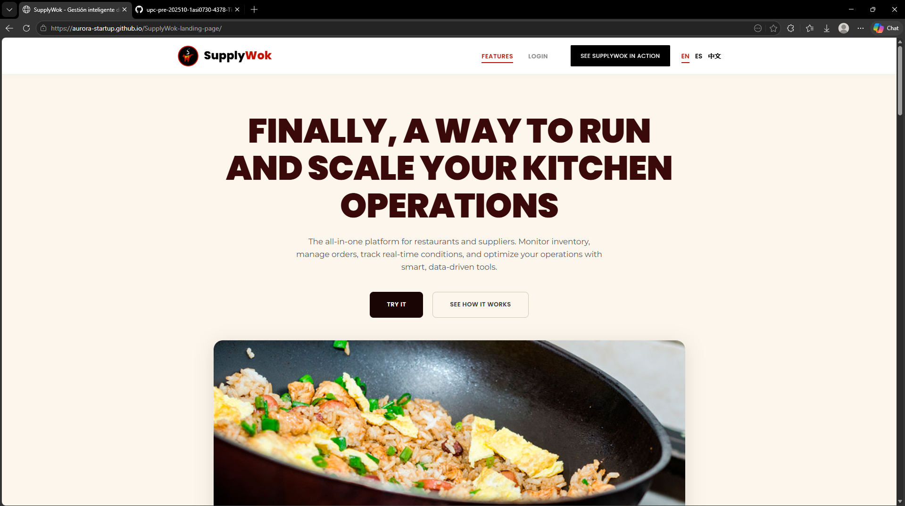

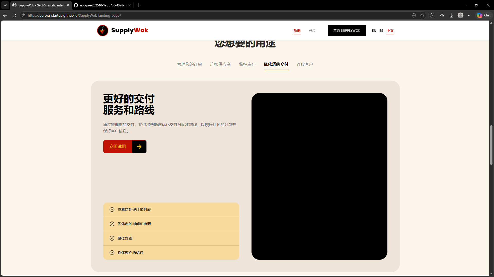


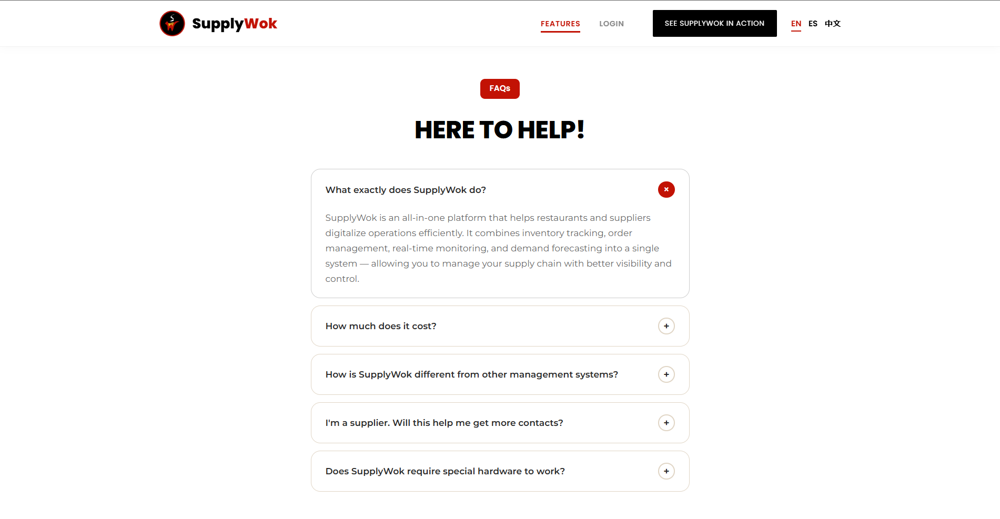

#### 5.2.1.6. Services Documentation Evidence for Sprint Review.

Como la Landing Page es una página estática, no fue necesario durante el Sprint el uso de servicios externos ni conexiones a APIs, por lo cual no hay generación ni evidencia de documentación técnica relacionada.

#### 5.2.1.7. Software Deployment Evidence for Sprint Review.

La evidencia del despliegue de la Landing Page durante el Sprint se mostrara a continuación, el despliegue se realizara en GitHub Pages.

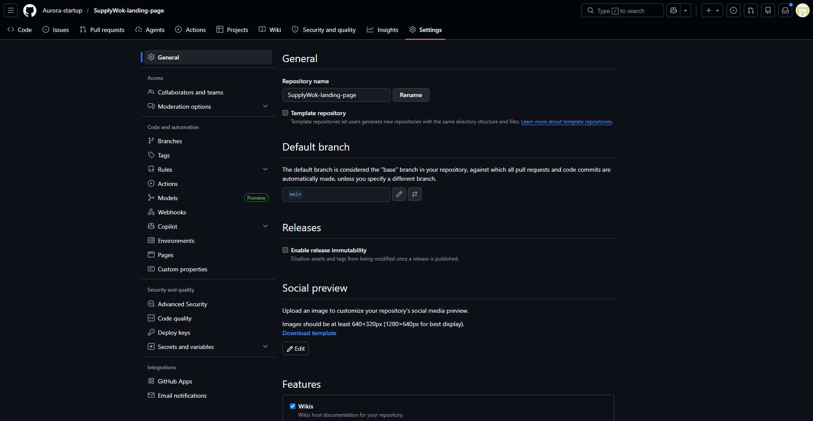

Revisamos que el repositorio este en publico:

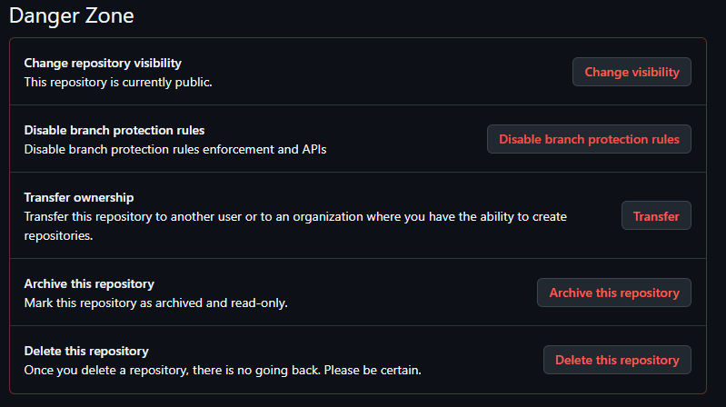

Nos dirigimos a la seccion de deploy, y selecionamos la rama main:

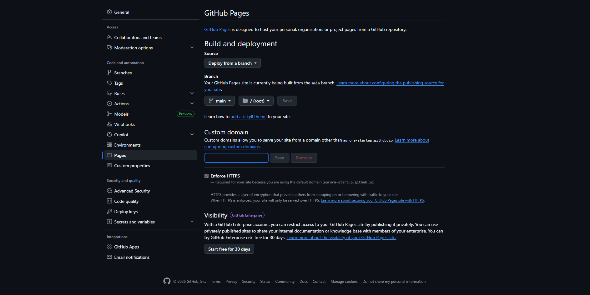

Luego de unos minutos, el deploy se realizara correctamente:

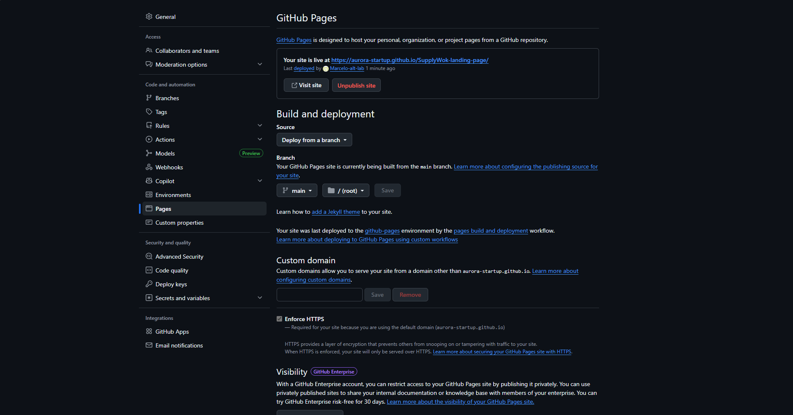

#### 5.2.1.8. Team Collaboration Insights during Sprint.

En este apartado se visualiza todos los graficos que representan la participacion de cada integrante en el repositorio del Landing Page.

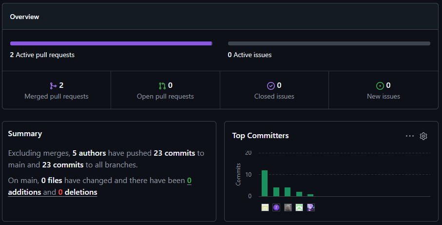

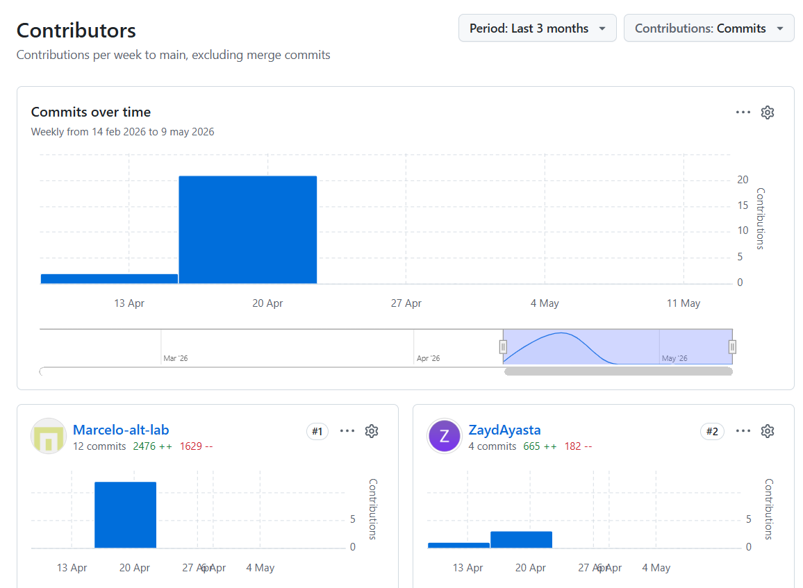

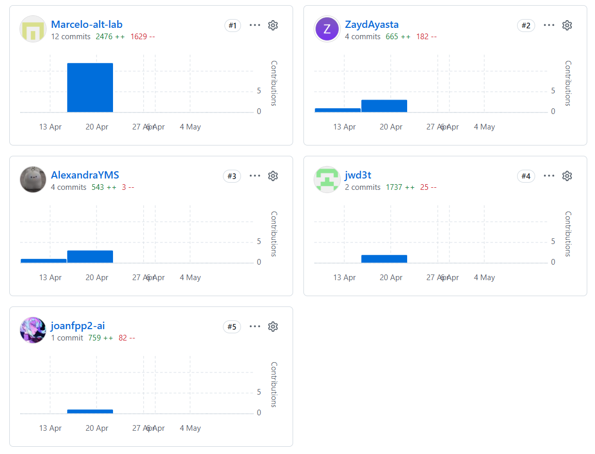

### 5.2.2. Sprint 2 
#### 5.2.2.1. Sprint Planning 2

En el Sprint 2, como equipo nos centramos en el desarrollo del frontend de SupplyWok, el cual será la interfaz principal de nuestra plataforma mediante la cual los usuarios podrán administrar sus servicios. Se implementaron diferentes dashboards para que tanto los dueños como los proveedores puedan gestionar las necesidades de sus respectivos negocios.

**Sprint Planning 2**

| **Sprint #** | 2 |
|---|---|
| **Date** | 08-05-2026 |
| **Time** | 13:00 |
| **Location** | Virtual, Discord |
| **Prepared by** | Zayd Ayasta, Juan Wang |
| **Attendees** | Marcelo Cuadros, Alexandra Meza, Joan Payano |
| **Sprint 1 Review Summary** | En el Sprint 1, el equipo se enfocó en el desarrollo del Landing Page de SupplyWok. Con ello, se logró configurar el entorno de trabajo, establecer los requerimientos principales del sistema, así como el diseño preliminar de la interfaz y la estructura de navegación de la plataforma. Por otro lado, el Product Owner brindó feedback positivo respecto al diseño inicial del sistema y sugirió corregir ciertos aspectos de la documentación del proyecto. |
| **Sprint 1 Retrospective Summary** | Durante el Sprint 1, surgieron dificultades relacionadas con la comunicación, la distribución de tareas y el cumplimiento de algunos entregables de la plataforma, afectando principalmente la documentación del proyecto. Sin embargo, a pesar de estas dificultades, se logró entregar un sprint casi completo y con una calidad aceptable. |
| **Sprint 2 Goal** | Nuestro enfoque en este sprint es desarrollar e implementar la interfaz principal de SupplyWok mediante dashboards funcionales para dueños y proveedores, permitiendo la visualización y gestión básica de la información del negocio. Además, se espera implementar la interfaz base de cada dashboard junto con las funcionalidades principales de cada bounded context. |
| **Sprint 2 Velocity** | Límite de **35 SP** |
| **Sum of Story Points** | **30 SP** |

#### 5.2.2.2. Aspect Leaders and Collaborators.

Durante el Sprint 2, el equipo se enfocó principalmente en el desarrollo del frontend de SupplyWok, priorizando las interfaz y funcionalidades principales de la plataforma. Los principales aspectos considerados en este sprint incluyen el desarrollo de los todos los bounded context.

- **Inventory Management Bounded Context**: Es el encargado de gestionar la informacion de los recursos de inventario de cada restaurante.

- **Supply and Purchasing Bounded Context**: Es el encargado de gestionar las órdenes de suplementos realizadas por cada restaurante.

- **Restaurant Management Bounded Context**: Es el encargado de gestionar todo lo relacionado con la operación del establecimiento.

- **Operational Monitoring and IoT Alerts Bounded Context**: Es el encargado de gestionar la información recopilada por los sensores del restaurante.

- **Supplier Management & Operations Bounded Context**: Es el encargado de gestionar la información de los proveedores y sus pedidos.

- **Identity & Access Bounded Context**: Es el encargado de gestionar todo lo relacionado con la autenticación y administración de cuentas.

- **Shared Bounded Context**: Contiene Value Objects y componenetes visuales comunes que son reutilizados por múltiples bounded contexts del sistema.

| Team Member | GitHub username | Inventory Management Bounded BC | Supply and Purchasing BC / Shared BC | Restaurant Management BC | Supplier Management & Operations BC | Operational Monitoring and IoT Alerts BC / Identity & Access BC  |
|---|---|---|---|---|---|---|
| Cuadros, Marcelo | Marcelo-alt-lab | C | C | C | - | L |
| Payano, Joan | Nounz27             | - | C | L | C | C |
| Meza, Alexandra | AlexandraYMS     | L | C | - | C | C |
| Ayasta, Zayd | Zayd Ayasta         | C | L | C | C | - |
| Wang, Juan | jwd3t                 | C | - | C | L | C |

#### 5.2.2.3. Sprint Backlog 2.

**Sprint 2 Backlog**

| US Id | US Title | Task Id | Task Title | Description | Estimation (Hours) | Assigned To | Status |
|---|---|---|---|---|---|---|---|
| US11 | Proyección de demanda basada en historial | T30 | Diseño de interfaz de proyección | Diseñar la interfaz para visualizar la proyección de consumo de insumos. | 3 | Alexandra Meza | Done |
| US11 | Proyección de demanda basada en historial | T31 | Implementación de gráficos estadísticos | Implementar gráficos y métricas de proyección de demanda. | 4 | Marcelo Cuadros | Done |
| US11 | Proyección de demanda basada en historial | T32 | Integración de datos históricos | Conectar la vista con los datos históricos de consumo. | 3 | Juan Wang | Done |
| US14 | Monitoreo de temperatura en almacén | T33 | Diseño del dashboard IoT | Diseñar el panel de monitoreo de sensores IoT. | 2 | Joan Payano | Done |
| US14 | Monitoreo de temperatura en almacén | T34 | Integración de datos de sensores | Implementar la recepción y visualización de temperatura en tiempo real. | 4 | Zayd Ayasta | Done |
| US15 | Alertas de riesgo en cocina | T35 | Sistema de alertas automáticas | Implementar alertas visuales ante condiciones peligrosas. | 3 | Alexandra Meza | Done |
| US15 | Alertas de riesgo en cocina | T36 | Configuración de umbrales | Configurar parámetros de temperatura y humedad para activar alertas. | 2 | Marcelo Cuadros | Done |
| US17 | Control de ocupación de mesas | T37 | Diseño de estado de mesas | Crear componentes visuales para representar el estado de las mesas. | 2 | Juan Wang | Done |
| US17 | Control de ocupación de mesas | T38 | Actualización en tiempo real | Implementar actualización dinámica de ocupación de mesas. | 3 | Joan Payano | Done |
| US18 | Historial de alertas e incidencias operativas | T39 | Registro de incidencias | Implementar almacenamiento de eventos y alertas. | 3 | Zayd Ayasta | Done |
| US18 | Historial de alertas e incidencias operativas | T40 | Vista histórica de alertas | Crear interfaz para consultar incidencias registradas. | 3 | Alexandra Meza | Done |
| US19 | Exportar reporte de monitoreo y alertas | T41 | Generación de reportes PDF | Implementar exportación de reportes en PDF. | 3 | Marcelo Cuadros | Done |
| US19 | Exportar reporte de monitoreo y alertas | T42 | Exportación CSV | Implementar exportación de datos en formato CSV. | 2 | Juan Wang | Done |
| US20 | Registro y perfil del proveedor | T43 | Formulario de registro | Implementar formulario para registro de proveedores. | 3 | Joan Payano | Done |
| US20 | Registro y perfil del proveedor | T44 | Vista de perfil del proveedor | Crear pantalla de perfil y edición de datos. | 3 | Zayd Ayasta | Done |
| US21 | Recepción y gestión de órdenes de compra | T45 | Panel de órdenes recibidas | Implementar listado de órdenes de compra recibidas. | 4 | Alexandra Meza | Done |
| US21 | Recepción y gestión de órdenes de compra | T46 | Gestión de estado de pedidos | Permitir actualizar estados de órdenes de compra. | 3 | Marcelo Cuadros | Done |
| US24 | Confirmación y seguimiento de entregas | T47 | Registro de entregas | Implementar formulario para confirmar entregas realizadas. | 3 | Juan Wang | Done |
| US24 | Confirmación y seguimiento de entregas | T48 | Seguimiento de despachos | Implementar visualización del estado de entregas. | 3 | Joan Payano | Done |
| US25 | Panel de rendimiento por cliente | T49 | Dashboard de clientes frecuentes | Implementar métricas de pedidos por cliente. | 4 | Zayd Ayasta | Done |
| US25 | Panel de rendimiento por cliente | T50 | Estadísticas comerciales | Mostrar estadísticas y tendencias de consumo. | 3 | Alexandra Meza | Done |
| US27 | Selección y gestión del plan de suscripción | T51 | Vista de planes disponibles | Diseñar pantalla de planes y beneficios. | 2 | Marcelo Cuadros | Done |
| US27 | Selección y gestión del plan de suscripción | T52 | Gestión de suscripción | Implementar selección y activación de planes. | 2 | Juan Wang | Done |
| US28 | Notificaciones en tiempo real | T53 | Sistema de notificaciones | Implementar notificaciones dinámicas en la plataforma. | 4 | Joan Payano | Done |
| US28 | Notificaciones en tiempo real | T54 | Alertas en tiempo real | Mostrar alertas instantáneas relacionadas al sistema. | 3 | Zayd Ayasta | Done |
| US29 | Inicio de sesión y registro de cuenta | T55 | Formulario de login | Implementar formulario de inicio de sesión con validación. | 3 | Marcelo Cuadros | Done |
| US29 | Inicio de sesión y registro de cuenta | T56 | Formulario de registro | Implementar formulario de registro de nueva cuenta con validación. | 3 | Joan Payano | Done |

#### 5.2.2.4. Development Evidence for Sprint Review.

A continuación se detalla los commits realizados por todos los integrantes.


| Repository | Branch | Commit Id | Commit Message | Commit Message Body | Commited on (Date) |
|---|---|---|---|---|---|
| Aurora-startup/SupplyWok-frontend | develop | 2d0e9b6 | feat: connect purchasing suppliers to mock api | Conexión de proveedores de compras a la API mock | 15/05/2026 |
| Aurora-startup/SupplyWok-frontend | develop | 5b15dfa | feat: connect purchasing suppliers to mock api | Conexión inicial de purchasing suppliers a la API mock | 15/05/2026 |
| Aurora-startup/SupplyWok-frontend | develop | 933f622 | fix: environments | Corrección de configuración de entornos | 15/05/2026 |
| Aurora-startup/SupplyWok-frontend | develop | e890844 | feat: implement identity-and-access bounded context and fix existing bounded context integration issues | Implementación del bounded context de identity-and-access y corrección de integraciones existentes | 15/05/2026 |
| Aurora-startup/SupplyWok-frontend | develop | 90e16bd | feat: implement inventory-management bounded context | Implementación del bounded context de inventory-management | 14/05/2026 |
| Aurora-startup/SupplyWok-frontend | develop | 510e880 | feat: add operational-monitoring-and-iot-alerts bounded context | Agregado del bounded context para operational monitoring and IoT alerts | 14/05/2026 |
| Aurora-startup/SupplyWok-frontend | develop | d42b822 | feat: add login and registration components with form handling and validation | Implementación de componentes de login y registro con manejo y validación de formularios | 13/05/2026 |
| Aurora-startup/SupplyWok-frontend | develop | 3492676 | Merge pull request #5 from Aurora-startup/feature/operational-monitoring-and-iot-alerts | Merge del feature operational-monitoring-and-iot-alerts hacia develop | 13/05/2026 |
| Aurora-startup/SupplyWok-frontend | develop | acbd3df | fix: restaurant-management infrastructure | Correcciones en la infraestructura de restaurant-management | 13/05/2026 |
| Aurora-startup/SupplyWok-frontend | develop | 77add27 | fix: restaurant-management infrastructure | Ajustes adicionales en la infraestructura de restaurant-management | 13/05/2026 |
| Aurora-startup/SupplyWok-frontend | develop | 0ccdbe2 | merge develop into feature/inventory-management-bounded-context | Sincronización de develop con feature/inventory-management-bounded-context | 12/05/2026 |
| Aurora-startup/SupplyWok-frontend | develop | 70c31f4 | Update Inventory Management Bouded | Actualización del módulo Inventory Management Bounded | 12/05/2026 |
| Aurora-startup/SupplyWok-frontend | develop | 56267f2 | feat: complete inventory management bounded context | Implementación completa del bounded context de inventory management | 12/05/2026 |
| Aurora-startup/SupplyWok-frontend | develop | 0823704 | Update Inventory Management Bouded Context interface | Actualización de interfaces del bounded context de inventory management | 12/05/2026 |
| Aurora-startup/SupplyWok-frontend | develop | a3e6f1e | feat: implement restaurant-management bounded context | Implementación del bounded context de restaurant-management | 12/05/2026 |
| Aurora-startup/SupplyWok-frontend | develop | ea5b27f | feat(restaurant-management): apply clean architecture structure | Aplicación de estructura Clean Architecture en restaurant-management | 12/05/2026 |
| Aurora-startup/SupplyWok-frontend | develop | b2007f3 | feat: implement supply and purchasing bounded context | Implementación del bounded context de supply and purchasing | 12/05/2026 |
| Aurora-startup/SupplyWok-frontend | develop | 92261ed | feat(supply-and-purchasing): implement bounded context pages and routes | Implementación de páginas y rutas para supply-and-purchasing | 12/05/2026 |
| Aurora-startup/SupplyWok-frontend | develop | 442cb84 | feat(table): add purchase orders table component | Creación del componente tabla para órdenes de compra | 12/05/2026 |
| Aurora-startup/SupplyWok-frontend | develop | 6dd333d | feat(forms): create purchase order form panel | Creación del panel de formulario para órdenes de compra | 12/05/2026 |
| Aurora-startup/SupplyWok-frontend | develop | 340672c | feat(orders): implement purchase orders page | Implementación de la página de órdenes de compra | 12/05/2026 |
| Aurora-startup/SupplyWok-frontend | develop | 408c86e | feat(i18n): add localization resources | Agregados recursos de localización e internacionalización | 12/05/2026 |
| Aurora-startup/SupplyWok-frontend | develop | fb3d9d6 | feat(layout): configure shared navigation and application routes | Configuración de navegación compartida y rutas de la aplicación | 12/05/2026 |
| Aurora-startup/SupplyWok-frontend | develop | 6be1695 | feat(store): add purchase order state management | Implementación de manejo de estado para órdenes de compra | 12/05/2026 |
| Aurora-startup/SupplyWok-frontend | develop | 221c88a | feat(api): integrate purchase order endpoints | Integración de endpoints para órdenes de compra | 12/05/2026 |
| Aurora-startup/SupplyWok-frontend | develop | 8633a54 | feat(core): add shared infrastructure and environment configuration | Configuración compartida de infraestructura y entorno | 12/05/2026 |
| Aurora-startup/SupplyWok-frontend | develop | 753c7e6 | feat(restaurant-management): implement restaurant management bounded context with tables occupancy and kitchen tickets | Implementación de bounded context para restaurant management con ocupación de mesas y kitchen tickets | 11/05/2026 |
| Aurora-startup/SupplyWok-frontend | develop | e687f11 | initial commit | Commit inicial del proyecto | 11/05/2026 |
| Aurora-startup/SupplyWok-frontend | develop | 71a55e2 | feat: implement IoT monitoring dashboard components and API integration | Implementación de dashboard IoT e integración con API | 10/05/2026 |
| Aurora-startup/SupplyWok-frontend | develop | ed68b1e | Merge pull request #1 from Aurora-startup/develop | Merge inicial de develop | 10/05/2026 |
| Aurora-startup/SupplyWok-frontend | develop | 95e0807 | chore: remove untracked IDE and cache folders | Eliminación de carpetas IDE y caché no rastreadas | 10/05/2026 |
| Aurora-startup/SupplyWok-frontend | develop | 81b2891 | feat: add initial application structure with routing, layout, and language switcher | Creación de estructura inicial de aplicación con routing, layout y selector de idioma | 10/05/2026 |
| Aurora-startup/SupplyWok-frontend | develop | a0c8b6f | chore: initialize project workspace and cache build artifacts | Inicialización del workspace y artefactos de build | 10/05/2026 |
| Aurora-startup/SupplyWok-frontend | develop | 7272f71 | chore: initial commit | Commit inicial del repositorio | 08/05/2026 |

#### 5.2.2.5. Execution Evidence for Sprint Review.

En este Sprint se logró desarrollar gran parte del frontend de la plataforma SupplyWok. Se integraron funcionalidades como el inicio de sesión, el dashboard general, los módulos de inventario, pedidos, comandas, sensores y alertas, junto con sus funcionalidades básicas principales.


#### 5.2.2.6. Services Documentation Evidence for Sprint Review.

Para esta sección se diran los servicios que se utilizaron para simular los json que devolveria nuestro backend, los cuales se implementaron en dos servicios, en mockapi y en my json server.

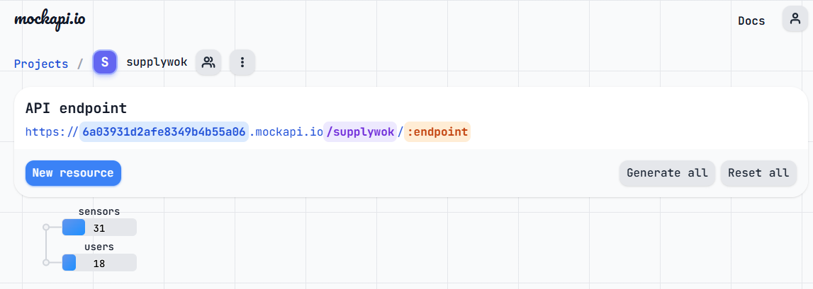

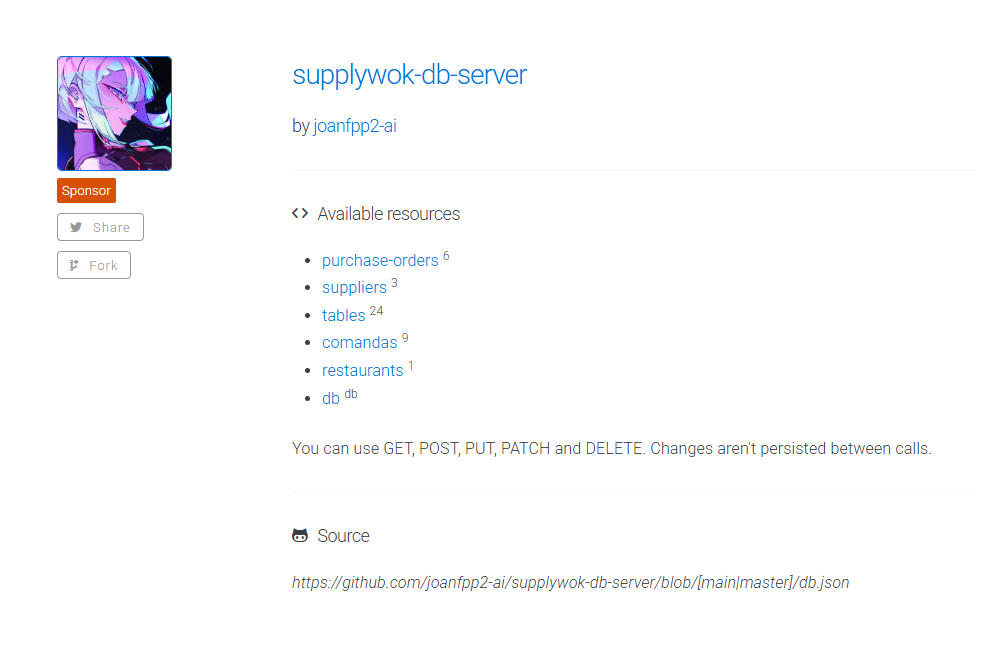

Estos implementarion endpoints para majenar los datos y mostrarlos en nuestros componentes que permiten utilizar nuestro sistema sin necesidad de tener un backend por el momento.

#### 5.2.2.7. Software Deployment Evidence for Sprint Review.

Para esta sección se diran los servicios que se utilizaron para simular los json que devolveria nuestro backend, los cuales se implementaron en dos servicios, en mockapi y en my json server.


Estos implementarion endpoints para majenar los datos y mostrarlos en nuestros componentes que permiten utilizar nuestro sistema sin necesidad de tener un backend por el momento.


#### 5.2.2.8. Team Collaboration Insights during Sprint.

En este apartado se visualiza todos los graficos que representan la participacion de cada integrante en el repositorio del fronted.

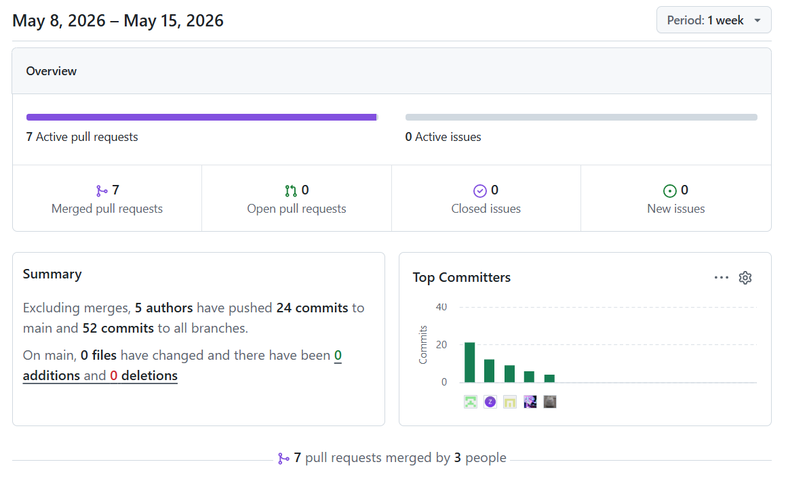

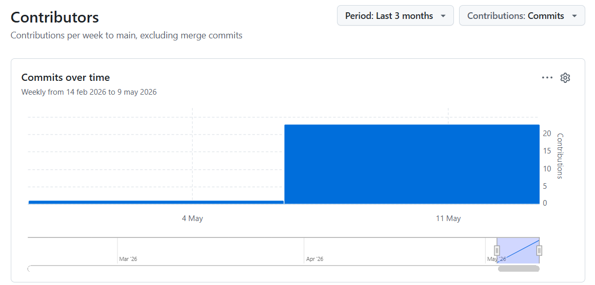

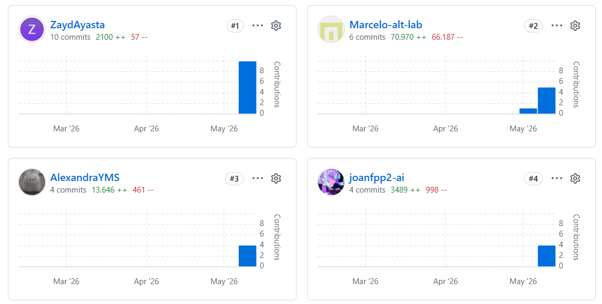
